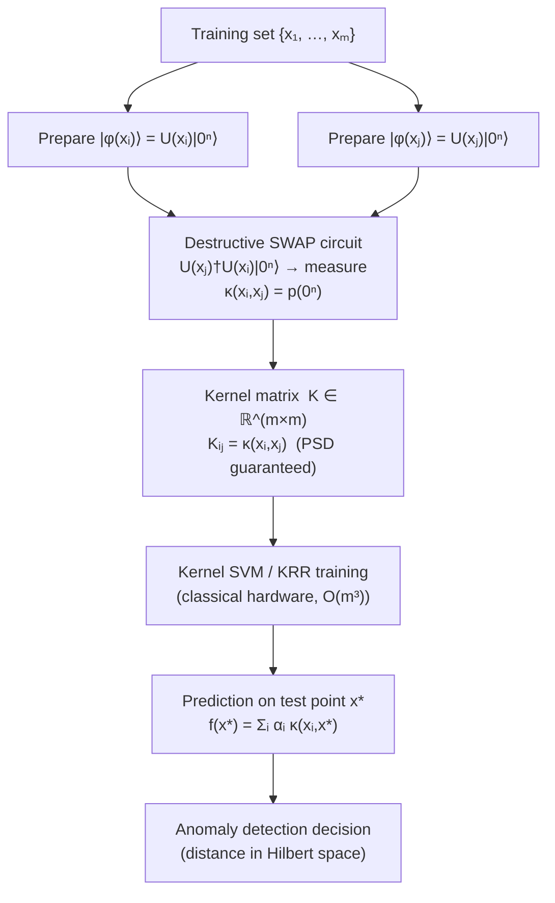

# QCSAA 910–919 · Section 01 · Subsection 911 · Subsubject 008 — Kernel-Induced Feature Spaces

## 1. Purpose

Defines the **quantum kernel** κ(x,y) = |⟨φ(x)|φ(y)⟩|² as the inner product in the feature Hilbert space ℋ induced by a quantum feature map φ(x) = U(x)|0ⁿ⟩, and establishes the formal connection between quantum feature maps and classical kernel methods (kernel SVM, kernel ridge regression)[^havlicek][^schuld2021]. Every quantum model with a fixed feature map implicitly computes a kernel, making kernel theory the natural framework for analysing the function class, generalisation behaviour, and advantage potential of quantum classifiers[^schuld2021].

This subsubject covers the estimation of the quantum kernel matrix from quantum hardware (SWAP test and destructive SWAP circuits), the positive-semidefiniteness guarantee of quantum kernels, the training complexity of kernel SVMs, and the geometric difference metric for comparing quantum and classical kernels. For aerospace applications, it treats anomaly detection via kernel SVM on avionics telemetry data as a concrete use case within the Q+ATLANTIDE baseline.

**Restricted band (N-006[^n006]).** This document inherits `governance_class: restricted`.

## 2. Scope

- Covers the *Kernel-Induced Feature Spaces* subsubject (`008`) of subsection `911`.
- Inherits Q-Division authority and ORB support from the parent row in [`README.md`](./README.md)[^archtable].
- Concepts in scope:
  - **Quantum kernel definition** — κ(x,y) = |⟨φ(x)|φ(y)⟩|² = |⟨0ⁿ|U(x)†U(y)|0ⁿ⟩|²; equivalently, for density-matrix feature states, κ(x,y) = Tr(φ(x)φ(y)); the kernel measures the overlap (similarity) between two feature states in Hilbert space.
  - **Kernel matrix estimation via SWAP test** — the SWAP test circuit uses an ancilla qubit and a controlled-SWAP gate to estimate |⟨φ(x)|φ(y)⟩|²; one evaluation requires preparing |φ(x)⟩ and |φ(y)⟩ in two separate registers and running a controlled-SWAP; circuit width is 2n+1 qubits; each kernel entry κ(xᵢ,xⱼ) requires a separate circuit execution.
  - **Destructive SWAP (Hadamard overlap test)** — an alternative kernel estimation circuit uses the circuit U(y)†U(x)|0ⁿ⟩ and measures the probability of the all-zeros outcome: κ(x,y) = p(0ⁿ) = |⟨0ⁿ|U(x)†U(y)|0ⁿ⟩|²; requires only n qubits (no ancilla); more hardware-efficient than the SWAP test; the standard method for quantum kernel estimation on NISQ devices.
  - **Positive-semidefiniteness of quantum kernels** — a quantum kernel is always positive-semidefinite (PSD) because it is an inner product in a Hilbert space; the Gram matrix K with Kᵢⱼ = κ(xᵢ,xⱼ) satisfies vᵀKv ≥ 0 for all v; this guarantees that kernel SVM has a convex training objective and a unique global optimum.
  - **Kernel SVM training complexity** — given an m×m kernel matrix K, training a kernel SVM via quadratic programming has time complexity O(m³) in the worst case (m training samples); this is independent of qubit count n but scales cubically in dataset size; quantum hardware provides the kernel matrix rows/columns, while SVM training remains on classical hardware.
  - **Kernel ridge regression** — kernel ridge regression (KRR) with quantum kernel: f(x) = Σᵢ αᵢ κ(xᵢ,x) where α = (K + λI)⁻¹ y; requires O(m³) for matrix inversion; provides closed-form predictions useful for regression tasks on aerospace sensor data.
  - **Geometric difference metric** — Huang et al. (2021) define the geometric difference g = ‖K_Q^(1/2) K_C^(−1/2)‖_F as the Frobenius-norm difference between the quantum kernel matrix K_Q and a classical baseline kernel matrix K_C; a large g (g > 1) indicates that the quantum kernel assigns significantly different similarity scores than the classical kernel, which is a necessary condition for quantum advantage in kernel classification; a large g alone does not guarantee advantage — data must have sufficient training signal aligned with the quantum kernel's geometry.
  - **Aerospace use case: anomaly detection via kernel SVM on telemetry data** — quantum kernel SVM applied to avionics telemetry feature vectors (engine health indicators, vibration spectra, hydraulic pressure readings) can detect anomalies by identifying samples far from the normal-class cluster in Hilbert space; the PSD guarantee ensures training stability; the geometric difference metric can be used to assess whether the quantum kernel captures anomaly patterns not visible to classical kernels.
- Out of scope: specific feature map circuits (see `001_`, `004_`–`007_`), trainability and expressibility (see `009_`), aerospace certification requirements (see `010_`), kernel hyperparameter tuning.

## 3. Diagram — Quantum Kernel Estimation and SVM Pipeline

## 4. Footprint

| Metric | Value |
|---|---|
| Architecture | `QCSAA` — Quantum Computing & Sentient Agency Architecture |
| Master range | `900–999` |
| Code range | `910-919` |
| Section | `01` — Quantum Machine Learning e IA Cuántica |
| Subsection | `911` — Quantum Feature Maps and Embeddings |
| Subsubject | `008` — Kernel-Induced Feature Spaces |
| Primary Q-Division | Q-HPC[^qdiv] |
| Support Q-Divisions | Q-HORIZON, Q-DATAGOV |
| ORB support | ORB-PMO, ORB-LEG |
| Governance class | `restricted`[^gov] |
| Folder path | `Q+ATLANTIDE/900-999_QCSAA/910-919_Quantum-Machine-Learning-e-IA-Cuantica/911_Quantum-Feature-Maps-and-Embeddings/` |
| Document | `008_Kernel-Induced-Feature-Spaces.md` (this file) |
| Parent subsection | [`README.md`](./README.md) · [`000_Overview.md`](./000_Overview.md) |
| Parent architecture | [`../../README.md`](../../README.md) |
| Parent baseline | [`organization/Q+ATLANTIDE.md`](../../../../organization/Q+ATLANTIDE.md) |

## 5. References & Citations

[^baseline]: **Q+ATLANTIDE controlled baseline (v1.0.0)** — [`organization/Q+ATLANTIDE.md`](../../../../organization/Q+ATLANTIDE.md). Defines the controlled `000-999` architecture-band taxonomy and the ATLAS-1000 register subpart.

[^archtable]: **§3 — Subsubject Index (parent README)** — [`README.md` §3](./README.md#3-subsubject-index). Authoritative source for the `911` subsection row (Primary Q-Division Q-HPC).

[^qdiv]: **Q-Division authority** — Q-Divisions provide technical authority over an architecture row (Q+ATLANTIDE Note N-002). See [`organization/Q+ATLANTIDE.md` §4](../../../../organization/Q+ATLANTIDE.md#4-notes).

[^gov]: **Governance class** — `restricted` denotes documents requiring additional governance, evidence packages and access controls (rule N-006[^n006]).

[^n006]: **Note N-006 (Restricted bands)** — Quantum-related (`900-999` QCSAA) bands require additional governance, evidence packages and access controls. Templates must additionally declare `governance_class: restricted`, `evidence_package_id` and `access_control_profile`. See [`organization/Q+ATLANTIDE.md` §5.3](../../../../organization/Q+ATLANTIDE.md#53-restricted-band-templates-n-006).

[^havlicek]: **Havlíček, V., Córcoles, A. D., Temme, K., et al. (2019)** — "Supervised learning with quantum-enhanced feature spaces." *Nature*, 567, 209–212. Introduces the quantum kernel, its estimation via the SWAP test, and its use in kernel SVM classification.

[^schuld2021]: **Schuld, M. (2021)** — "Supervised quantum machine learning models are kernel methods." arXiv:2101.11020. Establishes the formal RKHS equivalence, positive-semidefiniteness of quantum kernels, and discusses the geometric difference metric.

[^schuld2019]: **Schuld, M. & Killoran, N. (2019)** — "Quantum Machine Learning in Feature Hilbert Spaces." *Physical Review Letters*, 122, 040504. Provides the Hilbert-space framework for quantum kernels.

[^isoiec4879]: **ISO/IEC 4879:2023** — *Quantum computing — Vocabulary*. Defines quantum state, measurement, and inner product.

### Applicable standards

The following standards apply to this subsubject in addition to the cross-cutting Q+ATLANTIDE governance:

- Havlíček et al. (2019) — "Supervised learning with quantum-enhanced feature spaces"[^havlicek]
- Schuld (2021) — "Supervised quantum machine learning models are kernel methods"[^schuld2021]
- Schuld & Killoran (2019) — "Quantum Machine Learning in Feature Hilbert Spaces"[^schuld2019]
- ISO/IEC 4879:2023 — *Quantum computing — Vocabulary*[^isoiec4879]
