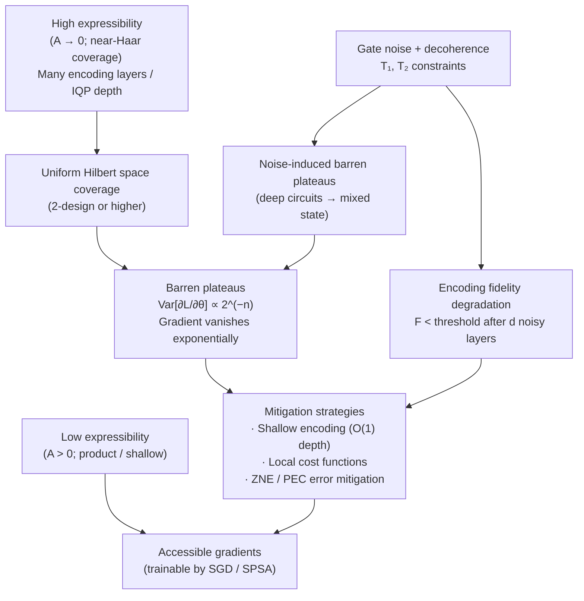

# QCSAA 910–919 · Section 01 · Subsection 911 · Subsubject 009 — Expressibility, Trainability and Noise

## 1. Purpose

Analyses the three-way tension between **expressibility** (the ability of a feature map to cover the Hilbert space of quantum states uniformly), **trainability** (the flatness or concentration of the loss landscape when gradients of the quantum model are used to optimise parameters), and **noise sensitivity** (the degradation of encoding fidelity under gate errors, decoherence, and readout noise) in quantum feature maps[^schuld2019][^havlicek]. This subsubject establishes the quantitative metrics and qualitative design principles that govern the selection and certification of encoding circuits for QML systems within the Q+ATLANTIDE baseline.

A central finding is that high expressibility and good trainability are fundamentally in tension: feature maps that cover the Hilbert space very uniformly (high expressibility) tend to produce loss landscapes with exponentially vanishing gradients (barren plateaus), making gradient-based training infeasible for large qubit counts[^schuld2021]. Additionally, highly expressive deep circuits accumulate more gate errors, reducing effective expressibility back towards the depolarised mixed state. Designing a feature map therefore requires explicit reasoning about the tradeoff triangle of expressibility, trainability, and noise, which this subsubject formalises for QCSAA use.

**Restricted band (N-006[^n006]).** This document inherits `governance_class: restricted`.

## 2. Scope

- Covers the *Expressibility, Trainability and Noise* subsubject (`009`) of subsection `911`.
- Inherits Q-Division authority and ORB support from the parent row in [`README.md`](./README.md)[^archtable].
- Concepts in scope:
  - **Expressibility metric (Sim et al. 2019 frame potential distance)** — expressibility A(U) is measured as the deviation of the distribution of states {|φ(x)⟩} generated by the feature map from the Haar-random distribution; formally, A(U) = ‖∫_{x} |φ(x)⟩⟨φ(x)|⊗² dx − ∫_Haar |ψ⟩⟨ψ|⊗² dψ‖_F; a feature map with A ≈ 0 is a 2-design (covers state space uniformly); higher expressibility → lower A value.
  - **Barren plateau connection** — for feature maps that approximate t-designs over the unitary group, the variance of the cost function gradient with respect to any circuit parameter θ satisfies Var[∂L/∂θ] ≤ O(2^(−n)) (exponentially small in qubit count n); this barren plateau effect[^schuld2021] means that gradient-based optimisation becomes exponentially slow for high-expressibility feature maps on large registers.
  - **Locality mitigation** — barren plateaus can be mitigated by using local cost functions (measuring only a subsystem, e.g., a single qubit), shallow circuits, or structured ansätze with restricted entanglement; local cost functions exploit the fact that global operators cause barren plateaus faster than local operators; the encoding design must be co-optimised with the cost function locality.
  - **Noise-induced barren plateaus** — even without high expressibility, noise channels (depolarising, amplitude-damping, dephasing) on deep circuits produce their own barren plateau: noise maps every state towards the maximally mixed state I/2ⁿ, making all cost function gradients exponentially small after O(log n) noisy layers[^schuld2021]; encoding circuit depth is therefore directly bounded by hardware noise rates.
  - **T₁/T₂ constraints on encoding circuit depth** — the encoding circuit depth d must satisfy d · t_gate ≪ min(T₁, T₂) to maintain fidelity above a threshold η; on current NISQ hardware, T₁ ≈ T₂ ≈ 100–500 µs and two-qubit gate times t_gate ≈ 200–400 ns, yielding coherence budget of ~500–2500 two-qubit gates; IQP feature maps with r=2 repetitions on n=10 qubits are within budget; deeper circuits require error mitigation.
  - **Effective expressibility under noise** — the effective expressibility of a noisy encoding circuit is reduced relative to the ideal (noiseless) case: noise channels act as a regulariser on the state distribution, reducing the diversity of encoded states; the effective expressibility under a global depolarising noise model with error rate p per gate is approximately A_eff ≈ A_ideal + O(p·d·n), where d is circuit depth and n is qubit count.
  - **Mitigation strategies** — shallow encoding circuits (O(1) depth angle encoding) are the primary noise mitigation strategy; local cost functions (Pauli-Z on a single qubit) mitigate barren plateaus; error mitigation techniques (zero-noise extrapolation, probabilistic error cancellation) can partially recover expressibility from noisy circuits but increase measurement overhead.
  - **Aerospace implications: reliability of encoding under hardware noise** — for aerospace QML inference, the encoding circuit must maintain fidelity above a minimum reliability threshold (e.g., F ≥ 0.99) over the operational lifetime of the quantum processor; this requires specification of maximum encoding circuit depth as a function of hardware noise rates, which must be included in the DO-178C evidence package (see `010_`).
- Out of scope: ansatz expressibility and trainability for VQCs (see subsection `912`), full barren plateau theory for deep VQAs (see subsection `917`), noise characterisation and hardware calibration (see QCSAA `900_Qubits` subsection `004_`).

## 3. Diagram — Expressibility–Trainability–Noise Tradeoff

## 4. Footprint

| Metric | Value |
|---|---|
| Architecture | `QCSAA` — Quantum Computing & Sentient Agency Architecture |
| Master range | `900–999` |
| Code range | `910-919` |
| Section | `01` — Quantum Machine Learning e IA Cuántica |
| Subsection | `911` — Quantum Feature Maps and Embeddings |
| Subsubject | `009` — Expressibility, Trainability and Noise |
| Primary Q-Division | Q-HPC[^qdiv] |
| Support Q-Divisions | Q-HORIZON, Q-DATAGOV |
| ORB support | ORB-PMO, ORB-LEG |
| Governance class | `restricted`[^gov] |
| Folder path | `Q+ATLANTIDE/900-999_QCSAA/910-919_Quantum-Machine-Learning-e-IA-Cuantica/911_Quantum-Feature-Maps-and-Embeddings/` |
| Document | `009_Expressibility-Trainability-and-Noise.md` (this file) |
| Parent subsection | [`README.md`](./README.md) · [`000_Overview.md`](./000_Overview.md) |
| Parent architecture | [`../../README.md`](../../README.md) |
| Parent baseline | [`organization/Q+ATLANTIDE.md`](../../../../organization/Q+ATLANTIDE.md) |

## 5. References & Citations

[^baseline]: **Q+ATLANTIDE controlled baseline (v1.0.0)** — [`organization/Q+ATLANTIDE.md`](../../../../organization/Q+ATLANTIDE.md). Defines the controlled `000-999` architecture-band taxonomy and the ATLAS-1000 register subpart.

[^archtable]: **§3 — Subsubject Index (parent README)** — [`README.md` §3](./README.md#3-subsubject-index). Authoritative source for the `911` subsection row (Primary Q-Division Q-HPC).

[^qdiv]: **Q-Division authority** — Q-Divisions provide technical authority over an architecture row (Q+ATLANTIDE Note N-002). See [`organization/Q+ATLANTIDE.md` §4](../../../../organization/Q+ATLANTIDE.md#4-notes).

[^gov]: **Governance class** — `restricted` denotes documents requiring additional governance, evidence packages and access controls (rule N-006[^n006]).

[^n006]: **Note N-006 (Restricted bands)** — Quantum-related (`900-999` QCSAA) bands require additional governance, evidence packages and access controls. Templates must additionally declare `governance_class: restricted`, `evidence_package_id` and `access_control_profile`. See [`organization/Q+ATLANTIDE.md` §5.3](../../../../organization/Q+ATLANTIDE.md#53-restricted-band-templates-n-006).

[^schuld2019]: **Schuld, M. & Killoran, N. (2019)** — "Quantum Machine Learning in Feature Hilbert Spaces." *Physical Review Letters*, 122, 040504. Introduces the expressibility metric and the frame potential distance; discusses the trainability implications of high expressibility.

[^havlicek]: **Havlíček, V., Córcoles, A. D., Temme, K., et al. (2019)** — "Supervised learning with quantum-enhanced feature spaces." *Nature*, 567, 209–212. Demonstrates practical feature maps on hardware and discusses noise effects on kernel estimation.

[^schuld2021]: **Schuld, M. (2021)** — "Supervised quantum machine learning models are kernel methods." arXiv:2101.11020. Proves the barren plateau connection for highly expressive quantum models and discusses noise-induced barren plateaus.

[^isoiec4879]: **ISO/IEC 4879:2023** — *Quantum computing — Vocabulary*. Defines decoherence, gate fidelity, and noise channel.

### Applicable standards

The following standards apply to this subsubject in addition to the cross-cutting Q+ATLANTIDE governance:

- Schuld & Killoran (2019) — "Quantum Machine Learning in Feature Hilbert Spaces"[^schuld2019]
- Havlíček et al. (2019) — "Supervised learning with quantum-enhanced feature spaces"[^havlicek]
- Schuld (2021) — "Supervised quantum machine learning models are kernel methods"[^schuld2021]
- ISO/IEC 4879:2023 — *Quantum computing — Vocabulary*[^isoiec4879]
