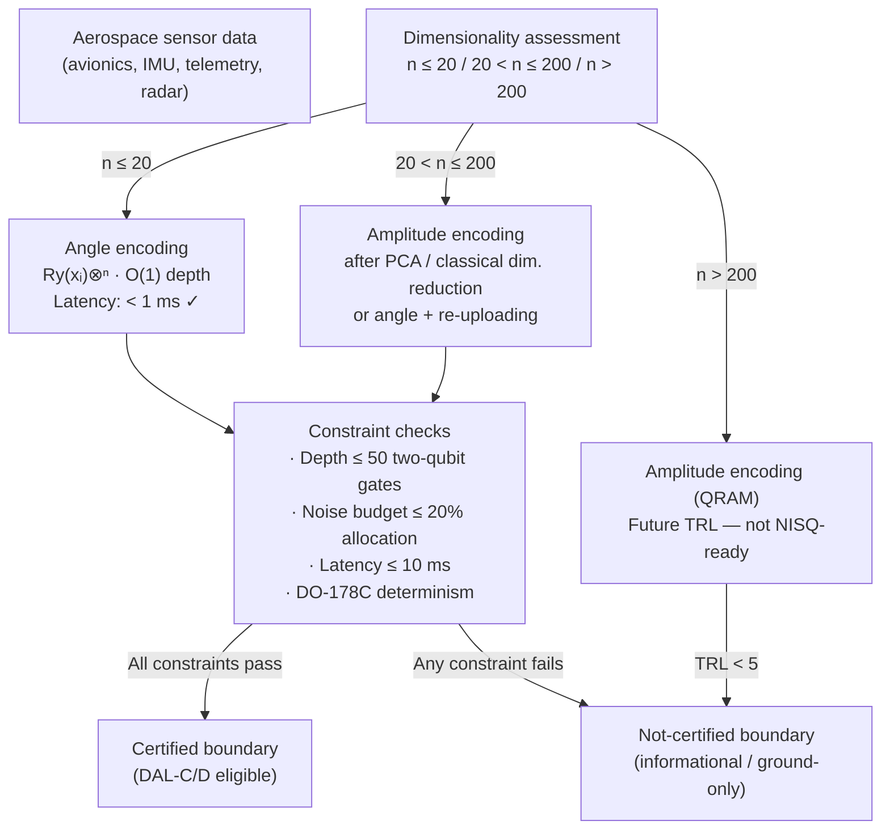

# QCSAA 910–919 · Section 01 · Subsection 911 · Subsubject 010 — Aerospace Data Embedding Boundaries

## 1. Purpose

Establishes the **aerospace-specific boundary conditions and constraints** that govern the selection and certification of quantum embedding strategies for aerospace sensor data, flight-control inputs, and predictive-maintenance feature vectors within the Q+ATLANTIDE baseline. This subsubject is the authoritative QCSAA reference for determining which embedding strategies are permissible for a given aerospace application class and for identifying the *no-certification boundary* — the set of embedding configurations that cannot yet be declared airworthy under current DO-178C / ARP4754A frameworks[^havlicek][^schuld2019].

The aerospace deployment of QML inference systems introduces constraints not present in research or commercial QML: real-time latency budgets for flight-critical inference loops, hardware noise budgets partitioned between encoding and computation circuits, strict determinism and reproducibility requirements imposed by aviation safety standards, and the need to demonstrate that an encoding circuit's output is deterministic and bounded under all operational conditions. This subsubject synthesises the technical constraints from subsubjects `004`–`009` into actionable design rules for aerospace system architects.

**Restricted band (N-006[^n006]).** This document inherits `governance_class: restricted`.

## 2. Scope

- Covers the *Aerospace Data Embedding Boundaries* subsubject (`010`) of subsection `911`.
- Inherits Q-Division authority and ORB support from the parent row in [`README.md`](./README.md)[^archtable].
- Concepts in scope:
  - **Sensor data dimensionality** — avionics QML use cases involve: (a) low-dimensional control-law features (n ≤ 20: airspeed, altitude, attitude, engine parameters) → angle encoding recommended; (b) medium-dimensional health-monitoring feature vectors (20 < n ≤ 200: vibration FFT bins, pressure time-series statistics) → angle encoding with data re-uploading or PCA-reduced amplitude encoding; (c) high-dimensional raw sensor arrays (n > 200: hyperspectral imaging, phased-array radar, structural acoustic emission) → amplitude encoding (QRAM-gated, future TRL) or classical dimensionality reduction + angle encoding.
  - **Real-time encoding latency constraints** — for flight-critical inference loops (e.g., fault detection in flight-control actuators), the total inference latency budget is typically ≤ 10 ms; the encoding circuit execution time must fit within this budget including qubit initialisation (|0⟩ reset), gate execution, and state readout; angle encoding achieves O(1) depth and is the only strategy compatible with current NISQ hardware latency budgets; amplitude encoding's O(2ⁿ) state preparation time (up to milliseconds for n=20) exceeds this budget without QRAM.
  - **Noise budget allocation** — the total hardware noise budget (expressed as maximum acceptable infidelity δ = 1 − F) must be partitioned between the encoding circuit and the downstream computation/ansatz circuit; the QCSAA convention allocates at most 20% of the total noise budget to the encoding circuit and at least 80% to the computation circuit; this allocation constrains the maximum encoding circuit depth to d_enc ≤ δ_enc / (ε_2q · n_2q) where ε_2q is the two-qubit gate error rate and n_2q is the number of two-qubit gates in the encoding circuit.
  - **NISQ depth limits for current-generation hardware** — current NISQ processors (IBM Eagle/Heron, Google Sycamore, IonQ Forte) support reliable two-qubit gate depths of approximately 10–50 before noise-induced barren plateaus dominate; angle encoding (depth ≤ 2 per layer) is well within this budget; IQP ZZFeatureMap with r=2 repetitions on n=10 qubits requires ~20 two-qubit gates, which is near the upper boundary; amplitude encoding requires hundreds to thousands of two-qubit gates and is not currently NISQ-compatible for n > 6.
  - **DO-178C alignment for embedded QML inference** — DO-178C (Software Considerations in Airborne Systems) requires software level (DAL) assignment, structural coverage criteria (MC/DC for DAL-A), and traceability from requirements to implementation; for QML inference, the encoding circuit constitutes a software artefact; the encoding function x → |φ(x)⟩ must satisfy: (1) determinism (same input x always produces the same circuit and, statistically, the same distribution of outcomes); (2) boundedness (all output states are valid unit vectors regardless of input range); (3) requirements traceability (each encoding gate is traceable to a requirements document in the evidence package).
  - **ARP4754A alignment for system-level design** — ARP4754A (Guidelines for Development of Civil Aircraft and Systems) applies to the system-level design process; the choice of embedding strategy must be documented as a design decision with failure mode and effects analysis (FMEA); the quantum hardware failure mode (decoherence, gate error) must be included in the system safety assessment.
  - **No-certification boundary** — the following embedding configurations cannot currently be certified for safety-critical (DAL-A/B) use: (a) amplitude encoding without QRAM on hardware with gate error > 10⁻³ per two-qubit gate; (b) any encoding circuit with depth > 50 two-qubit gates on current NISQ hardware; (c) trained (metric-learned) embeddings with trainable encoding parameters (insufficient determinism guarantee); (d) IQP feature maps with r > 3 repetitions on n > 15 qubits (noise-induced fidelity below safety threshold); these configurations may be used for DAL-D (informational) or ground-based analytics roles but not for airborne safety-critical inference.
  - **Permitted configurations for DAL-C/D use** — angle encoding (single layer, n ≤ 20 features, Ry gates only) on hardware with two-qubit error rate < 10⁻² and T₂ > 50 µs; basis encoding (n ≤ 20 bits) for binary fault-flag classification; IQP ZZFeatureMap (r ≤ 2, n ≤ 10) for ground-based predictive maintenance analytics (DAL-D).
- Out of scope: hardware qualification for aviation use (separate QCSAA track under `900_`), QML algorithm-level certification (see `919_Aerospace-QML-Use-Cases-and-Assurance-Boundaries`), software tool qualification, encryption of quantum communications.

## 3. Diagram — Aerospace Embedding Strategy Selection and Certification Boundary

## 4. Footprint

| Metric | Value |
|---|---|
| Architecture | `QCSAA` — Quantum Computing & Sentient Agency Architecture |
| Master range | `900–999` |
| Code range | `910-919` |
| Section | `01` — Quantum Machine Learning e IA Cuántica |
| Subsection | `911` — Quantum Feature Maps and Embeddings |
| Subsubject | `010` — Aerospace Data Embedding Boundaries |
| Primary Q-Division | Q-HPC[^qdiv] |
| Support Q-Divisions | Q-HORIZON, Q-DATAGOV |
| ORB support | ORB-PMO, ORB-LEG |
| Governance class | `restricted`[^gov] |
| Folder path | `Q+ATLANTIDE/900-999_QCSAA/910-919_Quantum-Machine-Learning-e-IA-Cuantica/911_Quantum-Feature-Maps-and-Embeddings/` |
| Document | `010_Aerospace-Data-Embedding-Boundaries.md` (this file) |
| Parent subsection | [`README.md`](./README.md) · [`000_Overview.md`](./000_Overview.md) |
| Parent architecture | [`../../README.md`](../../README.md) |
| Parent baseline | [`organization/Q+ATLANTIDE.md`](../../../../organization/Q+ATLANTIDE.md) |

## 5. References & Citations

[^baseline]: **Q+ATLANTIDE controlled baseline (v1.0.0)** — [`organization/Q+ATLANTIDE.md`](../../../../organization/Q+ATLANTIDE.md). Defines the controlled `000-999` architecture-band taxonomy and the ATLAS-1000 register subpart.

[^archtable]: **§3 — Subsubject Index (parent README)** — [`README.md` §3](./README.md#3-subsubject-index). Authoritative source for the `911` subsection row (Primary Q-Division Q-HPC).

[^qdiv]: **Q-Division authority** — Q-Divisions provide technical authority over an architecture row (Q+ATLANTIDE Note N-002). See [`organization/Q+ATLANTIDE.md` §4](../../../../organization/Q+ATLANTIDE.md#4-notes).

[^gov]: **Governance class** — `restricted` denotes documents requiring additional governance, evidence packages and access controls (rule N-006[^n006]).

[^n006]: **Note N-006 (Restricted bands)** — Quantum-related (`900-999` QCSAA) bands require additional governance, evidence packages and access controls. Templates must additionally declare `governance_class: restricted`, `evidence_package_id` and `access_control_profile`. See [`organization/Q+ATLANTIDE.md` §5.3](../../../../organization/Q+ATLANTIDE.md#53-restricted-band-templates-n-006).

[^havlicek]: **Havlíček, V., Córcoles, A. D., Temme, K., et al. (2019)** — "Supervised learning with quantum-enhanced feature spaces." *Nature*, 567, 209–212. Hardware demonstration on IBM 5-qubit processor; discusses noise sensitivity of feature map circuits in practice.

[^schuld2019]: **Schuld, M. & Killoran, N. (2019)** — "Quantum Machine Learning in Feature Hilbert Spaces." *Physical Review Letters*, 122, 040504. Encoding resource analysis and trainability considerations relevant to aerospace constraints.

[^schuld2021]: **Schuld, M. (2021)** — "Supervised quantum machine learning models are kernel methods." arXiv:2101.11020. Noise-induced barren plateau analysis underpinning the depth constraints defined here.

[^isoiec4879]: **ISO/IEC 4879:2023** — *Quantum computing — Vocabulary*. Defines quantum circuit, noise, and fidelity terms used in constraint specifications.

### Applicable standards

The following standards apply to this subsubject in addition to the cross-cutting Q+ATLANTIDE governance:

- Havlíček et al. (2019) — "Supervised learning with quantum-enhanced feature spaces"[^havlicek]
- Schuld & Killoran (2019) — "Quantum Machine Learning in Feature Hilbert Spaces"[^schuld2019]
- Schuld (2021) — "Supervised quantum machine learning models are kernel methods"[^schuld2021]
- ISO/IEC 4879:2023 — *Quantum computing — Vocabulary*[^isoiec4879]
