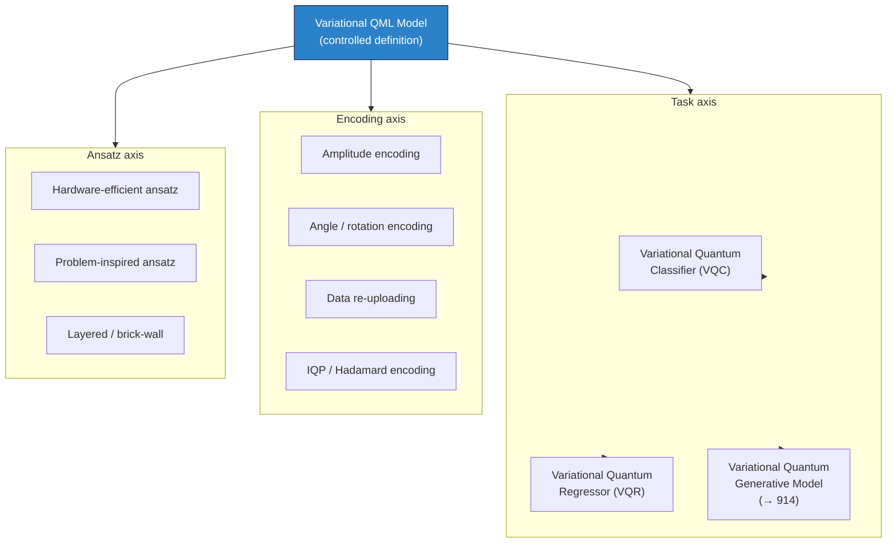

# QCSAA 910–919 · Section 01 · Subsection 912 · Subsubject 001 — Variational QML Controlled Definition

## 1. Purpose

Establishes the **controlled definition** of *Variational Quantum Machine Learning (Variational QML)* models within the Q+ATLANTIDE baseline[^baseline]. Defines the formal vocabulary — model structure, training paradigm, and taxonomy — that is binding on all downstream subsubjects (`002`–`010`), cross-subsection references within `910-919`, and aerospace-integration documents that cite variational-QML methods, in conformance with IEEE Std 7130-2023[^ieee7130] and ISO/IEC 4879:2023[^iso4879].

## 2. Scope

- Covers the *Variational QML Controlled Definition* subsubject (`001`) of subsection `912` within section `01` *Quantum Machine Learning e IA Cuántica*.
- Inherits Q-Division authority and ORB support from the parent row in [`../README.md` §3](../README.md#3-subsection-index)[^archtable].
- Concepts in scope:
  - **Variational Quantum Machine Learning model** — a hybrid classical–quantum learning model that uses a parameterized quantum circuit (PQC) as the core functional unit. The model is characterized by three components: (i) a classical or quantum data-encoding map, (ii) a variational ansatz with trainable parameters **θ**, and (iii) a classical post-processing layer that maps circuit measurement outcomes to predictions.
  - **Training paradigm** — optimization of **θ** by minimizing an empirical cost function over a training dataset using a classical optimizer, with gradient or gradient-free feedback derived from circuit evaluations; referred to as the *variational hybrid loop*.
  - **Taxonomy** — variational QML models are classified along three axes: (i) *task* (classification vs. regression vs. generative), (ii) *encoding strategy* (amplitude encoding, angle encoding, IQP, data re-uploading), and (iii) *ansatz structure* (hardware-efficient, problem-inspired, layered).
  - **Distinction from kernel methods** — variational models learn both feature map and decision boundary end-to-end via gradient descent; quantum kernel methods (`913_`) fix a quantum feature map and compute similarity in feature space without training the circuit parameters.
  - **Distinction from quantum neural networks (QNNs)** — the term "quantum neural network" is a colloquial descriptor; within this baseline the controlled term is *variational quantum classifier* (for classification tasks) or *variational quantum regressor* (for regression tasks), both instances of the broader *variational QML model* class.
  - **Hardware context** — variational QML models are the primary near-term (NISQ-era) quantum-ML paradigm; their circuit depth is constrained by coherence times and gate fidelities of current quantum hardware, distinguishing them from fault-tolerant quantum learning algorithms.
- Out of scope: detailed PQC structural definitions (`002_`), specific classifier architectures (`003_`), regression formulations (`004_`), and training-loop mechanics (`006_`).

## 3. Diagram — Variational QML Model Taxonomy

## 4. Footprint

| Metric | Value |
|---|---|
| Architecture | `QCSAA` — Quantum Computing & Sentient Agency Architecture |
| Master range | `900–999` |
| Code range | `910-919` |
| Section | `01` — Quantum Machine Learning e IA Cuántica |
| Subsection | `912` — Variational Quantum Classifiers and Regressors |
| Subsubject | `001` — Variational QML Controlled Definition |
| Primary Q-Division | Q-HPC[^qdiv] |
| Support Q-Divisions | Q-HORIZON, Q-DATAGOV |
| ORB support | ORB-PMO, ORB-LEG |
| Governance class | `restricted`[^gov] |
| Evidence package | `EP-QCSAA-912-001` |
| Access control profile | `ACP-QCSAA-RESTRICTED` |
| Folder path | `Q+ATLANTIDE/900-999_QCSAA/910-919_Quantum-Machine-Learning-e-IA-Cuantica/912_Variational-Quantum-Classifiers-and-Regressors/` |
| Document | `001_Variational-QML-Controlled-Definition.md` (this file) |
| Parent subsection | [`README.md`](./README.md) · [`000_Overview.md`](./000_Overview.md) |
| Parent architecture | [`../../README.md`](../../README.md) |
| Parent baseline | [`organization/Q+ATLANTIDE.md`](../../../../organization/Q+ATLANTIDE.md) |

## 5. References & Citations

[^baseline]: **Q+ATLANTIDE controlled baseline (v1.0.0)** — [`organization/Q+ATLANTIDE.md`](../../../../organization/Q+ATLANTIDE.md). Defines the controlled `000-999` architecture-band taxonomy and the ATLAS-1000 register subpart.

[^archtable]: **QCSAA §3 Subsection Index** — [`../README.md` §3](../README.md#3-subsection-index). Authoritative source for the `910-919` subsection listing and Q-Division authority.

[^qdiv]: **Q-Division authority** — Q-Divisions provide technical authority over an architecture row (Q+ATLANTIDE Note N-002). See [`organization/Q+ATLANTIDE.md` §4](../../../../organization/Q+ATLANTIDE.md#4-notes).

[^gov]: **Governance class** — `restricted` denotes documents requiring additional governance, evidence packages and access controls (rule N-006). See [`organization/Q+ATLANTIDE.md` §5.3](../../../../organization/Q+ATLANTIDE.md#53-restricted-band-templates-n-006).

[^ieee7130]: **IEEE Std 7130-2023 — IEEE Standard for Quantum Computing Definitions** — Establishes the controlled vocabulary for quantum computing terms; basis for the formal variational-QML definitions in this document.

[^iso4879]: **ISO/IEC 4879:2023 — Quantum computing — Terminology and vocabulary** — International standard providing foundational quantum-computing definitions aligned with IEEE Std 7130; co-normative for controlled terms used in this subsubject.

### Applicable standards

The following standards apply to this subsubject in addition to the cross-cutting Q+ATLANTIDE governance:

- IEEE Std 7130-2023 — IEEE Standard for Quantum Computing Definitions[^ieee7130]
- ISO/IEC 4879:2023 — Quantum computing — Terminology and vocabulary[^iso4879]
