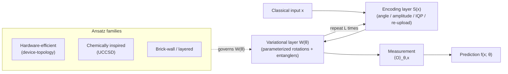

# QCSAA 910–919 · Section 01 · Subsection 912 · Subsubject 002 — Parameterized Quantum Circuits

## 1. Purpose

Defines the **Parameterized Quantum Circuit (PQC)** — the fundamental computational structure underlying all variational QML models defined in this subsection. Establishes the formal PQC model, canonical ansatz families, encoding layer types, structural quality metrics (expressibility and entanglement capacity), and the relationship between PQC design choices and downstream trainability, in conformance with the circuit vocabulary of `902_Circuits/`[^circuits902] and the definitions in IEEE Std 7130-2023[^ieee7130] and ISO/IEC 4879:2023[^iso4879]. This vocabulary is the foundational reference for classifier (`003_`), regressor (`004_`), and gradient-estimation (`007_`) subsubjects.

## 2. Scope

- Covers the *Parameterized Quantum Circuits* subsubject (`002`) of subsection `912` within section `01` *Quantum Machine Learning e IA Cuántica*.
- Inherits Q-Division authority and ORB support from the parent row in [`../README.md` §3](../README.md#3-subsection-index)[^archtable].
- Concepts in scope:
  - **PQC formal model** — a quantum circuit `U(θ, x)` parameterized by a trainable parameter vector **θ** ∈ ℝᵖ and optionally by classical input data **x**; the output is a quantum state or set of measurement expectation values that depend continuously and differentiably on **θ**.
  - **Encoding layers** — the sub-circuit `S(x)` that embeds classical input data into the quantum state: *angle encoding* (Rx/Ry/Rz rotations proportional to feature values), *amplitude encoding* (normalized amplitudes), *IQP encoding* (Hadamard + diagonal phase gates), and *data re-uploading* (repeated `S(x)` interleaved with variational layers).
  - **Variational layers (ansatz)** — the trainable sub-circuit `W(θ)` composed of parameterized rotation gates and fixed entangling gates; canonical families: (i) *hardware-efficient ansatz* (alternating Ry/Rz layers with CNOT entanglers matching device topology), (ii) *chemically inspired ansatz* (UCCSD excitation operators), (iii) *brick-wall / layered ansatz* (uniform two-qubit layers with fixed connectivity).
  - **Expressibility** — a metric quantifying how uniformly a PQC can approximate the space of unitaries (Haar measure); high expressibility correlates with increased trainability risk (barren plateaus, see `008_`).
  - **Entanglement capacity** — a metric quantifying the average entanglement generated by the PQC across parameter space; key design lever for classifier capacity vs. trainability trade-off.
  - **Circuit depth and width constraints** — NISQ hardware imposes maximum circuit depth (coherence budget) and qubit count (connectivity); PQC design must respect these budgets per the resource-estimation framework in `918_`.
  - **Layered structure** — a PQC is typically structured as L layers, each composed of an encoding block and a variational block; layer count L is a primary hyperparameter controlling expressibility.
- Out of scope: specific classifier (`003_`) and regressor (`004_`) architectures built from PQCs, loss-function definitions (`005_`), and gradient computation rules (`007_`).

## 3. Diagram — PQC Structure

## 4. Footprint

| Metric | Value |
|---|---|
| Architecture | `QCSAA` — Quantum Computing & Sentient Agency Architecture |
| Master range | `900–999` |
| Code range | `910-919` |
| Section | `01` — Quantum Machine Learning e IA Cuántica |
| Subsection | `912` — Variational Quantum Classifiers and Regressors |
| Subsubject | `002` — Parameterized Quantum Circuits |
| Primary Q-Division | Q-HPC[^qdiv] |
| Support Q-Divisions | Q-HORIZON, Q-DATAGOV |
| ORB support | ORB-PMO, ORB-LEG |
| Governance class | `restricted`[^gov] |
| Evidence package | `EP-QCSAA-912-001` |
| Access control profile | `ACP-QCSAA-RESTRICTED` |
| Folder path | `Q+ATLANTIDE/900-999_QCSAA/910-919_Quantum-Machine-Learning-e-IA-Cuantica/912_Variational-Quantum-Classifiers-and-Regressors/` |
| Document | `002_Parameterized-Quantum-Circuits.md` (this file) |
| Parent subsection | [`README.md`](./README.md) · [`000_Overview.md`](./000_Overview.md) |
| Parent architecture | [`../../README.md`](../../README.md) |
| Parent baseline | [`organization/Q+ATLANTIDE.md`](../../../../organization/Q+ATLANTIDE.md) |

## 5. References & Citations

[^baseline]: **Q+ATLANTIDE controlled baseline (v1.0.0)** — [`organization/Q+ATLANTIDE.md`](../../../../organization/Q+ATLANTIDE.md). Defines the controlled `000-999` architecture-band taxonomy and the ATLAS-1000 register subpart.

[^archtable]: **QCSAA §3 Subsection Index** — [`../README.md` §3](../README.md#3-subsection-index). Authoritative source for the `910-919` subsection listing and Q-Division authority.

[^qdiv]: **Q-Division authority** — Q-Divisions provide technical authority over an architecture row (Q+ATLANTIDE Note N-002). See [`organization/Q+ATLANTIDE.md` §4](../../../../organization/Q+ATLANTIDE.md#4-notes).

[^gov]: **Governance class** — `restricted` denotes documents requiring additional governance, evidence packages and access controls (rule N-006). See [`organization/Q+ATLANTIDE.md` §5.3](../../../../organization/Q+ATLANTIDE.md#53-restricted-band-templates-n-006).

[^ieee7130]: **IEEE Std 7130-2023 — IEEE Standard for Quantum Computing Definitions** — Establishes the controlled vocabulary for quantum circuits and gates; normative basis for PQC formal model terminology in this document.

[^iso4879]: **ISO/IEC 4879:2023 — Quantum computing — Terminology and vocabulary** — International standard for foundational quantum-computing concepts; co-normative for PQC terminology.

[^circuits902]: **QCSAA 900-909 · 902 — Circuits** — [`../../../900-909_Fundamentos-de-Computacion-Cuantica/902_Circuits/README.md`](../../../900-909_Fundamentos-de-Computacion-Cuantica/902_Circuits/README.md). Foundational quantum-circuit vocabulary upon which the PQC model defined here is built; in particular, gate composition, circuit depth/width metrics, and NISQ-era noise-resilient patterns.

### Applicable standards

The following standards apply to this subsubject in addition to the cross-cutting Q+ATLANTIDE governance:

- IEEE Std 7130-2023 — IEEE Standard for Quantum Computing Definitions[^ieee7130]
- ISO/IEC 4879:2023 — Quantum computing — Terminology and vocabulary[^iso4879]
