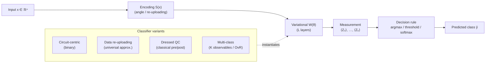

# QCSAA 910–919 · Section 01 · Subsection 912 · Subsubject 003 — Variational Quantum Classifiers

## 1. Purpose

Defines the **Variational Quantum Classifier (VQC)** — a supervised learning model that uses a parameterized quantum circuit (PQC, defined in `002_`) to map input data to class labels. Specifies canonical VQC architectures, measurement-based decision rules, multi-class extension strategies, and the relationship to hybrid classical post-processing, in conformance with the controlled definitions of `001_`[^def001] and IEEE Std 7130-2023[^ieee7130]. This vocabulary governs the classifier-architecture specifications referenced by hybrid neural-network subsection `916_` and by the aerospace-integration subsubject `010_`.

## 2. Scope

- Covers the *Variational Quantum Classifiers* subsubject (`003`) of subsection `912` within section `01` *Quantum Machine Learning e IA Cuántica*.
- Inherits Q-Division authority and ORB support from the parent row in [`../README.md` §3](../README.md#3-subsection-index)[^archtable].
- Concepts in scope:
  - **Circuit-centric classifier** — the canonical VQC architecture: input features encoded via an angle-encoding layer `S(x)`, followed by L variational layers `W(θ)`, terminated by a single-qubit Pauli-Z measurement; binary classification decision: sign(⟨Z⟩_θ,x).
  - **Data re-uploading classifier** — a VQC variant in which the encoding layer `S(x)` is repeated between each variational layer, enabling the circuit to approximate arbitrary functions of the input (universal function approximation in the single-qubit limit); particularly suited to low-qubit-count NISQ devices.
  - **Dressed quantum circuit (DQC)** — a VQC augmented with trainable classical pre- and post-processing layers (linear or nonlinear); the quantum circuit acts as a parameterized feature extractor between two classical processing stages.
  - **Measurement-based decision rule** — mapping from expectation values ⟨O₁⟩, …, ⟨Oₖ⟩ (one per class or qubit) to a class label; strategies: argmax over expectation values, threshold on a single observable, softmax over multiple observables.
  - **Multi-class extension** — binary VQC extended to K classes via: (i) one-vs-rest (K independent binary VQCs), (ii) multi-observable measurement (K observables on distinct qubits), or (iii) amplitude-based multi-class readout.
  - **Capacity and generalization** — VQC generalization bounds derived from Rademacher complexity and covering-number arguments; relationship between PQC expressibility (from `002_`) and generalization gap.
  - **NISQ-era constraints** — VQC circuit depth must respect device coherence budgets; shallow-depth VQCs favour hardware-efficient ansatz families and local measurement operators to avoid barren plateaus (`008_`).
- Out of scope: regression formulations (`004_`), loss-function detailed treatment (`005_`), and gradient computation (`007_`).

## 3. Diagram — VQC Architecture

## 4. Footprint

| Metric | Value |
|---|---|
| Architecture | `QCSAA` — Quantum Computing & Sentient Agency Architecture |
| Master range | `900–999` |
| Code range | `910-919` |
| Section | `01` — Quantum Machine Learning e IA Cuántica |
| Subsection | `912` — Variational Quantum Classifiers and Regressors |
| Subsubject | `003` — Variational Quantum Classifiers |
| Primary Q-Division | Q-HPC[^qdiv] |
| Support Q-Divisions | Q-HORIZON, Q-DATAGOV |
| ORB support | ORB-PMO, ORB-LEG |
| Governance class | `restricted`[^gov] |
| Evidence package | `EP-QCSAA-912-001` |
| Access control profile | `ACP-QCSAA-RESTRICTED` |
| Folder path | `Q+ATLANTIDE/900-999_QCSAA/910-919_Quantum-Machine-Learning-e-IA-Cuantica/912_Variational-Quantum-Classifiers-and-Regressors/` |
| Document | `003_Variational-Quantum-Classifiers.md` (this file) |
| Parent subsection | [`README.md`](./README.md) · [`000_Overview.md`](./000_Overview.md) |
| Parent architecture | [`../../README.md`](../../README.md) |
| Parent baseline | [`organization/Q+ATLANTIDE.md`](../../../../organization/Q+ATLANTIDE.md) |

## 5. References & Citations

[^baseline]: **Q+ATLANTIDE controlled baseline (v1.0.0)** — [`organization/Q+ATLANTIDE.md`](../../../../organization/Q+ATLANTIDE.md). Defines the controlled `000-999` architecture-band taxonomy and the ATLAS-1000 register subpart.

[^archtable]: **QCSAA §3 Subsection Index** — [`../README.md` §3](../README.md#3-subsection-index). Authoritative source for the `910-919` subsection listing and Q-Division authority.

[^qdiv]: **Q-Division authority** — Q-Divisions provide technical authority over an architecture row (Q+ATLANTIDE Note N-002). See [`organization/Q+ATLANTIDE.md` §4](../../../../organization/Q+ATLANTIDE.md#4-notes).

[^gov]: **Governance class** — `restricted` denotes documents requiring additional governance, evidence packages and access controls (rule N-006). See [`organization/Q+ATLANTIDE.md` §5.3](../../../../organization/Q+ATLANTIDE.md#53-restricted-band-templates-n-006).

[^def001]: **912.001 — Variational QML Controlled Definition** — [`./001_Variational-QML-Controlled-Definition.md`](./001_Variational-QML-Controlled-Definition.md). Provides the binding controlled definition of variational QML models from which VQC is derived.

[^ieee7130]: **IEEE Std 7130-2023 — IEEE Standard for Quantum Computing Definitions** — Normative vocabulary for quantum circuit and measurement terminology used in VQC architecture definitions.

[^iso4879]: **ISO/IEC 4879:2023 — Quantum computing — Terminology and vocabulary** — Co-normative international standard for foundational quantum-computing concepts.

### Applicable standards

The following standards apply to this subsubject in addition to the cross-cutting Q+ATLANTIDE governance:

- IEEE Std 7130-2023 — IEEE Standard for Quantum Computing Definitions[^ieee7130]
- ISO/IEC 4879:2023 — Quantum computing — Terminology and vocabulary[^iso4879]
