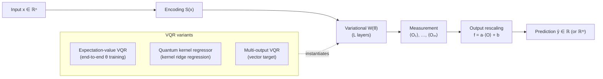

# QCSAA 910–919 · Section 01 · Subsection 912 · Subsubject 004 — Variational Quantum Regressors

## 1. Purpose

Defines the **Variational Quantum Regressor (VQR)** — a supervised learning model that uses a parameterized quantum circuit (PQC, defined in `002_`) to map input data to continuous-valued outputs. Specifies VQR architectures, expectation-value output formulations, loss-function choices for regression tasks (detailed in `005_`), and the relationship to quantum kernel regressors, in conformance with the controlled definitions of `001_`[^def001] and IEEE Std 7130-2023[^ieee7130]. This vocabulary governs VQR-based aerospace prediction models referenced in the assurance-boundary subsubject `010_`.

## 2. Scope

- Covers the *Variational Quantum Regressors* subsubject (`004`) of subsection `912` within section `01` *Quantum Machine Learning e IA Cuántica*.
- Inherits Q-Division authority and ORB support from the parent row in [`../README.md` §3](../README.md#3-subsection-index)[^archtable].
- Concepts in scope:
  - **Expectation-value regressor** — the canonical VQR model: PQC `U(θ, x)` applied to |0⟩, followed by measurement of one or more observables {O₁, …, Oₘ}; the output prediction is a continuous function f(x; θ) = ⟨O₁⟩_θ,x (single output) or a vector (multi-output regression).
  - **Observable design** — choice of measurement operator O determines the output range and sensitivity; common choices: single-qubit Pauli-Z (range [−1, 1]), sum of single-qubit Pauli-Z operators (range [−n, n]), and classical linear recombination of multiple qubit expectations.
  - **Output rescaling** — linear affine map from raw expectation value(s) to target output range; parameters may be fixed (hand-tuned) or learned as classical parameters appended to **θ**.
  - **Quantum kernel regressor** — a VQR variant in which the PQC implements a quantum feature map φ(x) and regression is performed via kernel ridge regression in feature space (k(x, x′) = |⟨φ(x)|φ(x′)⟩|²); the circuit is not trained end-to-end but the kernel matrix is estimated from circuit evaluations.
  - **Multi-output VQR** — regression over a vector-valued target using multiple observables; entanglement structure in the PQC enables correlations between output components.
  - **Expressive capacity for regression** — VQR function approximation is constrained by the Fourier frequency content of the PQC output (data-encoding structure determines the accessible frequency spectrum); angle-encoded PQCs generate trigonometric polynomials in input features.
  - **NISQ constraints** — same depth/width budget as VQC; shot noise in expectation-value estimates introduces additive regression error; mitigation via increased shot count or error-mitigation techniques (`008_`).
- Out of scope: classification decision rules (`003_`), loss-function treatment (`005_`), and gradient computation rules (`007_`).

## 3. Diagram — VQR Architecture

## 4. Footprint

| Metric | Value |
|---|---|
| Architecture | `QCSAA` — Quantum Computing & Sentient Agency Architecture |
| Master range | `900–999` |
| Code range | `910-919` |
| Section | `01` — Quantum Machine Learning e IA Cuántica |
| Subsection | `912` — Variational Quantum Classifiers and Regressors |
| Subsubject | `004` — Variational Quantum Regressors |
| Primary Q-Division | Q-HPC[^qdiv] |
| Support Q-Divisions | Q-HORIZON, Q-DATAGOV |
| ORB support | ORB-PMO, ORB-LEG |
| Governance class | `restricted`[^gov] |
| Evidence package | `EP-QCSAA-912-001` |
| Access control profile | `ACP-QCSAA-RESTRICTED` |
| Folder path | `Q+ATLANTIDE/900-999_QCSAA/910-919_Quantum-Machine-Learning-e-IA-Cuantica/912_Variational-Quantum-Classifiers-and-Regressors/` |
| Document | `004_Variational-Quantum-Regressors.md` (this file) |
| Parent subsection | [`README.md`](./README.md) · [`000_Overview.md`](./000_Overview.md) |
| Parent architecture | [`../../README.md`](../../README.md) |
| Parent baseline | [`organization/Q+ATLANTIDE.md`](../../../../organization/Q+ATLANTIDE.md) |

## 5. References & Citations

[^baseline]: **Q+ATLANTIDE controlled baseline (v1.0.0)** — [`organization/Q+ATLANTIDE.md`](../../../../organization/Q+ATLANTIDE.md). Defines the controlled `000-999` architecture-band taxonomy and the ATLAS-1000 register subpart.

[^archtable]: **QCSAA §3 Subsection Index** — [`../README.md` §3](../README.md#3-subsection-index). Authoritative source for the `910-919` subsection listing and Q-Division authority.

[^qdiv]: **Q-Division authority** — Q-Divisions provide technical authority over an architecture row (Q+ATLANTIDE Note N-002). See [`organization/Q+ATLANTIDE.md` §4](../../../../organization/Q+ATLANTIDE.md#4-notes).

[^gov]: **Governance class** — `restricted` denotes documents requiring additional governance, evidence packages and access controls (rule N-006). See [`organization/Q+ATLANTIDE.md` §5.3](../../../../organization/Q+ATLANTIDE.md#53-restricted-band-templates-n-006).

[^def001]: **912.001 — Variational QML Controlled Definition** — [`./001_Variational-QML-Controlled-Definition.md`](./001_Variational-QML-Controlled-Definition.md). Provides the binding controlled definition of variational QML models from which VQR is derived.

[^ieee7130]: **IEEE Std 7130-2023 — IEEE Standard for Quantum Computing Definitions** — Normative vocabulary for quantum circuit and measurement terminology used in VQR architecture definitions.

[^iso4879]: **ISO/IEC 4879:2023 — Quantum computing — Terminology and vocabulary** — Co-normative international standard for foundational quantum-computing concepts.

### Applicable standards

The following standards apply to this subsubject in addition to the cross-cutting Q+ATLANTIDE governance:

- IEEE Std 7130-2023 — IEEE Standard for Quantum Computing Definitions[^ieee7130]
- ISO/IEC 4879:2023 — Quantum computing — Terminology and vocabulary[^iso4879]
