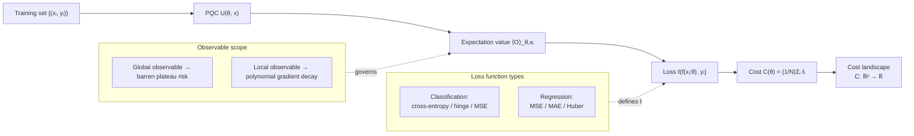

# QCSAA 910–919 · Section 01 · Subsection 912 · Subsubject 005 — Loss Functions and Cost Landscapes

## 1. Purpose

Defines the **loss functions** and **cost landscapes** used to train variational quantum classifiers and regressors within the Q+ATLANTIDE baseline[^baseline]. Establishes the controlled vocabulary for global and local cost functions, their quantum-circuit representations, shot-noise impact, and cost-landscape geometry including flat-region characterisation and its connection to barren plateaus (`008_`). This vocabulary is the foundational input to the optimizer and training-loop definitions in `006_`.

## 2. Scope

- Covers the *Loss Functions and Cost Landscapes* subsubject (`005`) of subsection `912` within section `01` *Quantum Machine Learning e IA Cuántica*.
- Inherits Q-Division authority and ORB support from the parent row in [`../README.md` §3](../README.md#3-subsection-index)[^archtable].
- Concepts in scope:
  - **Classification loss functions** — cross-entropy loss (log-loss) applied to softmax-normalized expectation-value outputs; hinge loss for margin-based classifiers; mean-squared error (MSE) loss for label-probability matching; all expressed as C(θ) = (1/N) Σᵢ ℓ(f(xᵢ; θ), yᵢ) over training set {(xᵢ, yᵢ)}.
  - **Regression loss functions** — MSE: C(θ) = (1/N) Σᵢ (f(xᵢ; θ) − yᵢ)²; mean absolute error (MAE); Huber loss for outlier-robust regression; all defined over expectation-value outputs.
  - **Global cost functions** — cost defined using a global observable (e.g., multi-qubit parity operator) whose gradients vanish exponentially with system size; strongly correlated with barren plateaus (`008_`); to be avoided in large-qubit NISQ settings.
  - **Local cost functions** — cost defined using local single-qubit or small-subsystem observables; gradient magnitude decreases at most polynomially with system size; preferred for trainable NISQ circuits.
  - **Shot-noise impact** — each cost-function evaluation requires a finite number of measurement shots; shot noise introduces a stochastic error of order O(1/√S) in the cost estimate where S is the shot count; affects gradient precision (see `007_`) and convergence rate.
  - **Cost landscape geometry** — the parameter-space surface C(θ): ℝᵖ → ℝ; characterised by number and depth of local minima, saddle points, and flat regions; PQC expressibility (from `002_`) correlates with landscape complexity.
  - **Flat regions and barren plateaus** — regions where ‖∇C(θ)‖ ≈ 0 exponentially; preliminary detection via gradient-norm monitoring; causal analysis deferred to `008_`.
- Out of scope: optimizer algorithms (`006_`) and barren-plateau mitigation strategies (`008_`).

## 3. Diagram — Cost Function and Landscape

## 4. Footprint

| Metric | Value |
|---|---|
| Architecture | `QCSAA` — Quantum Computing & Sentient Agency Architecture |
| Master range | `900–999` |
| Code range | `910-919` |
| Section | `01` — Quantum Machine Learning e IA Cuántica |
| Subsection | `912` — Variational Quantum Classifiers and Regressors |
| Subsubject | `005` — Loss Functions and Cost Landscapes |
| Primary Q-Division | Q-HPC[^qdiv] |
| Support Q-Divisions | Q-HORIZON, Q-DATAGOV |
| ORB support | ORB-PMO, ORB-LEG |
| Governance class | `restricted`[^gov] |
| Evidence package | `EP-QCSAA-912-001` |
| Access control profile | `ACP-QCSAA-RESTRICTED` |
| Folder path | `Q+ATLANTIDE/900-999_QCSAA/910-919_Quantum-Machine-Learning-e-IA-Cuantica/912_Variational-Quantum-Classifiers-and-Regressors/` |
| Document | `005_Loss-Functions-and-Cost-Landscapes.md` (this file) |
| Parent subsection | [`README.md`](./README.md) · [`000_Overview.md`](./000_Overview.md) |
| Parent architecture | [`../../README.md`](../../README.md) |
| Parent baseline | [`organization/Q+ATLANTIDE.md`](../../../../organization/Q+ATLANTIDE.md) |

## 5. References & Citations

[^baseline]: **Q+ATLANTIDE controlled baseline (v1.0.0)** — [`organization/Q+ATLANTIDE.md`](../../../../organization/Q+ATLANTIDE.md). Defines the controlled `000-999` architecture-band taxonomy and the ATLAS-1000 register subpart.

[^archtable]: **QCSAA §3 Subsection Index** — [`../README.md` §3](../README.md#3-subsection-index). Authoritative source for the `910-919` subsection listing and Q-Division authority.

[^qdiv]: **Q-Division authority** — Q-Divisions provide technical authority over an architecture row (Q+ATLANTIDE Note N-002). See [`organization/Q+ATLANTIDE.md` §4](../../../../organization/Q+ATLANTIDE.md#4-notes).

[^gov]: **Governance class** — `restricted` denotes documents requiring additional governance, evidence packages and access controls (rule N-006). See [`organization/Q+ATLANTIDE.md` §5.3](../../../../organization/Q+ATLANTIDE.md#53-restricted-band-templates-n-006).

[^ieee7130]: **IEEE Std 7130-2023 — IEEE Standard for Quantum Computing Definitions** — Normative vocabulary for quantum measurement and expectation-value terminology used throughout this document.

[^iso4879]: **ISO/IEC 4879:2023 — Quantum computing — Terminology and vocabulary** — Co-normative international standard for foundational quantum-computing concepts.

### Applicable standards

The following standards apply to this subsubject in addition to the cross-cutting Q+ATLANTIDE governance:

- IEEE Std 7130-2023 — IEEE Standard for Quantum Computing Definitions[^ieee7130]
- ISO/IEC 4879:2023 — Quantum computing — Terminology and vocabulary[^iso4879]
