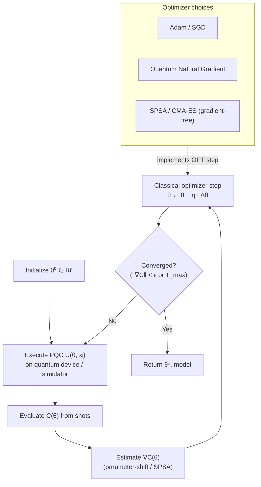

# QCSAA 910–919 · Section 01 · Subsection 912 · Subsubject 006 — Optimizers and Training Loops

## 1. Purpose

Defines the **optimizers** and **training loop** architecture used to minimize the cost function (defined in `005_`) over the variational parameter vector **θ** of a variational QML model. Establishes the controlled vocabulary for gradient-based and gradient-free classical optimizers, the hybrid classical–quantum training loop structure, convergence criteria, and hyperparameter selection guidelines, within the Q+ATLANTIDE baseline[^baseline]. This vocabulary is the operational context for gradient-estimation methods defined in `007_` and for trainability constraints in `008_`.

## 2. Scope

- Covers the *Optimizers and Training Loops* subsubject (`006`) of subsection `912` within section `01` *Quantum Machine Learning e IA Cuántica*.
- Inherits Q-Division authority and ORB support from the parent row in [`../README.md` §3](../README.md#3-subsection-index)[^archtable].
- Concepts in scope:
  - **Hybrid classical–quantum training loop** — the iterative procedure: (1) evaluate cost C(θ) on quantum hardware/simulator via circuit execution; (2) estimate gradient ∇C(θ) (gradient-based path) or evaluate cost at probe points (gradient-free path); (3) update **θ** with classical optimizer; (4) check convergence; repeat until convergence or resource budget exhaustion.
  - **Gradient-based optimizers** — *Gradient Descent* (vanilla GD, step size η); *Adam* (adaptive moment estimation, momentum β₁ and variance β₂); *Quantum Natural Gradient (QNG)* (preconditioned by the quantum Fisher information matrix / Fubini-Study metric, mitigates ill-conditioning of PQC parameter space).
  - **Gradient-free optimizers** — *SPSA* (Simultaneous Perturbation Stochastic Approximation, uses two cost evaluations per update; efficient on noisy hardware); *Nelder–Mead* simplex; *CMA-ES* (Covariance Matrix Adaptation Evolution Strategy, suitable for moderate-dimension problems ≲50 parameters).
  - **Learning-rate schedules** — constant, step-decay, cosine annealing; learning-rate warm-up for Adam with noisy gradients.
  - **Mini-batch training** — cost estimated over a subset of training data per iteration to reduce circuit evaluations; mini-batch size is a hyperparameter trading off gradient variance vs. evaluation cost.
  - **Convergence criteria** — gradient-norm threshold ‖∇C‖ < ε_g; cost plateau detection (change in C over a window of iterations < ε_c); maximum-iteration budget T_max; all three criteria are checked and the run terminates on first trigger.
  - **Hyperparameter selection** — learning rate η, optimizer-specific parameters (β₁, β₂ for Adam; perturbation magnitude for SPSA), number of layers L (PQC depth), number of shots S per cost evaluation; selection via grid search, random search, or Bayesian optimisation over a held-out validation set.
- Out of scope: gradient estimation mechanics (`007_`), barren-plateau effects on optimizer behaviour (`008_`), and benchmarking protocols (`009_`).

## 3. Diagram — Hybrid Classical–Quantum Training Loop

## 4. Footprint

| Metric | Value |
|---|---|
| Architecture | `QCSAA` — Quantum Computing & Sentient Agency Architecture |
| Master range | `900–999` |
| Code range | `910-919` |
| Section | `01` — Quantum Machine Learning e IA Cuántica |
| Subsection | `912` — Variational Quantum Classifiers and Regressors |
| Subsubject | `006` — Optimizers and Training Loops |
| Primary Q-Division | Q-HPC[^qdiv] |
| Support Q-Divisions | Q-HORIZON, Q-DATAGOV |
| ORB support | ORB-PMO, ORB-LEG |
| Governance class | `restricted`[^gov] |
| Evidence package | `EP-QCSAA-912-001` |
| Access control profile | `ACP-QCSAA-RESTRICTED` |
| Folder path | `Q+ATLANTIDE/900-999_QCSAA/910-919_Quantum-Machine-Learning-e-IA-Cuantica/912_Variational-Quantum-Classifiers-and-Regressors/` |
| Document | `006_Optimizers-and-Training-Loops.md` (this file) |
| Parent subsection | [`README.md`](./README.md) · [`000_Overview.md`](./000_Overview.md) |
| Parent architecture | [`../../README.md`](../../README.md) |
| Parent baseline | [`organization/Q+ATLANTIDE.md`](../../../../organization/Q+ATLANTIDE.md) |

## 5. References & Citations

[^baseline]: **Q+ATLANTIDE controlled baseline (v1.0.0)** — [`organization/Q+ATLANTIDE.md`](../../../../organization/Q+ATLANTIDE.md). Defines the controlled `000-999` architecture-band taxonomy and the ATLAS-1000 register subpart.

[^archtable]: **QCSAA §3 Subsection Index** — [`../README.md` §3](../README.md#3-subsection-index). Authoritative source for the `910-919` subsection listing and Q-Division authority.

[^qdiv]: **Q-Division authority** — Q-Divisions provide technical authority over an architecture row (Q+ATLANTIDE Note N-002). See [`organization/Q+ATLANTIDE.md` §4](../../../../organization/Q+ATLANTIDE.md#4-notes).

[^gov]: **Governance class** — `restricted` denotes documents requiring additional governance, evidence packages and access controls (rule N-006). See [`organization/Q+ATLANTIDE.md` §5.3](../../../../organization/Q+ATLANTIDE.md#53-restricted-band-templates-n-006).

[^ieee7130]: **IEEE Std 7130-2023 — IEEE Standard for Quantum Computing Definitions** — Normative vocabulary for quantum circuit and expectation-value terminology relevant to training loop execution.

[^iso4879]: **ISO/IEC 4879:2023 — Quantum computing — Terminology and vocabulary** — Co-normative international standard for foundational quantum-computing concepts.

### Applicable standards

The following standards apply to this subsubject in addition to the cross-cutting Q+ATLANTIDE governance:

- IEEE Std 7130-2023 — IEEE Standard for Quantum Computing Definitions[^ieee7130]
- ISO/IEC 4879:2023 — Quantum computing — Terminology and vocabulary[^iso4879]
