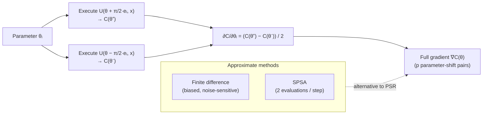

# QCSAA 910–919 · Section 01 · Subsection 912 · Subsubject 007 — Gradient Estimation and Parameter Shift

## 1. Purpose

Defines the **parameter-shift rule** and associated **gradient-estimation** methods for variational quantum circuits, establishing the controlled vocabulary for exact and approximate gradient computation on quantum hardware within the Q+ATLANTIDE baseline[^baseline]. Covers the standard parameter-shift rule, higher-order generalizations, finite-difference and SPSA approximations, and the impact of hardware noise and shot noise on gradient estimate quality. These methods provide the ∇C(θ) input required by gradient-based optimizers in `006_`, and their noise sensitivity directly informs the trainability analysis in `008_`.

## 2. Scope

- Covers the *Gradient Estimation and Parameter Shift* subsubject (`007`) of subsection `912` within section `01` *Quantum Machine Learning e IA Cuántica*.
- Inherits Q-Division authority and ORB support from the parent row in [`../README.md` §3](../README.md#3-subsection-index)[^archtable].
- Concepts in scope:
  - **Parameter-shift rule (PSR)** — for a PQC gate of the form `exp(−i θ G/2)` (G a Hermitian generator with eigenvalues ±r), the exact partial derivative is: ∂C/∂θ = r · [C(θ + π/(2r)) − C(θ − π/(2r))]; for Pauli generators G with r = 1/2, the standard shift is ±π/2. The PSR enables exact gradient evaluation using only two additional circuit executions per parameter per cost-function term.
  - **Generalized PSR** — extension to gates with generators having more than two eigenvalue gaps; computes gradients using O(d) circuit evaluations where d is the number of distinct eigenvalue gaps of the generator.
  - **Higher-order parameter-shift rules** — computation of Hessian entries (∂²C/∂θᵢ∂θⱼ) using four-point PSR; required for second-order optimizers (e.g., Quantum Natural Gradient metric tensor estimation).
  - **Finite-difference gradient** — ∂C/∂θ ≈ [C(θ + ε eᵢ) − C(θ − ε eᵢ)] / (2ε); biased estimator (truncation error O(ε²)) subject to shot noise amplification for small ε; used only when PSR is inapplicable (non-shift-rule gates).
  - **SPSA gradient** — Simultaneous Perturbation Stochastic Approximation: perturbs all parameters simultaneously with a random Bernoulli vector Δ; two circuit evaluations yield a gradient estimate; unbiased in expectation; preferred on noisy hardware for gradient-free regime.
  - **Shot-noise impact on gradients** — each PSR term estimated from S shots has variance O(1/S); gradient variance scales as O(p/S) for p parameters; minimum shot count S_min = O(p/ε²) to achieve gradient precision ε.
  - **Hardware-noise impact** — coherent and incoherent gate errors introduce a systematic bias in expectation-value estimates; this bias propagates to gradient estimates and may cause the optimizer to converge to noise-induced spurious minima; mitigation via zero-noise extrapolation (ZNE) applied to each PSR circuit pair.
- Out of scope: optimizer update rules (`006_`) and barren-plateau root-cause analysis (`008_`).

## 3. Diagram — Parameter-Shift Rule

## 4. Footprint

| Metric | Value |
|---|---|
| Architecture | `QCSAA` — Quantum Computing & Sentient Agency Architecture |
| Master range | `900–999` |
| Code range | `910-919` |
| Section | `01` — Quantum Machine Learning e IA Cuántica |
| Subsection | `912` — Variational Quantum Classifiers and Regressors |
| Subsubject | `007` — Gradient Estimation and Parameter Shift |
| Primary Q-Division | Q-HPC[^qdiv] |
| Support Q-Divisions | Q-HORIZON, Q-DATAGOV |
| ORB support | ORB-PMO, ORB-LEG |
| Governance class | `restricted`[^gov] |
| Evidence package | `EP-QCSAA-912-001` |
| Access control profile | `ACP-QCSAA-RESTRICTED` |
| Folder path | `Q+ATLANTIDE/900-999_QCSAA/910-919_Quantum-Machine-Learning-e-IA-Cuantica/912_Variational-Quantum-Classifiers-and-Regressors/` |
| Document | `007_Gradient-Estimation-and-Parameter-Shift.md` (this file) |
| Parent subsection | [`README.md`](./README.md) · [`000_Overview.md`](./000_Overview.md) |
| Parent architecture | [`../../README.md`](../../README.md) |
| Parent baseline | [`organization/Q+ATLANTIDE.md`](../../../../organization/Q+ATLANTIDE.md) |

## 5. References & Citations

[^baseline]: **Q+ATLANTIDE controlled baseline (v1.0.0)** — [`organization/Q+ATLANTIDE.md`](../../../../organization/Q+ATLANTIDE.md). Defines the controlled `000-999` architecture-band taxonomy and the ATLAS-1000 register subpart.

[^archtable]: **QCSAA §3 Subsection Index** — [`../README.md` §3](../README.md#3-subsection-index). Authoritative source for the `910-919` subsection listing and Q-Division authority.

[^qdiv]: **Q-Division authority** — Q-Divisions provide technical authority over an architecture row (Q+ATLANTIDE Note N-002). See [`organization/Q+ATLANTIDE.md` §4](../../../../organization/Q+ATLANTIDE.md#4-notes).

[^gov]: **Governance class** — `restricted` denotes documents requiring additional governance, evidence packages and access controls (rule N-006). See [`organization/Q+ATLANTIDE.md` §5.3](../../../../organization/Q+ATLANTIDE.md#53-restricted-band-templates-n-006).

[^ieee7130]: **IEEE Std 7130-2023 — IEEE Standard for Quantum Computing Definitions** — Normative vocabulary for quantum gate and expectation-value terminology used in parameter-shift rule formulations.

[^iso4879]: **ISO/IEC 4879:2023 — Quantum computing — Terminology and vocabulary** — Co-normative international standard for foundational quantum-computing concepts.

### Applicable standards

The following standards apply to this subsubject in addition to the cross-cutting Q+ATLANTIDE governance:

- IEEE Std 7130-2023 — IEEE Standard for Quantum Computing Definitions[^ieee7130]
- ISO/IEC 4879:2023 — Quantum computing — Terminology and vocabulary[^iso4879]
