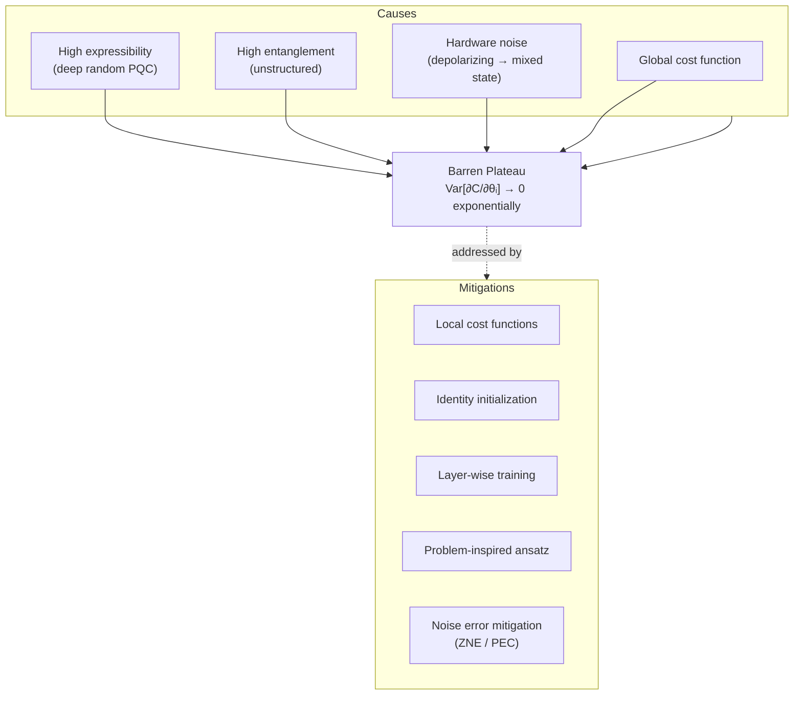

# QCSAA 910–919 · Section 01 · Subsection 912 · Subsubject 008 — Trainability, Barren Plateaus, and Noise

## 1. Purpose

Defines the **trainability** constraints for variational quantum classifiers and regressors, with a focus on **barren plateaus** — regions in parameter space where cost-function gradients vanish exponentially with system size — and on **noise-induced gradient suppression**. Establishes the controlled vocabulary for barren-plateau causes, detection, and mitigation strategies within the Q+ATLANTIDE baseline[^baseline]. Directly extends the gradient-estimation analysis of `007_` and informs design choices for PQCs (`002_`) and loss functions (`005_`). The trainability analysis framework is shared with the dedicated trainability subsection `917_QML-Trainability-Barren-Plateaus-and-Optimization`.

## 2. Scope

- Covers the *Trainability, Barren Plateaus, and Noise* subsubject (`008`) of subsection `912` within section `01` *Quantum Machine Learning e IA Cuántica*.
- Inherits Q-Division authority and ORB support from the parent row in [`../README.md` §3](../README.md#3-subsection-index)[^archtable].
- Concepts in scope:
  - **Barren plateau definition** — a region where Var_θ[∂C/∂θᵢ] decreases exponentially with the number of qubits n: Var[∂C/∂θᵢ] ≤ O(exp(−n)); the gradient therefore vanishes with high probability for any random parameter initialization, making gradient-descent training exponentially resource-intensive.
  - **Expressibility-induced barren plateaus** — highly expressive PQCs (deep hardware-efficient ansätze with uniformly random parameters) form approximate unitary 2-designs, leading to exponentially vanishing gradient variance; the more expressive the circuit, the more severe the barren plateau.
  - **Entanglement-induced barren plateaus** — PQCs that generate high entanglement across all subsystems exhibit barren plateaus even for local cost functions when entanglement is not structured; entanglement entropy growth is a predictor of barren-plateau onset.
  - **Noise-induced barren plateaus** — under depolarizing or general Markovian noise, the steady-state density matrix approaches a maximally mixed state exponentially in circuit depth d; the cost landscape approaches a constant value exponentially fast, eliminating all informative gradients regardless of PQC expressibility.
  - **Global-cost-induced barren plateaus** — global cost functions (see `005_`) exhibit exponentially vanishing gradients even for shallow circuits; local cost functions mitigate this source.
  - **Mitigation strategies** — (i) *local cost functions* — replace global observables with single-qubit or k-local terms; (ii) *identity initialization* — initialize PQC parameters so each layer acts near the identity, preserving gradient signal at early training; (iii) *layer-wise training* — train one layer at a time, freezing earlier layers; (iv) *correlated parameter initialization* (e.g., Gaussian initialization scaled by 1/√n); (v) *noise-aware circuit design* — minimize circuit depth; apply error mitigation (`ZNE`, `PEC`) at the gradient-estimation step (`007_`); (vi) *problem-inspired ansatz* — restrict the variational manifold to the relevant subspace of the cost function.
  - **Detection protocol** — compute gradient norms ‖∇C‖ and their variance across random initializations; if Var[∂C/∂θᵢ] < threshold / 2ⁿ, classify as barren-plateau regime; report in benchmarking (`009_`).
- Out of scope: full treatment in dedicated subsection `917_QML-Trainability-Barren-Plateaus-and-Optimization` (cross-subsection reference).

## 3. Diagram — Barren Plateau Sources and Mitigations

## 4. Footprint

| Metric | Value |
|---|---|
| Architecture | `QCSAA` — Quantum Computing & Sentient Agency Architecture |
| Master range | `900–999` |
| Code range | `910-919` |
| Section | `01` — Quantum Machine Learning e IA Cuántica |
| Subsection | `912` — Variational Quantum Classifiers and Regressors |
| Subsubject | `008` — Trainability, Barren Plateaus, and Noise |
| Primary Q-Division | Q-HPC[^qdiv] |
| Support Q-Divisions | Q-HORIZON, Q-DATAGOV |
| ORB support | ORB-PMO, ORB-LEG |
| Governance class | `restricted`[^gov] |
| Evidence package | `EP-QCSAA-912-001` |
| Access control profile | `ACP-QCSAA-RESTRICTED` |
| Folder path | `Q+ATLANTIDE/900-999_QCSAA/910-919_Quantum-Machine-Learning-e-IA-Cuantica/912_Variational-Quantum-Classifiers-and-Regressors/` |
| Document | `008_Trainability-Barren-Plateaus-and-Noise.md` (this file) |
| Parent subsection | [`README.md`](./README.md) · [`000_Overview.md`](./000_Overview.md) |
| Parent architecture | [`../../README.md`](../../README.md) |
| Parent baseline | [`organization/Q+ATLANTIDE.md`](../../../../organization/Q+ATLANTIDE.md) |

## 5. References & Citations

[^baseline]: **Q+ATLANTIDE controlled baseline (v1.0.0)** — [`organization/Q+ATLANTIDE.md`](../../../../organization/Q+ATLANTIDE.md). Defines the controlled `000-999` architecture-band taxonomy and the ATLAS-1000 register subpart.

[^archtable]: **QCSAA §3 Subsection Index** — [`../README.md` §3](../README.md#3-subsection-index). Authoritative source for the `910-919` subsection listing and Q-Division authority.

[^qdiv]: **Q-Division authority** — Q-Divisions provide technical authority over an architecture row (Q+ATLANTIDE Note N-002). See [`organization/Q+ATLANTIDE.md` §4](../../../../organization/Q+ATLANTIDE.md#4-notes).

[^gov]: **Governance class** — `restricted` denotes documents requiring additional governance, evidence packages and access controls (rule N-006). See [`organization/Q+ATLANTIDE.md` §5.3](../../../../organization/Q+ATLANTIDE.md#53-restricted-band-templates-n-006).

[^ieee7130]: **IEEE Std 7130-2023 — IEEE Standard for Quantum Computing Definitions** — Normative vocabulary for quantum circuit depth, noise model, and expectation-value terminology used in barren-plateau definitions.

[^iso4879]: **ISO/IEC 4879:2023 — Quantum computing — Terminology and vocabulary** — Co-normative international standard for foundational quantum-computing concepts.

### Applicable standards

The following standards apply to this subsubject in addition to the cross-cutting Q+ATLANTIDE governance:

- IEEE Std 7130-2023 — IEEE Standard for Quantum Computing Definitions[^ieee7130]
- ISO/IEC 4879:2023 — Quantum computing — Terminology and vocabulary[^iso4879]
