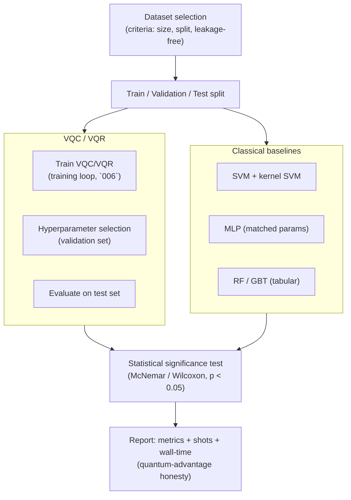

# QCSAA 910–919 · Section 01 · Subsection 912 · Subsubject 009 — Benchmarking, Classical Baselines, and Validation

## 1. Purpose

Defines the **benchmarking protocols**, **classical baseline selection**, and **validation methodology** required to rigorously evaluate variational quantum classifiers and regressors within the Q+ATLANTIDE baseline[^baseline]. Establishes dataset selection criteria, classical comparator models, performance metrics, statistical significance testing procedures, and the honesty standards for quantum-advantage claims in alignment with the QML Resource Estimation and Quantum Advantage Honesty framework of subsection `918_`[^qae918]. This vocabulary governs the validation requirements referenced in the aerospace assurance-boundary subsubject `010_`.

## 2. Scope

- Covers the *Benchmarking, Classical Baselines, and Validation* subsubject (`009`) of subsection `912` within section `01` *Quantum Machine Learning e IA Cuántica*.
- Inherits Q-Division authority and ORB support from the parent row in [`../README.md` §3](../README.md#3-subsection-index)[^archtable].
- Concepts in scope:
  - **Dataset selection criteria** — for a meaningful benchmark: (i) dataset must be genuinely available to both quantum and classical models (no artificial quantum-native encoding advantage); (ii) dataset size N must be large enough to distinguish generalization performance (N ≥ 1000 recommended for publication-quality comparisons); (iii) datasets must be split into training, validation, and held-out test sets with no data leakage; (iv) aerospace-relevant datasets are preferred for cross-subsection relevance.
  - **Classical baseline models** — minimum required comparators: *Support Vector Machine (SVM)* with RBF kernel (canonical classical classifier with comparable Hilbert-space intuition); *Kernel SVM* with the corresponding quantum kernel (isolates the impact of quantum encoding from the variational training component); *Multi-Layer Perceptron (MLP)* with similar parameter count; random-forest and gradient-boosted-tree baselines for tabular data.
  - **Performance metrics (classification)** — accuracy, precision, recall, F1-score, area under ROC curve (AUC-ROC), confusion matrix; reported on held-out test set.
  - **Performance metrics (regression)** — MSE, Root-MSE (RMSE), mean absolute error (MAE), coefficient of determination R², Pearson correlation; reported on held-out test set.
  - **Statistical significance testing** — McNemar test (classification), paired t-test or Wilcoxon signed-rank test (regression); minimum 30 independent repetitions with different random seeds required; p-value threshold p < 0.05; effect size (Cohen's d or odds ratio) must be reported alongside p-value.
  - **Quantum-advantage honesty** — quantum model must not receive information not available to the classical baseline; wall-clock time, energy consumption, and total circuit evaluations (shots × iterations) must be reported alongside accuracy; claims of "quantum advantage" must be accompanied by evidence that classical baselines have been genuinely optimized (no straw-man comparisons); see cross-reference to `918_`[^qae918].
  - **Validation protocol** — k-fold cross-validation (k = 5 or 10) for small datasets; holdout validation for large datasets; hyperparameter selection on validation set only; final performance evaluated on held-out test set exactly once.
  - **Barren-plateau screening in benchmarks** — before publishing benchmark results, gradient-norm analysis per `008_` must be performed to confirm the model was not trapped in a barren plateau during training; if plateau was detected, mitigation strategies applied and training restarted.
- Out of scope: aerospace-specific assurance and certification validation requirements (`010_`).

## 3. Diagram — Benchmarking Pipeline

## 4. Footprint

| Metric | Value |
|---|---|
| Architecture | `QCSAA` — Quantum Computing & Sentient Agency Architecture |
| Master range | `900–999` |
| Code range | `910-919` |
| Section | `01` — Quantum Machine Learning e IA Cuántica |
| Subsection | `912` — Variational Quantum Classifiers and Regressors |
| Subsubject | `009` — Benchmarking, Classical Baselines, and Validation |
| Primary Q-Division | Q-HPC[^qdiv] |
| Support Q-Divisions | Q-HORIZON, Q-DATAGOV |
| ORB support | ORB-PMO, ORB-LEG |
| Governance class | `restricted`[^gov] |
| Evidence package | `EP-QCSAA-912-001` |
| Access control profile | `ACP-QCSAA-RESTRICTED` |
| Folder path | `Q+ATLANTIDE/900-999_QCSAA/910-919_Quantum-Machine-Learning-e-IA-Cuantica/912_Variational-Quantum-Classifiers-and-Regressors/` |
| Document | `009_Benchmarking-Classical-Baselines-and-Validation.md` (this file) |
| Parent subsection | [`README.md`](./README.md) · [`000_Overview.md`](./000_Overview.md) |
| Parent architecture | [`../../README.md`](../../README.md) |
| Parent baseline | [`organization/Q+ATLANTIDE.md`](../../../../organization/Q+ATLANTIDE.md) |

## 5. References & Citations

[^baseline]: **Q+ATLANTIDE controlled baseline (v1.0.0)** — [`organization/Q+ATLANTIDE.md`](../../../../organization/Q+ATLANTIDE.md). Defines the controlled `000-999` architecture-band taxonomy and the ATLAS-1000 register subpart.

[^archtable]: **QCSAA §3 Subsection Index** — [`../README.md` §3](../README.md#3-subsection-index). Authoritative source for the `910-919` subsection listing and Q-Division authority.

[^qdiv]: **Q-Division authority** — Q-Divisions provide technical authority over an architecture row (Q+ATLANTIDE Note N-002). See [`organization/Q+ATLANTIDE.md` §4](../../../../organization/Q+ATLANTIDE.md#4-notes).

[^gov]: **Governance class** — `restricted` denotes documents requiring additional governance, evidence packages and access controls (rule N-006). See [`organization/Q+ATLANTIDE.md` §5.3](../../../../organization/Q+ATLANTIDE.md#53-restricted-band-templates-n-006).

[^qae918]: **QCSAA 910-919 · 918 — QML Resource Estimation and Quantum Advantage Honesty** — [`../918_QML-Resource-Estimation-and-Quantum-Advantage-Honesty/`](../918_QML-Resource-Estimation-and-Quantum-Advantage-Honesty/). Governs quantum-advantage claim standards and resource-reporting requirements that this subsubject implements for variational models.

[^ieee7130]: **IEEE Std 7130-2023 — IEEE Standard for Quantum Computing Definitions** — Normative vocabulary for quantum circuit, measurement, and shot terminology used in this benchmarking framework.

[^iso4879]: **ISO/IEC 4879:2023 — Quantum computing — Terminology and vocabulary** — Co-normative international standard for foundational quantum-computing concepts.

### Applicable standards

The following standards apply to this subsubject in addition to the cross-cutting Q+ATLANTIDE governance:

- IEEE Std 7130-2023 — IEEE Standard for Quantum Computing Definitions[^ieee7130]
- ISO/IEC 4879:2023 — Quantum computing — Terminology and vocabulary[^iso4879]
