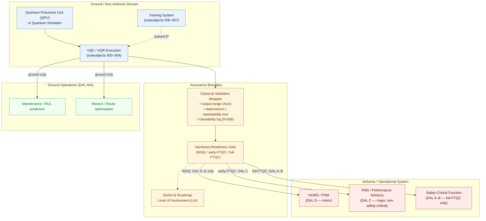

# QCSAA 910–919 · Section 01 · Subsection 912 · Subsubject 010 — Aerospace Assurance and Use-Case Boundaries

## 1. Purpose

Documents the **aerospace use cases** for variational quantum classifiers and regressors defined in subsubjects `001`–`009` and establishes the **assurance boundaries** that govern their integration into safety-critical and mission-critical airborne and space systems within the Q+ATLANTIDE baseline[^baseline]. Maps each use-case category to its applicable certification framework (DO-178C[^do178c], ARP4754A[^arp4754a], ARP4761[^arp4761]) and defines the interface boundary between variational-QML model outputs and the classical airborne system that acts on those outputs. Aligns with EASA AI Roadmap 2.0[^easa2023] for AI/ML-based system assurance in aviation.

## 2. Scope

- Covers the *Aerospace Assurance and Use-Case Boundaries* subsubject (`010`) of subsection `912` within section `01` *Quantum Machine Learning e IA Cuántica*.
- Inherits Q-Division authority and ORB support from the parent row in [`../README.md` §3](../README.md#3-subsection-index)[^archtable].
- Concepts in scope:
  - **Fault detection and health monitoring** — VQC-based anomaly classifiers applied to airborne sensor streams (vibration, temperature, pressure, ECS); classification output consumed by Health and Usage Monitoring Systems (HUMS) or Prognostics and Health Management (PHM) ground-support tools; **DAL D** (failure condition: minor) for non-safety-critical HUMS aiding functions; ground-support or non-airborne only in NISQ era.
  - **Structural integrity classification** — VQC applied to non-destructive testing (NDT) data (ultrasonic, thermographic) to classify structural defects; ground-system integration only; not directly airborne; no real-time DAL requirement; output validated against DO-178C-compliant classical wrapper before engineering disposition.
  - **Flight parameter regression** — VQR applied to predict aerodynamic coefficients, fuel flow, or atmospheric parameters from in-flight sensor data; output consumed by FMS or performance-monitoring tools; **DAL C** (failure condition: major) if used as non-safety-critical advisory input with classical override; **DAL B** (failure condition: hazardous) if safety-critical use is proposed — restricted to full-FTQC era with validated classical wrapper.
  - **Mission and route optimisation** — VQC/VQR applied to route planning, gate assignment, or crew scheduling in ground operations; no direct airborne DAL requirement; DAL not applicable; subject to operational security and data-governance controls.
  - **Prognostic remaining-useful-life regression** — VQR estimating component remaining useful life (RUL) from historical sensor data; output consumed by maintenance-planning systems; ground-system only; DAL not applicable; classical validation wrapper required per N-006 evidence package.
  - **Assurance boundary definition** — the boundary at which VQC/VQR outputs enter a safety-critical context; requirements: (i) classical validation wrapper (output-range check, determinism/repeatability test, traceability log); (ii) hardware-readiness gate (NISQ / early-FTQC / full-FTQC); (iii) EASA AI Roadmap Level of Involvement (LoI) assessment; (iv) DO-178C objective evidence for any software implementing or consuming the VQC/VQR output.
  - **DAL mapping** — assignment of Development Assurance Levels (DAL A–E per ARP4754A[^arp4754a]) to VQC/VQR use-cases based on failure condition severity; NISQ-era restriction: only DAL D–E (minor, no safety effect) use cases are permissible without full-FTQC hardware and formal verification of the quantum-classical interface.
  - **Hardware-readiness gating** — gate criteria linking VQC/VQR hardware-readiness to permitted deployment scope: (i) *NISQ* → ground-only or non-safety-critical advisory (DAL D–E); (ii) *early-FTQC* → non-safety-critical aiding with classical override (DAL C); (iii) *full-FTQC* → safety-critical with validated classical wrapper (DAL A–B).
- Out of scope: quantum communication and QKD in avionics (`920-929`), quantum sensing and metrology (`940-949`), and programme-specific DO-178C software development plans.

## 3. Diagram — VQC/VQR Assurance Boundary Architecture

## 4. Footprint

| Metric | Value |
|---|---|
| Architecture | `QCSAA` — Quantum Computing & Sentient Agency Architecture |
| Master range | `900–999` |
| Code range | `910-919` |
| Section | `01` — Quantum Machine Learning e IA Cuántica |
| Subsection | `912` — Variational Quantum Classifiers and Regressors |
| Subsubject | `010` — Aerospace Assurance and Use-Case Boundaries |
| Primary Q-Division | Q-HPC[^qdiv] |
| Support Q-Divisions | Q-HORIZON, Q-DATAGOV |
| ORB support | ORB-PMO, ORB-LEG |
| Governance class | `restricted`[^gov] |
| Evidence package | `EP-QCSAA-912-001` |
| Access control profile | `ACP-QCSAA-RESTRICTED` |
| Folder path | `Q+ATLANTIDE/900-999_QCSAA/910-919_Quantum-Machine-Learning-e-IA-Cuantica/912_Variational-Quantum-Classifiers-and-Regressors/` |
| Document | `010_Aerospace-Assurance-and-Use-Case-Boundaries.md` (this file) |
| Parent subsection | [`README.md`](./README.md) · [`000_Overview.md`](./000_Overview.md) |
| Parent architecture | [`../../README.md`](../../README.md) |
| Parent baseline | [`organization/Q+ATLANTIDE.md`](../../../../organization/Q+ATLANTIDE.md) |

## 5. References & Citations

[^baseline]: **Q+ATLANTIDE controlled baseline (v1.0.0)** — [`organization/Q+ATLANTIDE.md`](../../../../organization/Q+ATLANTIDE.md). Defines the controlled `000-999` architecture-band taxonomy and the ATLAS-1000 register subpart.

[^archtable]: **QCSAA §3 Subsection Index** — [`../README.md` §3](../README.md#3-subsection-index). Authoritative source for the `910-919` subsection listing and Q-Division authority.

[^qdiv]: **Q-Division authority** — Q-Divisions provide technical authority over an architecture row (Q+ATLANTIDE Note N-002). See [`organization/Q+ATLANTIDE.md` §4](../../../../organization/Q+ATLANTIDE.md#4-notes).

[^gov]: **Governance class** — `restricted` denotes documents requiring additional governance, evidence packages and access controls (rule N-006). See [`organization/Q+ATLANTIDE.md` §5.3](../../../../organization/Q+ATLANTIDE.md#53-restricted-band-templates-n-006).

[^iso4879]: **ISO/IEC 4879:2023 — Quantum computing — Terminology and vocabulary** — Normative vocabulary for quantum computing terms used in use-case definitions.

[^do178c]: **RTCA DO-178C — Software Considerations in Airborne Systems and Equipment Certification** — Primary certification standard governing software assurance objectives for airborne systems; defines DAL A–E, objective evidence requirements, and the certification liaison process.

[^arp4754a]: **SAE ARP4754A — Guidelines for Development of Civil Aircraft and Systems** — System-level development assurance process; source of DAL A–E assignment criteria applied to VQC/VQR use-case integration.

[^arp4761]: **SAE ARP4761 — Guidelines and Methods for Conducting Safety Assessment Process on Civil Airborne Systems** — Safety-assessment methodology (FHA, PSSA, SSA) used to assign failure-condition severity and derive DAL requirements for VQC/VQR integration.

[^easa2023]: **EASA AI Roadmap 2.0 (2023)** — EASA framework for assurance of AI/ML-based systems in aviation; defines Level of Involvement (LoI) and trustworthiness properties applicable to variational QML models deployed in aviation contexts.

### Applicable standards

The following standards apply to this subsubject in addition to the cross-cutting Q+ATLANTIDE governance:

- ISO/IEC 4879:2023 — Quantum computing — Terminology and vocabulary[^iso4879]
- RTCA DO-178C — Software Considerations in Airborne Systems and Equipment Certification[^do178c]
- SAE ARP4754A — Guidelines for Development of Civil Aircraft and Systems[^arp4754a]
- SAE ARP4761 — Guidelines and Methods for Conducting Safety Assessment Process on Civil Airborne Systems[^arp4761]
- EASA AI Roadmap 2.0 (2023)[^easa2023]
