# QCSAA 940–949 · Section 04 — Sensores y Metrología Cuántica

## 1. Purpose

Section-level index for *Sensores y Metrología Cuántica* (`940-949`) within the QCSAA band. Quantum Sensing and Metrology: Quantum sensing foundations, atomic clocks, magnetometry, inertial sensing, gravimetry, quantum imaging, NV-centers, sensor fusion.

This section is part of the **ATLAS-1000** register, a subpart of the controlled **Q+ATLANTIDE** baseline[^baseline][^n001]. Bands classify technologies, Q-Divisions provide technical authority and ORB-Functions provide enterprise support[^n002].

**Restricted band (N-006[^n006]).** All subsections and templates under this section additionally inherit `governance_class: restricted`.

## 2. Scope

- Aggregates the subsections within the `940-949` code range listed in §3.
- Inherits Q-Division authority and ORB support from the parent row in [`../README.md` §3](../README.md#3-architecture-table)[^archtable].
- Each subsection folder contains its own `README.md` (subsection index) and may contain Overview and subsubject documents.
- All subsections under this section must declare `governance_class: restricted`, `evidence_package_id` and `access_control_profile` per rule N-006[^n006].

## 3. Subsection Index

| Code | Title | Folder | Status |
|---:|---|---|---|
| `940` | Quantum Sensing Foundations | [`./940_Quantum-Sensing-Foundations/`](./940_Quantum-Sensing-Foundations/) | active |
| `941` | Atomic and Optical Clocks | [`./941_Atomic-and-Optical-Clocks/`](./941_Atomic-and-Optical-Clocks/) | active |
| `942` | Quantum Magnetometry and Gradiometry | [`./942_Quantum-Magnetometry-and-Gradiometry/`](./942_Quantum-Magnetometry-and-Gradiometry/) | active |
| `943` | Quantum Inertial Sensing and Gravimetry | [`./943_Quantum-Inertial-Sensing-and-Gravimetry/`](./943_Quantum-Inertial-Sensing-and-Gravimetry/) | active |
| `944` | Quantum Imaging and LIDAR | [`./944_Quantum-Imaging-and-LIDAR/`](./944_Quantum-Imaging-and-LIDAR/) | active |
| `945` | NV Center and Solid State Sensors | [`./945_NV-Center-and-Solid-State-Sensors/`](./945_NV-Center-and-Solid-State-Sensors/) | active |
| `946` | Quantum Calibration and Metrology Standards | [`./946_Quantum-Calibration-and-Metrology-Standards/`](./946_Quantum-Calibration-and-Metrology-Standards/) | active |
| `947` | Sensor Fusion Classical Quantum Hybrid | [`./947_Sensor-Fusion-Classical-Quantum-Hybrid/`](./947_Sensor-Fusion-Classical-Quantum-Hybrid/) | active |
| `948` | QSensing Resource and Sensitivity Limits | [`./948_QSensing-Resource-and-Sensitivity-Limits/`](./948_QSensing-Resource-and-Sensitivity-Limits/) | active |
| `949` | Aerospace QSensing Use Cases and Assurance Boundaries | [`./949_Aerospace-QSensing-Use-Cases-and-Assurance-Boundaries/`](./949_Aerospace-QSensing-Use-Cases-and-Assurance-Boundaries/) | active |

## 4. Interfaces Diagram

```mermaid
flowchart TB
    PARENT["QCSAA<br/>(`900–999` master range)"]:::parent
    SEC["Section 04 · 940-949<br/>Sensores y Metrología Cuántica"]:::sec
    PARENT --> SEC

    subgraph SUBS["Subsections"]
        direction LR
        SUB_940["940 — Quantum Sensing Foundations"]:::sub
        SUB_941["941 — Atomic and Optical Clocks"]:::sub
        SUB_942["942 — Quantum Magnetometry and Gradiometry"]:::sub
        SUB_943["943 — Quantum Inertial Sensing and Gravimetry"]:::sub
        SUB_944["944 — Quantum Imaging and LIDAR"]:::sub
        SUB_945["945 — NV Center and Solid State Sensors"]:::sub
        SUB_946["946 — Quantum Calibration and Metrology Standards"]:::sub
        SUB_947["947 — Sensor Fusion Classical Quantum Hybrid"]:::sub
        SUB_948["948 — QSensing Resource and Sensitivity Limits"]:::sub
        SUB_949["949 — Aerospace QSensing Use Cases and Assurance Boundaries"]:::sub
    end
    SEC --> SUBS

    SUBS --> SUB_940
    SUBS --> SUB_941
    SUBS --> SUB_942
    SUBS --> SUB_943
    SUBS --> SUB_944
    SUBS --> SUB_945
    SUBS --> SUB_946
    SUBS --> SUB_947
    SUBS --> SUB_948
    SUBS --> SUB_949

    QPRIM["Q-HORIZON<br/>(primary Q-Division)"]:::qdiv
    QSUPP["Q-SPACE, Q-AIR, Q-HPC<br/>(support Q-Divisions)"]:::qdiv
    ORB["ORB-PMO, ORB-LEG<br/>(ORB support)"]:::orb

    SEC --> QPRIM
    SEC -.-> QSUPP
    SEC -.-> ORB

    classDef parent fill:#1f3a93,stroke:#0b1d4a,color:#fff
    classDef sec fill:#2c82c9,stroke:#0b1d4a,color:#fff
    classDef sub fill:#eaf3fb,stroke:#2c82c9,color:#0b1d4a
    classDef qdiv fill:#f6e6ff,stroke:#7d3c98,color:#3b1f4d
    classDef orb fill:#fff4dd,stroke:#b9770e,color:#5a3b00
```

*Solid arrows show parent→section→subsection ownership and primary Q-Division authority; dotted arrows show support Q-Divisions and ORB enterprise support.*

## 5. Footprint

| Metric | Value |
|---|---|
| Architecture | `QCSAA` — Quantum Computing & Sentient Agency Architecture |
| Master range | `900–999` |
| Code range | `940-949` |
| Section | `04` — Sensores y Metrología Cuántica |
| Subsections | 10 populated |
| Primary Q-Division | Q-HORIZON[^qdiv] |
| Support Q-Divisions | Q-SPACE, Q-AIR, Q-HPC |
| ORB support | ORB-PMO, ORB-LEG |
| Governance class | `restricted`[^gov] |
| Folder path | `Q+ATLANTIDE/900-999_QCSAA/940-949_Sensores-y-Metrologia-Cuantica/` |
| Document | `README.md` (this file) |
| Parent architecture | [`../README.md`](../README.md) |
| Parent baseline | [`organization/Q+ATLANTIDE.md`](../../../organization/Q+ATLANTIDE.md) |

## Governance

Governed by [`organization/Q+ATLANTIDE.md`](../../../organization/Q+ATLANTIDE.md)[^baseline]. All subsections under this section inherit `architecture_code = QCSAA`, `primary_q_division = Q-HORIZON`, and `governance_class = restricted` from this section header. Templates declared in this section must also declare `evidence_package_id` and `access_control_profile` per rule N-006[^n006]. The No-AAA Rule[^n004] applies.

## 6. References & Citations

[^baseline]: **Q+ATLANTIDE controlled baseline (v1.0.0)** — [`organization/Q+ATLANTIDE.md`](../../../organization/Q+ATLANTIDE.md). Defines the controlled `000-999` architecture-band taxonomy and the ATLAS-1000 register subpart.

[^archtable]: **§3 — Architecture Table (parent)** — [`../README.md` §3](../README.md#3-architecture-table). Source of authority for primary/support Q-Divisions and ORB support of this section.

[^qdiv]: **Q-Division authority** — [`organization/Q-Divisions/`](../../../organization/Q-Divisions/). Technical-authority units for the Q+ATLANTIDE baseline.

[^gov]: **Governance class** — `restricted` denotes documents requiring additional governance, evidence packages and access controls (rule N-006[^n006]).

[^templates]: **§5 — Templates System** — [`organization/Q+ATLANTIDE.md` §5](../../../organization/Q+ATLANTIDE.md#5-templates-system).

[^n001]: **Note N-001** — Q+ATLANTIDE (with its ATLAS-1000 register subpart) is a taxonomy and traceability ecosystem, not an organization chart. See [`organization/Q+ATLANTIDE.md` §4](../../../organization/Q+ATLANTIDE.md#4-notes).

[^n002]: **Note N-002** — Architecture bands classify technologies; Q-Divisions provide technical authority; ORB-Functions provide enterprise support. See [`organization/Q+ATLANTIDE.md` §4](../../../organization/Q+ATLANTIDE.md#4-notes).

[^n004]: **Note N-004 (No-AAA Rule)** — "AAA" is not a valid domain, division, architecture, interface or function in this baseline. See [`organization/Q+ATLANTIDE.md` §4](../../../organization/Q+ATLANTIDE.md#4-notes).

[^n006]: **Note N-006 (Restricted bands)** — Defence-related (`200-299` DTTA), cybersecurity-related (`800-899` CYB) and quantum-related (`900-999` QCSAA) bands require additional governance, evidence packages and access controls beyond the baseline trace record. Templates must additionally declare `governance_class: restricted`, `evidence_package_id` and `access_control_profile`. See [`organization/Q+ATLANTIDE.md` §5.3](../../../organization/Q+ATLANTIDE.md#53-restricted-band-templates-n-006).
