# QCSAA 950–959 · Section 05 — Simulación Cuántica

## 1. Purpose

Section-level index for *Simulación Cuántica* (`950-959`) within the QCSAA band. Quantum Simulation: Quantum simulation foundations, Hamiltonian simulation, variational simulation, quantum chemistry, fluid/plasma, lattice models, noisy systems.

This section is part of the **ATLAS-1000** register, a subpart of the controlled **Q+ATLANTIDE** baseline[^baseline][^n001]. Bands classify technologies, Q-Divisions provide technical authority and ORB-Functions provide enterprise support[^n002].

**Restricted band (N-006[^n006]).** All subsections and templates under this section additionally inherit `governance_class: restricted`.

## 2. Scope

- Aggregates the subsections within the `950-959` code range listed in §3.
- Inherits Q-Division authority and ORB support from the parent row in [`../README.md` §3](../README.md#3-architecture-table)[^archtable].
- Each subsection folder contains its own `README.md` (subsection index) and may contain Overview and subsubject documents.
- All subsections under this section must declare `governance_class: restricted`, `evidence_package_id` and `access_control_profile` per rule N-006[^n006].

## 3. Subsection Index

| Code | Title | Folder | Status |
|---:|---|---|---|
| `950` | Quantum Simulation Foundations | [`./950_Quantum-Simulation-Foundations/`](./950_Quantum-Simulation-Foundations/) | active |
| `951` | Hamiltonian Simulation Methods | [`./951_Hamiltonian-Simulation-Methods/`](./951_Hamiltonian-Simulation-Methods/) | active |
| `952` | Variational Quantum Simulation | [`./952_Variational-Quantum-Simulation/`](./952_Variational-Quantum-Simulation/) | active |
| `953` | Quantum Chemistry and Materials Simulation | [`./953_Quantum-Chemistry-and-Materials-Simulation/`](./953_Quantum-Chemistry-and-Materials-Simulation/) | active |
| `954` | Quantum Fluid and Plasma Simulation | [`./954_Quantum-Fluid-and-Plasma-Simulation/`](./954_Quantum-Fluid-and-Plasma-Simulation/) | active |
| `955` | Quantum Lattice Models and Field Theory | [`./955_Quantum-Lattice-Models-and-Field-Theory/`](./955_Quantum-Lattice-Models-and-Field-Theory/) | active |
| `956` | Open System and Noisy Quantum Simulation | [`./956_Open-System-and-Noisy-Quantum-Simulation/`](./956_Open-System-and-Noisy-Quantum-Simulation/) | active |
| `957` | Classical Verification of Quantum Simulation | [`./957_Classical-Verification-of-Quantum-Simulation/`](./957_Classical-Verification-of-Quantum-Simulation/) | active |
| `958` | QSim Resource Estimation and Validation | [`./958_QSim-Resource-Estimation-and-Validation/`](./958_QSim-Resource-Estimation-and-Validation/) | active |
| `959` | Aerospace QSim Use Cases and Assurance Boundaries | [`./959_Aerospace-QSim-Use-Cases-and-Assurance-Boundaries/`](./959_Aerospace-QSim-Use-Cases-and-Assurance-Boundaries/) | active |

## 4. Interfaces Diagram

```mermaid
flowchart TB
    PARENT["QCSAA<br/>(`900–999` master range)"]:::parent
    SEC["Section 05 · 950-959<br/>Simulación Cuántica"]:::sec
    PARENT --> SEC

    subgraph SUBS["Subsections"]
        direction LR
        SUB_950["950 — Quantum Simulation Foundations"]:::sub
        SUB_951["951 — Hamiltonian Simulation Methods"]:::sub
        SUB_952["952 — Variational Quantum Simulation"]:::sub
        SUB_953["953 — Quantum Chemistry and Materials Simulation"]:::sub
        SUB_954["954 — Quantum Fluid and Plasma Simulation"]:::sub
        SUB_955["955 — Quantum Lattice Models and Field Theory"]:::sub
        SUB_956["956 — Open System and Noisy Quantum Simulation"]:::sub
        SUB_957["957 — Classical Verification of Quantum Simulation"]:::sub
        SUB_958["958 — QSim Resource Estimation and Validation"]:::sub
        SUB_959["959 — Aerospace QSim Use Cases and Assurance Boundaries"]:::sub
    end
    SEC --> SUBS

    SUBS --> SUB_950
    SUBS --> SUB_951
    SUBS --> SUB_952
    SUBS --> SUB_953
    SUBS --> SUB_954
    SUBS --> SUB_955
    SUBS --> SUB_956
    SUBS --> SUB_957
    SUBS --> SUB_958
    SUBS --> SUB_959

    QPRIM["Q-HPC<br/>(primary Q-Division)"]:::qdiv
    QSUPP["Q-HORIZON, Q-STRUCTURES, Q-GREENTECH<br/>(support Q-Divisions)"]:::qdiv
    ORB["ORB-PMO, ORB-FIN<br/>(ORB support)"]:::orb

    SEC --> QPRIM
    SEC -.-> QSUPP
    SEC -.-> ORB

    classDef parent fill:#1f3a93,stroke:#0b1d4a,color:#fff
    classDef sec fill:#2c82c9,stroke:#0b1d4a,color:#fff
    classDef sub fill:#eaf3fb,stroke:#2c82c9,color:#0b1d4a
    classDef qdiv fill:#f6e6ff,stroke:#7d3c98,color:#3b1f4d
    classDef orb fill:#fff4dd,stroke:#b9770e,color:#5a3b00
```

*Solid arrows show parent→section→subsection ownership and primary Q-Division authority; dotted arrows show support Q-Divisions and ORB enterprise support.*

## 5. Footprint

| Metric | Value |
|---|---|
| Architecture | `QCSAA` — Quantum Computing & Sentient Agency Architecture |
| Master range | `900–999` |
| Code range | `950-959` |
| Section | `05` — Simulación Cuántica |
| Subsections | 10 populated |
| Primary Q-Division | Q-HPC[^qdiv] |
| Support Q-Divisions | Q-HORIZON, Q-STRUCTURES, Q-GREENTECH |
| ORB support | ORB-PMO, ORB-FIN |
| Governance class | `restricted`[^gov] |
| Folder path | `Q+ATLANTIDE/900-999_QCSAA/950-959_Simulacion-Cuantica/` |
| Document | `README.md` (this file) |
| Parent architecture | [`../README.md`](../README.md) |
| Parent baseline | [`organization/Q+ATLANTIDE.md`](../../../organization/Q+ATLANTIDE.md) |

## Governance

Governed by [`organization/Q+ATLANTIDE.md`](../../../organization/Q+ATLANTIDE.md)[^baseline]. All subsections under this section inherit `architecture_code = QCSAA`, `primary_q_division = Q-HPC`, and `governance_class = restricted` from this section header. Templates declared in this section must also declare `evidence_package_id` and `access_control_profile` per rule N-006[^n006]. The No-AAA Rule[^n004] applies.

## 6. References & Citations

[^baseline]: **Q+ATLANTIDE controlled baseline (v1.0.0)** — [`organization/Q+ATLANTIDE.md`](../../../organization/Q+ATLANTIDE.md). Defines the controlled `000-999` architecture-band taxonomy and the ATLAS-1000 register subpart.

[^archtable]: **§3 — Architecture Table (parent)** — [`../README.md` §3](../README.md#3-architecture-table). Source of authority for primary/support Q-Divisions and ORB support of this section.

[^qdiv]: **Q-Division authority** — [`organization/Q-Divisions/`](../../../organization/Q-Divisions/). Technical-authority units for the Q+ATLANTIDE baseline.

[^gov]: **Governance class** — `restricted` denotes documents requiring additional governance, evidence packages and access controls (rule N-006[^n006]).

[^templates]: **§5 — Templates System** — [`organization/Q+ATLANTIDE.md` §5](../../../organization/Q+ATLANTIDE.md#5-templates-system).

[^n001]: **Note N-001** — Q+ATLANTIDE (with its ATLAS-1000 register subpart) is a taxonomy and traceability ecosystem, not an organization chart. See [`organization/Q+ATLANTIDE.md` §4](../../../organization/Q+ATLANTIDE.md#4-notes).

[^n002]: **Note N-002** — Architecture bands classify technologies; Q-Divisions provide technical authority; ORB-Functions provide enterprise support. See [`organization/Q+ATLANTIDE.md` §4](../../../organization/Q+ATLANTIDE.md#4-notes).

[^n004]: **Note N-004 (No-AAA Rule)** — "AAA" is not a valid domain, division, architecture, interface or function in this baseline. See [`organization/Q+ATLANTIDE.md` §4](../../../organization/Q+ATLANTIDE.md#4-notes).

[^n006]: **Note N-006 (Restricted bands)** — Defence-related (`200-299` DTTA), cybersecurity-related (`800-899` CYB) and quantum-related (`900-999` QCSAA) bands require additional governance, evidence packages and access controls beyond the baseline trace record. Templates must additionally declare `governance_class: restricted`, `evidence_package_id` and `access_control_profile`. See [`organization/Q+ATLANTIDE.md` §5.3](../../../organization/Q+ATLANTIDE.md#53-restricted-band-templates-n-006).
