# QCSAA 970–979 · Section 07 — Agencia Sentiente Cuántica

## 1. Purpose

Section-level index for *Agencia Sentiente Cuántica* (`970-979`) within the QCSAA band. Quantum Sentient Agency: Sentient agency foundations, quantum cognitive architectures, identity/continuity, multi-agent coordination, decision-making, self-modeling, containment.

This section is part of the **ATLAS-1000** register, a subpart of the controlled **Q+ATLANTIDE** baseline[^baseline][^n001]. Bands classify technologies, Q-Divisions provide technical authority and ORB-Functions provide enterprise support[^n002].

**Restricted band (N-006[^n006]).** All subsections and templates under this section additionally inherit `governance_class: restricted`.

## 2. Scope

- Aggregates the subsections within the `970-979` code range listed in §3.
- Inherits Q-Division authority and ORB support from the parent row in [`../README.md` §3](../README.md#3-architecture-table)[^archtable].
- Each subsection folder contains its own `README.md` (subsection index) and may contain Overview and subsubject documents.
- All subsections under this section must declare `governance_class: restricted`, `evidence_package_id` and `access_control_profile` per rule N-006[^n006].

## 3. Subsection Index

| Code | Title | Folder | Status |
|---:|---|---|---|
| `970` | Sentient Agency Foundations and Definitions | [`./970_Sentient-Agency-Foundations-and-Definitions/`](./970_Sentient-Agency-Foundations-and-Definitions/) | active |
| `971` | Quantum Cognitive Architectures | [`./971_Quantum-Cognitive-Architectures/`](./971_Quantum-Cognitive-Architectures/) | active |
| `972` | Agency Identity and Continuity | [`./972_Agency-Identity-and-Continuity/`](./972_Agency-Identity-and-Continuity/) | active |
| `973` | Multi Agent Quantum Coordination | [`./973_Multi-Agent-Quantum-Coordination/`](./973_Multi-Agent-Quantum-Coordination/) | active |
| `974` | Decision Making Under Quantum Uncertainty | [`./974_Decision-Making-Under-Quantum-Uncertainty/`](./974_Decision-Making-Under-Quantum-Uncertainty/) | active |
| `975` | Self Modeling and Reflexive Agents | [`./975_Self-Modeling-and-Reflexive-Agents/`](./975_Self-Modeling-and-Reflexive-Agents/) | active |
| `976` | Boundaries Containment and Reversibility | [`./976_Boundaries-Containment-and-Reversibility/`](./976_Boundaries-Containment-and-Reversibility/) | active |
| `977` | Agency Verification and Validation | [`./977_Agency-Verification-and-Validation/`](./977_Agency-Verification-and-Validation/) | active |
| `978` | Sentient Agency Resource and Risk Estimation | [`./978_Sentient-Agency-Resource-and-Risk-Estimation/`](./978_Sentient-Agency-Resource-and-Risk-Estimation/) | active |
| `979` | Aerospace Sentient Agency Use Cases and Assurance Boundaries | [`./979_Aerospace-Sentient-Agency-Use-Cases-and-Assurance-Boundaries/`](./979_Aerospace-Sentient-Agency-Use-Cases-and-Assurance-Boundaries/) | active |

## 4. Interfaces Diagram

```mermaid
flowchart TB
    PARENT["QCSAA<br/>(`900–999` master range)"]:::parent
    SEC["Section 07 · 970-979<br/>Agencia Sentiente Cuántica"]:::sec
    PARENT --> SEC

    subgraph SUBS["Subsections"]
        direction LR
        SUB_970["970 — Sentient Agency Foundations and Definitions"]:::sub
        SUB_971["971 — Quantum Cognitive Architectures"]:::sub
        SUB_972["972 — Agency Identity and Continuity"]:::sub
        SUB_973["973 — Multi Agent Quantum Coordination"]:::sub
        SUB_974["974 — Decision Making Under Quantum Uncertainty"]:::sub
        SUB_975["975 — Self Modeling and Reflexive Agents"]:::sub
        SUB_976["976 — Boundaries Containment and Reversibility"]:::sub
        SUB_977["977 — Agency Verification and Validation"]:::sub
        SUB_978["978 — Sentient Agency Resource and Risk Estimation"]:::sub
        SUB_979["979 — Aerospace Sentient Agency Use Cases and Assurance Boundaries"]:::sub
    end
    SEC --> SUBS

    SUBS --> SUB_970
    SUBS --> SUB_971
    SUBS --> SUB_972
    SUBS --> SUB_973
    SUBS --> SUB_974
    SUBS --> SUB_975
    SUBS --> SUB_976
    SUBS --> SUB_977
    SUBS --> SUB_978
    SUBS --> SUB_979

    QPRIM["Q-HORIZON<br/>(primary Q-Division)"]:::qdiv
    QSUPP["Q-HPC, Q-DATAGOV<br/>(support Q-Divisions)"]:::qdiv
    ORB["ORB-LEG, ORB-PMO<br/>(ORB support)"]:::orb

    SEC --> QPRIM
    SEC -.-> QSUPP
    SEC -.-> ORB

    classDef parent fill:#1f3a93,stroke:#0b1d4a,color:#fff
    classDef sec fill:#2c82c9,stroke:#0b1d4a,color:#fff
    classDef sub fill:#eaf3fb,stroke:#2c82c9,color:#0b1d4a
    classDef qdiv fill:#f6e6ff,stroke:#7d3c98,color:#3b1f4d
    classDef orb fill:#fff4dd,stroke:#b9770e,color:#5a3b00
```

*Solid arrows show parent→section→subsection ownership and primary Q-Division authority; dotted arrows show support Q-Divisions and ORB enterprise support.*

## 5. Footprint

| Metric | Value |
|---|---|
| Architecture | `QCSAA` — Quantum Computing & Sentient Agency Architecture |
| Master range | `900–999` |
| Code range | `970-979` |
| Section | `07` — Agencia Sentiente Cuántica |
| Subsections | 10 populated |
| Primary Q-Division | Q-HORIZON[^qdiv] |
| Support Q-Divisions | Q-HPC, Q-DATAGOV |
| ORB support | ORB-LEG, ORB-PMO |
| Governance class | `restricted`[^gov] |
| Folder path | `Q+ATLANTIDE/900-999_QCSAA/970-979_Agencia-Sentiente-Cuantica/` |
| Document | `README.md` (this file) |
| Parent architecture | [`../README.md`](../README.md) |
| Parent baseline | [`organization/Q+ATLANTIDE.md`](../../../organization/Q+ATLANTIDE.md) |

## Governance

Governed by [`organization/Q+ATLANTIDE.md`](../../../organization/Q+ATLANTIDE.md)[^baseline]. All subsections under this section inherit `architecture_code = QCSAA`, `primary_q_division = Q-HORIZON`, and `governance_class = restricted` from this section header. Templates declared in this section must also declare `evidence_package_id` and `access_control_profile` per rule N-006[^n006]. The No-AAA Rule[^n004] applies.

## 6. References & Citations

[^baseline]: **Q+ATLANTIDE controlled baseline (v1.0.0)** — [`organization/Q+ATLANTIDE.md`](../../../organization/Q+ATLANTIDE.md). Defines the controlled `000-999` architecture-band taxonomy and the ATLAS-1000 register subpart.

[^archtable]: **§3 — Architecture Table (parent)** — [`../README.md` §3](../README.md#3-architecture-table). Source of authority for primary/support Q-Divisions and ORB support of this section.

[^qdiv]: **Q-Division authority** — [`organization/Q-Divisions/`](../../../organization/Q-Divisions/). Technical-authority units for the Q+ATLANTIDE baseline.

[^gov]: **Governance class** — `restricted` denotes documents requiring additional governance, evidence packages and access controls (rule N-006[^n006]).

[^templates]: **§5 — Templates System** — [`organization/Q+ATLANTIDE.md` §5](../../../organization/Q+ATLANTIDE.md#5-templates-system).

[^n001]: **Note N-001** — Q+ATLANTIDE (with its ATLAS-1000 register subpart) is a taxonomy and traceability ecosystem, not an organization chart. See [`organization/Q+ATLANTIDE.md` §4](../../../organization/Q+ATLANTIDE.md#4-notes).

[^n002]: **Note N-002** — Architecture bands classify technologies; Q-Divisions provide technical authority; ORB-Functions provide enterprise support. See [`organization/Q+ATLANTIDE.md` §4](../../../organization/Q+ATLANTIDE.md#4-notes).

[^n004]: **Note N-004 (No-AAA Rule)** — "AAA" is not a valid domain, division, architecture, interface or function in this baseline. See [`organization/Q+ATLANTIDE.md` §4](../../../organization/Q+ATLANTIDE.md#4-notes).

[^n006]: **Note N-006 (Restricted bands)** — Defence-related (`200-299` DTTA), cybersecurity-related (`800-899` CYB) and quantum-related (`900-999` QCSAA) bands require additional governance, evidence packages and access controls beyond the baseline trace record. Templates must additionally declare `governance_class: restricted`, `evidence_package_id` and `access_control_profile`. See [`organization/Q+ATLANTIDE.md` §5.3](../../../organization/Q+ATLANTIDE.md#53-restricted-band-templates-n-006).
