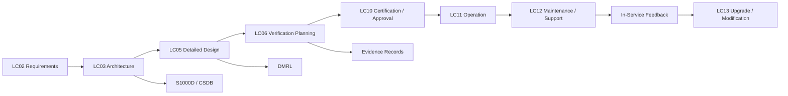

<!--
Controlled badge options:


Usage rule:
- TBD = value, source, boundary, interface, requirement, or evidence not yet determined.
- To Be Completed = section structure exists but content is intentionally incomplete.
- DRAFT = content exists but is not yet reviewed, frozen, or baselined.
- DONE = content has been reviewed and is complete for the current baseline.
-->

# <CODE> — <Controlled Title>

## 0. Hyperlink Policy

All linkable content in this file shall be expressed as Markdown links where a stable target exists.

Use:

- relative links for repository-internal content;
- anchor links for headings, figures, diagrams, glossary terms, citations, references, open issues, and lifecycle sections;
- stable external links only for public standards or authoritative sources;
- `TBD` or `<relative-link-or-TBD>` where no stable target exists.

Do not invent links.

Every table containing a document, path, code, reference, acronym, figure, diagram, lifecycle phase, Q-Division, ORB-Function, DMC, BREX, DMRL, evidence record, or issue shall include either a direct link or an explicit `TBD` target.

---

## 1. Purpose

This document defines the controlled technical scope for **<Controlled Title>** within the [Q+ATLANTIDE](../../../../Q+ATLANTIDE/) / [ATLAS 000-099](../../) architecture branch.

The objective is to provide a deterministic, [S1000D](https://s1000d.org/)-compatible technical baseline for [system architecture definition](#5-architecture-description), [maintenance documentation](#13-maintenance-concept), [configuration control](#14-s1000d--csdb-mapping), [verification planning](#17-verification-and-validation), and [lifecycle traceability](#9-mermaid--lifecycle-traceability).

This file belongs to:

[`Q+ATLANTIDE/000-099_ATLAS/<CODE-RANGE>/<NODE>/<FILE>`](./)

---

## 2. Applicability

This document applies to the [AMPEL360e Wide Tube-and-Wing Family](../../../../Programmes_example/090_AMPEL360e-Wide-Tube-and-Wing-Family/) programme and the **eWTW** configuration.

| Applicability Item | Value | Status |
|---|---|---|
| Programme | [AMPEL360e Wide Tube-and-Wing Family](../../../../Programmes_example/090_AMPEL360e-Wide-Tube-and-Wing-Family/) |  |
| Short code | [eWTW](#glossary-ewtw) |  |
| Architecture register | [Q+ATLANTIDE](../../../../Q+ATLANTIDE/) |  |
| ATLAS band | [000-099_ATLAS](../../) |  |
| ATA reference | [ATA <XX>](#ref-ata) |  |
| S1000D compatibility | [S1000D-CSDB-compatible](https://s1000d.org/) |  |
| Lifecycle use | [LC03](../../../../Governance/Lifecycle/LC03-Architecture-Definition.md) / [LC05](../../../../Governance/Lifecycle/LC05-Detailed-Design.md) / [LC06](../../../../Governance/Lifecycle/LC06-Verification-Planning.md) / [LC11](../../../../Governance/Lifecycle/LC11-Operation.md) / [LC12](../../../../Governance/Lifecycle/LC12-Maintenance-Support.md) |  |

---

## 3. System / Function Overview

The **<Controlled Title>** node covers the architecture, interfaces, operational logic, maintenance boundaries, and traceability requirements associated with this system or function.

For the [AMPEL360e](#glossary-ampel360e) configuration, the node shall be treated as part of a full-electric, medium-range, approximately 100-passenger aircraft architecture. Where conventional aircraft assumptions rely on engine bleed, hydraulic supply, pneumatic supply, or legacy equipment, the AMPEL360e implementation shall be explicitly reviewed for electric, distributed, or digitally controlled alternatives.

This document does not freeze the final certified design. It establishes a controlled scaffold for downstream engineering, [S1000D](#glossary-s1000d) data-module planning, [CSDB](#glossary-csdb) integration, and evidence capture.

---

## 4. Scope

### 4.1 Included

This document includes:

- controlled definition of the system or function;
- architecture boundaries;
- major equipment and component classes;
- operating modes;
- interfaces with adjacent aircraft systems;
- monitoring and diagnostics;
- maintenance and inspection implications;
- [S1000D / CSDB](#14-s1000d--csdb-mapping) mapping logic;
- lifecycle evidence requirements.

### 4.2 Excluded

This document excludes:

- supplier-proprietary internal design data unless released to the programme baseline;
- final certification compliance statements;
- detailed maintenance procedures unless assigned by the [DMRL](#glossary-dmrl);
- final illustrated parts data unless released through the [CSDB](#glossary-csdb);
- production-level configuration until [CCB](#glossary-ccb) freeze.

---

## 5. Architecture Description 

The **<Controlled Title>** architecture is organized around controlled interfaces, deterministic function allocation, and maintainable component boundaries.

At architecture level, the system shall be described in terms of:

1. **Function** — what the system does.
2. **Equipment** — which [LRUs](#glossary-lru), assemblies, panels, modules, or components implement the function.
3. **Interfaces** — how the system exchanges power, data, fluid, air, signal, force, or commands.
4. **Control logic** — how the system is commanded, monitored, degraded, isolated, or reset.
5. **Maintenance boundary** — what a technician can inspect, test, remove, install, or replace.
6. **Evidence boundary** — which requirements, tests, inspections, and records prove compliance.

---

## 6. Functional Breakdown 

| Ref | Function | Description | Primary Interface | Status |
|---:|---|---|---|---|
| [F-001](#f-001) | <a id="f-001"></a><Function 1> | <Describe the first controlled function.> | [Interface](#10-interfaces) |  |
| [F-002](#f-002) | <a id="f-002"></a><Function 2> | <Describe the second controlled function.> | [Interface](#10-interfaces) |  |
| [F-003](#f-003) | <a id="f-003"></a><Function 3> | <Describe the third controlled function.> | [Interface](#10-interfaces) |  |
| [F-004](#f-004) | <a id="f-004"></a>Monitoring | Captures status, failures, degradation, and maintenance data. | [CMS / BITE](#12-monitoring-and-diagnostics) |  |
| [F-005](#f-005) | <a id="f-005"></a>Traceability | Links architecture, requirements, evidence, and S1000D content. | [CSDB / DMRL / BREX](#14-s1000d--csdb-mapping) |  |

---

## 7. Mermaid — System Context Diagram

<a id="diagram-system-context"></a>

```mermaid
flowchart LR
    A[Aircraft-Level Function] --> B[<Controlled Node>]
    B --> C[Power Interface]
    B --> D[Data / Control Interface]
    B --> E[Mechanical / Fluid / Air Interface]
    B --> F[Monitoring and Diagnostics]
    F --> G[Central Maintenance System]
    G --> H[S1000D / CSDB Evidence]
````

***[Diagram 1](#diagram-system-context) — System context diagram for <Controlled Title>. Related sections: [Interfaces](#10-interfaces), [Monitoring and Diagnostics](#12-monitoring-and-diagnostics), [S1000D / CSDB Mapping](#14-s1000d--csdb-mapping).***

---

## 8. Mermaid — Internal Functional Architecture

<a id="diagram-internal-functional-architecture"></a>

```mermaid
flowchart TB
    SYS[<Controlled Title>] --> F1[Function 1]
    SYS --> F2[Function 2]
    SYS --> F3[Function 3]
    SYS --> CTRL[Control Logic]
    SYS --> MON[Monitoring and Diagnostics]
    SYS --> MAINT[Maintenance Boundary]

    CTRL --> IMA[IMA / Controller Interface]
    MON --> CMS[CMS / BITE]
    MAINT --> CSDB[S1000D Data Modules]
```

***[Diagram 2](#diagram-internal-functional-architecture) — Internal functional architecture. Related sections: [Functional Breakdown](#6-functional-breakdown), [Maintenance Concept](#13-maintenance-concept), [Footprints](#15-footprints).***

---

## 9. Mermaid — Lifecycle Traceability

<a id="diagram-lifecycle-traceability"></a>



***[Diagram 3](#diagram-lifecycle-traceability) — Lifecycle traceability from requirements to maintenance feedback. Related sections: [Verification and Validation](#17-verification-and-validation), [References](#20-references), [Open Issues](#21-open-issues).***

---

## 10. Interfaces 

| Interface Type        | Connected System                                      | Description                                                   | Evidence Required                        | Status                                                                  |
| --------------------- | ----------------------------------------------------- | ------------------------------------------------------------- | ---------------------------------------- | ----------------------------------------------------------------------- |
| Electrical power      | [<ATA / ATLAS node>](relative-link-or-TBD)            | <Describe power interface.>                                   | [Wiring / load analysis](#20-references) |                             |
| Data / control        | [IMA / CMS / controller](relative-link-or-TBD)        | <Describe command and monitoring interface.>                  | [ICD / data dictionary](#20-references)  |                             |
| Mechanical            | [Structure / installation zone](relative-link-or-TBD) | <Describe mounting, access, or load path.>                    | [Installation drawing](#20-references)   |                             |
| Fluid / air / thermal | [Adjacent system](relative-link-or-TBD)               | <Describe flow, pressure, temperature, or thermal interface.> | [Test report](#20-references)            |                             |
| Maintenance           | [CSDB / IETP](relative-link-or-TBD)                   | <Describe technician-facing access and procedure boundary.>   | [DMRL / BREX](#14-s1000d--csdb-mapping)  |  |

---

## 11. Operating Modes 

| Mode                                             | Description                                                                                                  | Entry Condition                             | Exit Condition                                    | Status                                              |
| ------------------------------------------------ | ------------------------------------------------------------------------------------------------------------ | ------------------------------------------- | ------------------------------------------------- | --------------------------------------------------- |
| [Normal](#mode-normal)                           | <a id="mode-normal"></a>System operates within nominal limits.                                               | Aircraft powered and system enabled.        | Shutdown, fault, or mode change.                  |  |
| [Degraded](#mode-degraded)                       | <a id="mode-degraded"></a>System operates with reduced function or redundancy.                               | Fault detected or partial loss of function. | Recovery, isolation, or maintenance action.       |  |
| [Maintenance](#mode-maintenance)                 | <a id="mode-maintenance"></a>System is configured for inspection, test, removal, installation, or servicing. | Authorized maintenance action.              | Maintenance close-up and operational check.       |  |
| [Failure / Safe State](#mode-failure-safe-state) | <a id="mode-failure-safe-state"></a>System enters protective state to prevent unsafe operation.              | Fault threshold exceeded.                   | Reset, repair, replacement, or dispatch decision. |         |

---

## 12. Monitoring and Diagnostics 

The system shall provide sufficient monitoring to support safe operation, maintenance troubleshooting, and lifecycle evidence capture.

Monitoring may include:

* status indication;
* fault detection;
* [BITE](#glossary-bite) results;
* sensor plausibility checks;
* degraded-mode reporting;
* maintenance messages;
* event recording;
* configuration status;
* software or hardware part-number reporting where applicable.

Diagnostic data shall be mapped to the relevant [S1000D / CSDB](#14-s1000d--csdb-mapping) fault isolation and maintenance data modules.

---

## 13. Maintenance Concept 

The maintenance concept shall support modular inspection, fault isolation, removal, installation, and return-to-service verification.

Maintenance content should be structured around:

* access requirements;
* safety precautions;
* isolation conditions;
* required tools and test equipment;
* inspection criteria;
* functional test criteria;
* fault isolation logic;
* replacement boundaries;
* close-up and return-to-service checks.

Maintenance procedures shall remain provisional until validated against the applicable [DMRL](#glossary-dmrl), [BREX](#glossary-brex), and task validation records.

---

## 14. S1000D / CSDB Mapping 

| S1000D Element      | Controlled Value                                                | Status                                                                  |
| ------------------- | --------------------------------------------------------------- | ----------------------------------------------------------------------- |
| Model ident code    | `AMPEL360E`                                                     |                      |
| System diff code    | `EWTW`                                                          |                      |
| System code         | `<XXX>`                                                         |                             |
| Sub-system code     | `<X>`                                                           |                             |
| Sub-sub-system code | `<XX>`                                                          |                             |
| Assy code           | `<XXA>`                                                         |                             |
| Info code           | `<040 / 300 / 400 / 520 / 720 / 941>`                           |  |
| Item location code  | `D`                                                             |                      |
| DMC prefix          | [`DMC-AMPEL360E-EWTW-<SNS>`](relative-link-to-csdb-path-or-TBD) |                             |

### Recommended Data Module Set

|      Info code | Data module purpose                                 | Suggested filename                                                                   | Status                                                                  |
| -------------: | --------------------------------------------------- | ------------------------------------------------------------------------------------ | ----------------------------------------------------------------------- |
| [040](#dm-040) | <a id="dm-040"></a>Descriptive information          | [`DMC-AMPEL360E-EWTW-<SNS>-040A-D_System-Description.xml`](relative-link-or-TBD)     |  |
| [300](#dm-300) | <a id="dm-300"></a>Examination / inspection / check | [`DMC-AMPEL360E-EWTW-<SNS>-300A-D_Inspection.xml`](relative-link-or-TBD)             |  |
| [400](#dm-400) | <a id="dm-400"></a>Fault isolation                  | [`DMC-AMPEL360E-EWTW-<SNS>-400A-D_Fault-Isolation.xml`](relative-link-or-TBD)        |  |
| [520](#dm-520) | <a id="dm-520"></a>Remove / disassemble             | [`DMC-AMPEL360E-EWTW-<SNS>-520A-D_Remove.xml`](relative-link-or-TBD)                 |  |
| [720](#dm-720) | <a id="dm-720"></a>Install / assemble / connect     | [`DMC-AMPEL360E-EWTW-<SNS>-720A-D_Install.xml`](relative-link-or-TBD)                |  |
| [941](#dm-941) | <a id="dm-941"></a>Illustrated parts data           | [`DMC-AMPEL360E-EWTW-<SNS>-941A-D_Illustrated-Parts-Data.xml`](relative-link-or-TBD) |  |

---

## 15. Footprints 

### 15.1 Physical Footprint

| Footprint Item        | Description                                    | Status                                       |
| --------------------- | ---------------------------------------------- | -------------------------------------------- |
| Installation zone     | <Aircraft zone or compartment.>                |  |
| Access panels         | <Relevant access points.>                      |  |
| Mounting provisions   | <Rack, bracket, panel, structural attachment.> |  |
| Clearance envelope    | <Required removal / installation clearance.>   |  |
| Cooling / ventilation | <Thermal management interface.>                |  |
| Drainage / leak path  | <If applicable.>                               |  |

### 15.2 Electrical / Data Footprint

| Footprint Item      | Description                                              | Status                                       |
| ------------------- | -------------------------------------------------------- | -------------------------------------------- |
| Power supply        | <Voltage / phase / bus source.>                          |  |
| Protection          | <Circuit breaker / SSPC / fuse / electronic protection.> |  |
| Data buses          | <ARINC / AFDX / CAN / discrete / optical / other.>       |  |
| Connectors          | <Connector families or interface references.>            |  |
| Bonding / grounding | <Bonding and grounding provision.>                       |  |
| EMC / EMI controls  | <Shielding, segregation, filtering.>                     |  |

### 15.3 Maintenance Footprint

| Footprint Item          | Description                                  | Status                                       |
| ----------------------- | -------------------------------------------- | -------------------------------------------- |
| Access level            | Line / base / shop                           |  |
| Replaceable unit        | LRU / SRU / assembly / panel                 |  |
| Removal time            | Estimated or controlled maintenance interval |  |
| Required tools          | Standard / special tools                     |  |
| Required GSE            | Ground support equipment                     |  |
| Return-to-service check | Operational / functional / BITE check        |  |

### 15.4 Data Footprint

| Footprint Item        | Description                                            | Status                                       |
| --------------------- | ------------------------------------------------------ | -------------------------------------------- |
| Configuration records | Part number, serial number, software load, effectivity |  |
| Evidence records      | Test, inspection, compliance, review records           |  |
| CSDB records          | DMCs, ICNs, BREX, applicability                        |  |
| Maintenance data      | Fault history, BITE, removal/installation records      |  |
| Cybersecurity records | Access, load authorization, integrity checks           |  |

---

## 16. Safety and Certification Considerations 

The system shall be assessed according to its aircraft-level function, failure effects, operational criticality, and integration dependencies.

The certification and safety analysis shall consider:

* functional hazard assessment;
* failure modes and effects;
* common-cause failures;
* degraded-mode behavior;
* latent failures;
* maintenance-induced failures;
* incorrect installation;
* incorrect configuration;
* loss of indication or misleading indication;
* software and hardware assurance levels where applicable;
* environmental qualification;
* electromagnetic compatibility;
* continued airworthiness impact.

Final safety classification shall remain **TBD**  until reviewed against the applicable [FHA](#glossary-fha), [PSSA](#glossary-pssa), [SSA](#glossary-ssa), and certification basis.

---

## 17. Verification and Validation 

Verification shall demonstrate that the system satisfies its requirements under nominal, degraded, maintenance, and failure conditions.

| Verification Method                          | Description                                                                                                          | Evidence                               | Status                                                                  |
| -------------------------------------------- | -------------------------------------------------------------------------------------------------------------------- | -------------------------------------- | ----------------------------------------------------------------------- |
| [Analysis](#verification-analysis)           | <a id="verification-analysis"></a>Engineering calculation, modelling, simulation, or safety analysis.                | [Analysis report](#20-references)      |  |
| [Inspection](#verification-inspection)       | <a id="verification-inspection"></a>Physical or visual verification of installation, marking, routing, or condition. | [Inspection record](#20-references)    |  |
| [Test](#verification-test)                   | <a id="verification-test"></a>Functional, environmental, integration, or system test.                                | [Test report](#20-references)          |  |
| [Demonstration](#verification-demonstration) | <a id="verification-demonstration"></a>Operational demonstration under controlled conditions.                        | [Demonstration record](#20-references) |  |
| [Similarity](#verification-similarity)       | <a id="verification-similarity"></a>Justified reuse of existing certified design evidence.                           | [Similarity report](#20-references)    |                             |

---

## 18. Glossary of Terms and Acronyms

| Term / Acronym                           | Meaning                                                                                | Link                                                                                 | Status                                                                  |
| ---------------------------------------- | -------------------------------------------------------------------------------------- | ------------------------------------------------------------------------------------ | ----------------------------------------------------------------------- |
| <a id="glossary-ampel360e"></a>AMPEL360e | Electrified aircraft programme family used as the programme example.                   | [Programme](../../../../Programmes_example/090_AMPEL360e-Wide-Tube-and-Wing-Family/) |                      |
| <a id="glossary-atlas"></a>ATLAS         | Aircraft Top Level Architecture Schema/System.                                         | [ATLAS 000-099](../../)                                                              |                      |
| <a id="glossary-bite"></a>BITE           | Built-In Test Equipment.                                                               | [Monitoring and Diagnostics](#12-monitoring-and-diagnostics)                         |                      |
| <a id="glossary-brex"></a>BREX           | Business Rules Exchange; S1000D rule set used to validate data-module content.         | [BREX](relative-link-or-TBD)                                                         |                             |
| <a id="glossary-ccb"></a>CCB             | Configuration Control Board.                                                           | [Governance](../../../../Governance/)                                                |  |
| <a id="glossary-csdb"></a>CSDB           | Common Source DataBase.                                                                | [S1000D / CSDB Mapping](#14-s1000d--csdb-mapping)                                    |                      |
| <a id="glossary-dmc"></a>DMC             | Data Module Code.                                                                      | [S1000D DMC Mapping](#14-s1000d--csdb-mapping)                                       |                      |
| <a id="glossary-dmrl"></a>DMRL           | Data Module Requirement List.                                                          | [DMRL](relative-link-or-TBD)                                                         |                             |
| <a id="glossary-ewtw"></a>eWTW           | Electric Wide Tube-and-Wing.                                                           | [Programme](../../../../Programmes_example/090_AMPEL360e-Wide-Tube-and-Wing-Family/) |                      |
| <a id="glossary-fha"></a>FHA             | Functional Hazard Assessment.                                                          | [Safety and Certification](#16-safety-and-certification-considerations)              |  |
| <a id="glossary-ietp"></a>IETP           | Interactive Electronic Technical Publication.                                          | [S1000D](https://s1000d.org/)                                                        |                      |
| <a id="glossary-lc"></a>LC               | Lifecycle phase code.                                                                  | [Lifecycle Governance](../../../../Governance/Lifecycle/)                            |                      |
| <a id="glossary-lru"></a>LRU             | Line Replaceable Unit.                                                                 | [Maintenance Concept](#13-maintenance-concept)                                       |                      |
| <a id="glossary-pssa"></a>PSSA           | Preliminary System Safety Assessment.                                                  | [Safety and Certification](#16-safety-and-certification-considerations)              |  |
| <a id="glossary-qdatagov"></a>Q-DATAGOV  | Q-Division responsible for data governance, digital architecture, and traceability.    | [Q-DATAGOV](../../../../Q-Divisions/Q-DATAGOV/)                                      |                      |
| <a id="glossary-s1000d"></a>S1000D       | International specification for technical publications using a common source database. | [S1000D](https://s1000d.org/)                                                        |                      |
| <a id="glossary-sns"></a>SNS             | Standard Numbering System.                                                             | [S1000D / CSDB Mapping](#14-s1000d--csdb-mapping)                                    |                      |
| <a id="glossary-ssa"></a>SSA             | System Safety Assessment.                                                              | [Safety and Certification](#16-safety-and-certification-considerations)              |  |
| <a id="glossary-tbc"></a>TBC             | To Be Confirmed.                                                                       | [Open Issues](#21-open-issues)                                                       |                      |
| <a id="glossary-tbd"></a>TBD             | To Be Determined.                                                                      | [Open Issues](#21-open-issues)                                                       |                      |

---

## 19. Citations 

| Ref                 | Citation                                                                | Use                            | Link                                                                                          | Status                                                                  |
| ------------------- | ----------------------------------------------------------------------- | ------------------------------ | --------------------------------------------------------------------------------------------- | ----------------------------------------------------------------------- |
| [CIT-001](#cit-001) | <a id="cit-001"></a>`<Standard or source title>, <edition>, <section>.` | Architecture / terminology     | [Source](stable-link-or-TBD)                                                                  |                             |
| [CIT-002](#cit-002) | <a id="cit-002"></a>`<Regulatory source>, <paragraph>.`                 | Certification basis            | [Source](stable-link-or-TBD)                                                                  |                             |
| [CIT-003](#cit-003) | <a id="cit-003"></a>`<Programme document>, <revision>.`                 | Programme-specific requirement | [Programme baseline](../../../../Programmes_example/090_AMPEL360e-Wide-Tube-and-Wing-Family/) |  |
| [CIT-004](#cit-004) | <a id="cit-004"></a>`<Supplier document>, <revision>.`                  | Equipment-specific data        | [Supplier evidence](relative-link-or-TBD)                                                     |                             |
| [CIT-005](#cit-005) | <a id="cit-005"></a>`<Test or analysis report>, <revision>.`            | Verification evidence          | [Evidence record](relative-link-or-TBD)                                                       |                             |

---

## 20. References 

| Ref                 | Document                                                      |                  Identifier | Revision | Status                                       | Link                                                                            |
| ------------------- | ------------------------------------------------------------- | --------------------------: | -------: | -------------------------------------------- | ------------------------------------------------------------------------------- |
| [REF-001](#ref-001) | <a id="ref-001"></a>Q+ATLANTIDE ATLAS master index            |        `QATL-ATLAS-000-099` |      TBD |  | [Open](../../)                                                                  |
| [REF-002](#ref-002) | <a id="ref-002"></a>AMPEL360e programme architecture baseline |     `AMP360E-ARCH-BASELINE` |      TBD |  | [Open](../../../../Programmes_example/090_AMPEL360e-Wide-Tube-and-Wing-Family/) |
| [REF-003](#ref-003) | <a id="ref-003"></a>S1000D project BREX                       |       `BREX-AMPEL360E-EWTW` |      TBD |  | [Open](relative-link-or-TBD)                                                    |
| [REF-004](#ref-004) | <a id="ref-004"></a>DMRL for applicable system                | `DMRL-AMPEL360E-EWTW-<SNS>` |      TBD |  | [Open](relative-link-or-TBD)                                                    |
| [REF-005](#ref-005) | <a id="ref-005"></a>System safety assessment                  |    `SSA-AMPEL360E-<SYSTEM>` |      TBD |  | [Open](relative-link-or-TBD)                                                    |
| [REF-ATA](#ref-ata) | <a id="ref-ata"></a>ATA iSpec 2200 reference                  |            `ATA-ISPEC-2200` |      TBD |  | [Source](stable-link-or-TBD)                                                    |

---

## 21. Open Issues

| ID                | Issue                                                                     | Owner              | Status          | Badge                                                                   | Link                                                                    |
| ----------------- | ------------------------------------------------------------------------- | ------------------ | --------------- | ----------------------------------------------------------------------- | ----------------------------------------------------------------------- |
| [OI-001](#oi-001) | <a id="oi-001"></a>Confirm final system boundary.                         | System expert      | TBD             |                             | [Architecture Description](#5-architecture-description)                 |
| [OI-002](#oi-002) | <a id="oi-002"></a>Complete S1000D SNS allocation.                        | Q-DATAGOV          | To Be Completed |  | [S1000D / CSDB Mapping](#14-s1000d--csdb-mapping)                       |
| [OI-003](#oi-003) | <a id="oi-003"></a>Confirm certification basis and safety classification. | Certification lead | TBD             |                             | [Safety and Certification](#16-safety-and-certification-considerations) |
| [OI-004](#oi-004) | <a id="oi-004"></a>Confirm maintenance task allocation in DMRL.           | Tech pubs lead     | To Be Completed |  | [Maintenance Concept](#13-maintenance-concept)                          |

---

## 22. Status Legend

| Badge                                                                   | Meaning          | Use                                                                                          |
| ----------------------------------------------------------------------- | ---------------- | -------------------------------------------------------------------------------------------- |
|                             | To Be Determined | Required value, source, boundary, interface, requirement, or evidence is not yet determined. |
|  | To Be Completed  | Section exists but content is intentionally incomplete.                                      |
|                      | Draft            | Content exists but is not yet reviewed, frozen, or baselined.                                |
|                   | Done             | Content has been reviewed and is complete for the current baseline.                          |

---

## 23. Change Log

| Revision          | Date                           | Author                | Change                                 | Link                                     | Status                                              |
| ----------------- | ------------------------------ | --------------------- | -------------------------------------- | ---------------------------------------- | --------------------------------------------------- |
| [0.1.0](#chg-010) | <a id="chg-010"></a>2026-05-09 | GAIA-QAO / IDEALE-ESG | Initial programme-controlled scaffold. | [Document root](#code--controlled-title) |  |

---

> Programme-controlled scaffold. Content is subject to [BREX](#glossary-brex), [SNS](#glossary-sns), applicability, [DMRL](#glossary-dmrl), evidence review, and [CCB](#glossary-ccb) freeze before controlled release.

> **To be reviewed by system expert.**

```
```

