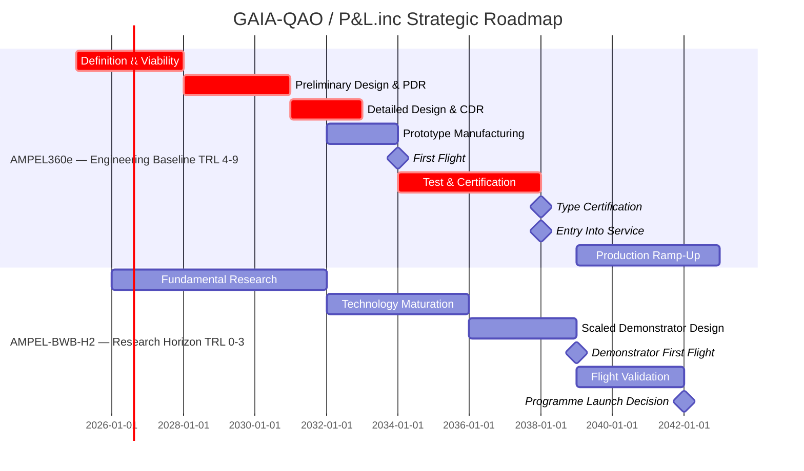

---
repository:
  owner: "AmedeoPelliccia"
  name: "Qplus-For-All-Queer-People-and-Quantum"
  title: "Q+ : For All Queer People. And Quantum"
  short_name: "Q+"
  role: "corporate / organizational umbrella"

brand:
  public_mark: "Q+"
  spoken_name: "Q Plus"
  code_alias: "QP"
  controlled_title: "Q+ : For All Queer People. And Quantum"
  semantic_statement: "For All Queer People. And Quantum."
  primary_meaning:
    "Q+": "organization / corporation / public title / public mark"
    "Queer People": "human dignity, inclusion, civic protection, non-erasure"
    "Quantum": "quantum technologies, quantum governance, quantum-aerospace future"

  architecture:
    short_public_mark: "Q+"
    ascii_safe_alias: "QP"
    aerospace_abbreviation: "Q+A"
    future_full_brand: "Q+AEROSPACE"
    semantic_expansion: "Quantum + Aerospace"
    hierarchy:
      - "Q+ = public mark / organizational umbrella"
      - "QP = ASCII-safe code alias for Q+"
      - "Q+A = Quantum + Aerospace abbreviation"
      - "Q+AEROSPACE = future full aerospace brand"
      - "Quantum + Aerospace = semantic expansion"

  positioning:
    category: "quantum-aerospace governance and architecture framework"
    strategic_role: "democratic quantum-aerospace counterweight to private orbital hegemony"
    not_positioned_as: "anti-SpaceX"
    positioned_as: "open, accountable, humane, European, quantum-aerospace architecture"

foundation:
  legal_style_name: "P&L.inc_Peace-and-Love"
  short_name: "P&L inc."
  semantic_expansion: "Peace-and-Love inc."
  dedication: "Dem&PeL.inc_Democracies-and-Peace-and-Loving"

distinction:
  "Q+": "organization / corporation / public title / public mark"
  "QP": "ASCII-safe alphanumeric alias of Q+ for paths, IDs, repositories, and code systems"
  "Q+A": "Quantum + Aerospace abbreviation; technical-commercial shorthand"
  "Q+AEROSPACE": "future full aerospace brand for Quantum + Aerospace"
  "Q+ATLANTIDE": "architecture-taxonomy ecosystem. Acronym stands for Quantum + Aerospace Top Level Architectures and Novel Technologies Identification and Data Ecosystem."
  "Q+ATLANTIDE1000": "controlled 000–999 identification schema"

q_atlantide:
  full_name: "Quantum + Aerospace Top Level Architectures and Novel Technologies Identification and Data Ecosystem"
  short_name: "Q+ATLANTIDE"
  schema_name: "Q+ATLANTIDE1000"
  schema_range: "000–999"
  role: "controlled architecture-taxonomy ecosystem / Libro Unico delle Tecnologie"
  hierarchy:
    - "Q+ATLANTIDE1000 = full controlled 000–999 architecture taxonomy"
    - "Architecture Band / Master Range = one 100-code architecture band, e.g. 000-099_ATLAS"
    - "Code Range = one 10-code block inside a master range, e.g. 010-019_Manejo-en-Tierra-Servicio"
    - "Node / Subject Folder = controlled architecture node inside a code range, e.g. 010_Ground-handling"
    - "Markdown File Set = controlled node-level files, e.g. 010-000-Ground-Handling-Overview.md"
    - "Programme DMC Mapping = programme-specific S1000D/CSDB implementation of applicable taxonomy nodes"

governance:
  principle: "inclusive_democracy"
  inclusion_clause: "All qualified stakeholders are included without erasing proportional responsibility, merit, or accountability."
  linguistic_register: "institutional with controlled irony"
  humour_note: "If it is IVA, it is also Zanicchi."
  no_aaa_rule: true

technical_alignment:
  domains:
    - "quantum"
    - "aerospace"
    - "space systems"
    - "digital technical publications"
    - "S1000D / CSDB"
    - "AI / neural networks"
    - "democratic enterprise governance"
    - "open technical knowledge"
  lifecycle_model: "LC01–LC14"
  publication_model: "S1000D / CSDB"
  evidence_model: "deterministic, auditable, lifecycle-gated"

document:
  document_id: "QPLUS-ROOT-README"
  filename: "README.md"
  version: "1.0.0"
  status: "Draft → Stakeholder Review"
  primary_language: "multilingual"
  owner: "Office of the CEO / Amedeo Pelliccia"
  classification: "Open technical / strategic brand baseline"
---


# Q+ : For All Queer People. And Quantum

## **For All Queer People. And Quantum**

**Corporate / organizational umbrella for quantum, aerospace, democratic governance, open technical knowledge, and human dignity.**


---

## Document Control

| Field | Value |
|---|---|
| **Document ID** | `QPLUS-ROOT-README` |
| **Version** | `1.0.0` |
| **Status** | `Draft → Stakeholder Review` |
| **Primary Language** | Multilingual |
| **Owner** | `Office of the CEO / Amedeo Pelliccia` |
| **Classification** | `Open technical / strategic brand baseline` |
| **Baseline Dependencies** | `Q+ATLANTIDE1000`, `Q+ATLANTIDE`, `IDEALE-ESG`, `LC01–LC14`, `S1000D / CSDB`, `DEGF v1.0` |

---


# Table of Contents

## Core Framework

1. [Purpose & Strategic Vision](#1-purpose--strategic-vision)
2. [Canonical Architecture Governance](#2-canonical-architecture-governance)
3. [Q+ATLANTIDE1000 Architecture Bands](#3-qatlantide1000-architecture-bands)
4. [Repository Structure Alignment](#4-repository-structure-alignment)
5. [Democratic Enterprise Governance Framework](#5-democratic-enterprise-governance-framework)
6. [Technical Divisions — Q-Divisions](#6-technical-divisions--q-divisions)
7. [Enterprise Functions — ORB-Functions](#7-enterprise-functions--orb-functions)
8. [Phased Development Strategy](#8-phased-development-strategy)
9. [Integrated Operating Model](#9-integrated-operating-model)
10. [Talent & Competency Management](#10-talent--competency-management)
11. [Quality & Safety Management System](#11-quality--safety-management-system)
12. [Regulatory Compliance Framework](#12-regulatory-compliance-framework)
13. [Key Performance Indicators](#13-key-performance-indicators)
14. [Master Roadmap & Phase Gates](#14-master-roadmap--phase-gates)
15. [Financial Management & Budgeting](#15-financial-management--budgeting)
16. [Strategic Risk Management](#16-strategic-risk-management)
17. [Strategic Communications Plan](#17-strategic-communications-plan)
18. [Implementation Roadmap](#18-implementation-roadmap)
19. [Annexes](#19-annexes)
20. [Quick Navigation & Coded Paths](#20-quick-navigation--coded-paths)
21. [Footprint](#21-footprint)
22. [References](#22-references)

---

# 1. Purpose & Strategic Vision

## 1.1 Mission

**Q+** is an idealized strategic structure for sustainable aviation, advanced aerospace architectures, quantum-enabled engineering, democratic enterprise governance, and European industrial sovereignty.

Its mission is to create a controlled industrial architecture for developing, governing, certifying, and industrializing next-generation aerospace systems.

Q+ connects:

* sustainable aircraft architectures;
* space and orbital infrastructure;
* digital twins and lifecycle evidence systems;
* quantum- and AI-assisted optimization;
* S1000D / CSDB technical-publication readiness;
* safety-first aerospace governance;
* European industrial participation;
* transparent stakeholder governance.

Q+ is not only a brand or repository structure. It is a governance model for making aerospace technology traceable, certifiable, reusable, and accountable across its full lifecycle.

## 1.2 Vision

To establish a European-led aerospace and quantum-industrial framework for delivering **safe, sustainable, certifiable, and socially accountable aerospace products** across the full lifecycle: concept, requirements, architecture, certification, production, operation, support, maintenance, retirement, and circularity.

Q+ exists to make advanced aerospace technology **traceable, governable, reusable, certifiable, and accountable**.

## 1.3 Core Values

| Value                                | Operational Meaning                                                                                                                   |
| ------------------------------------ | ------------------------------------------------------------------------------------------------------------------------------------- |
| **Safety First**                     | Airworthiness, human safety, system safety, and regulatory compliance are non-negotiable.                                             |
| **Realistic Ambition**               | Advanced objectives are decomposed into gated, auditable, achievable work packages.                                                   |
| **Technical Sovereignty**            | Critical data, models, configurations, evidence, supply chains, and industrial capacity remain under controlled governance.           |
| **Sustainability by Design**         | Environmental performance is designed into architecture, supply chain, production, operations, maintenance, and end-of-life recovery. |
| **Traceability**                     | Every decision maps to requirements, evidence, authority, configuration, lifecycle gate, and accountable ownership.                   |
| **Democratic Enterprise Governance** | Stakeholders participate through structured rights, responsibilities, and controlled decision mechanisms.                             |
| **Certification Readiness**          | Outputs are structured for verification, validation, audit, authority review, and certification support from the beginning.           |
| **No-AAA Rule**                      | `AAA` is not a valid domain, division, architecture, interface, enterprise function, or taxonomy element.                             |

## 1.4 Strategic Objectives

| Horizon   | Objective                                                                                                                          | Target                                                                |
| --------- | ---------------------------------------------------------------------------------------------------------------------------------- | --------------------------------------------------------------------- |
| 2025–2030 | Establish baseline governance, Q-Divisions, ORB-Functions, lifecycle gates, and the architecture-band register                     | Q+ATLANTIDE1000 operational baseline                                  |
| 2025–2038 | Develop the Gen 1 sustainable commercial aircraft programme                                                                        | AMPEL360e EIS target                                                  |
| 2026–2040 | Mature hydrogen, BWB, hybrid-electric, and safety-critical demonstrator technologies                                               | AMPEL360 BWB-H₂ demonstrator TRL maturation                           |
| 2030–2045 | Establish digital-thread, S1000D/CSDB, PLM, evidence-chain, and Digital Product Passport governance across programmes              | Full lifecycle traceability                                           |
| 2035+     | Deploy non-critical quantum-enabled optimization, sensing, simulation, and assurance support capabilities                          | Certifiable integration path                                          |
| 2040+     | Consolidate European aerospace industrial leadership through controlled supply chains, industrial participation, and IP governance | Supplier ecosystem, skilled jobs, reusable evidence, and IP portfolio |

---

# 2. Canonical Architecture Governance

## 2.1 Canonical Hierarchy

```text
Q+ATLANTIDE1000
└── Architecture Band / Master Range
    └── Code Range
        └── Node / Subject Folder
            └── Markdown File Set
                └── Numbered Item / Topic

Programme impact studies then map applicable nodes/items to:
S1000D-CSDB/DMC/
```

## 2.2 Hierarchy Table

| Level                            | Definition                                                       |                                Format | Example                                                                                |
| -------------------------------- | ---------------------------------------------------------------- | ------------------------------------: | -------------------------------------------------------------------------------------- |
| Q+ATLANTIDE1000                  | Full controlled architecture taxonomy                            |                             `000–999` | `Q+ATLANTIDE1000`                                                                      |
| Architecture Band / Master Range | One 100-code architecture band                                   |                             `000–099` | `000-099_ATLAS` — Aircraft Top Level Architecture Schema/System                        |
| Code Range                       | Internal 10-code block inside a master range                     |                             `000–009` | `000-009_Informacion-General-y-Servicio`                                               |
| Node / Subject Folder            | Controlled architecture node inside a code range                 |      `000`, `001`, `010`, `021`, etc. | `000_Identificacion`, `010_Ground-handling`, `021_Air-Conditioning-and-Pressurization` |
| Markdown File Set                | Controlled files inside a node folder                            | `<node>-<item>-<Controlled-Title>.md` | `010-000-Ground-Handling-Overview.md`                                                  |
| Item / Topic                     | Numbered content item inside a node                              |             `000`, `001`, `002`, etc. | `000` = Overview, `001` = Scope and Definitions                                        |
| Programme DMC Mapping            | Programme-specific S1000D/CSDB implementation of a taxonomy node |       `DMC-<PROGRAMME>-<node>-<item>` | `DMC-AMPEL360E-EWTW-021-060`                                                           |

## 2.3 Example Hierarchy

```text
Q+ATLANTIDE/
└── 000-099_ATLAS/
    └── 010-019_Manejo-en-Tierra-Servicio/
        └── 010_Ground-handling/
            ├── README.md
            ├── 010-000-Ground-Handling-Overview.md
            ├── 010-001-Ground-Handling-Scope-and-Definitions.md
            ├── 010-002-Ground-Handling-Roles-Authorizations-and-Responsibilities.md
            ├── 010-003-Ground-Handling-Safety-Zones-Hazards-and-Exclusion-Areas.md
            ├── 010-004-Ground-Support-Equipment-Interfaces.md
            └── 010-005-Ground-Handling-Documentation-Logs-and-Traceability.md
```

## 2.4 Naming Rule

The term **sub-range** is deprecated as a controlled hierarchy level.

Use:

| Deprecated          | Correct                                                |
| ------------------- | ------------------------------------------------------ |
| Sub-range           | Code Range                                             |
| Sub-range block     | Code Range                                             |
| Sub-range table     | Architecture table                                     |
| Sub-range breakdown | Code Range → Node / Subject Folder → Markdown File Set |

## 2.5 Identifier Order

All architecture tables shall order identifiers as:

```text
Architecture → Architecture Band / Master Range → Code Range → Node / Subject Folder → Markdown File Set → Item / Topic
```

Programme implementation may then add:

```text
Programme → Impact Study → S1000D-CSDB → DMC → XML / ICN / BREX / Applicability / Evidence
```

---

# 3. Q+ATLANTIDE1000 Architecture Bands

## 3.1 Controlled Expansion

| Segment | Expansion          | Meaning                                                                          |
| ------- | ------------------ | -------------------------------------------------------------------------------- |
| **Q+**  | **Quantum Plus**   | Quantum, advanced, transversal, and extensible layer                             |
| **A**   | **Aerospace**      | Core aerospace domain                                                            |
| **T**   | **Top**            | Highest level of classification                                                  |
| **L**   | **Level**          | Top-level architecture / master range                                            |
| **A**   | **Architectures**  | Controlled architecture bands                                                    |
| **N**   | **Novel**          | New, disruptive, or emerging technologies                                        |
| **T**   | **Technologies**   | Systems, subsystems, materials, energy, digital, cyber, and quantum technologies |
| **I**   | **Identification** | Technical identification, traceability, and coding                               |
| **D**   | **Data**           | Structured data, metadata, evidence, CSDB / PLM                                  |
| **E**   | **Ecosystem**      | Complete classification and governance ecosystem                                 |

## 3.2 Libro Unico delle Tecnologie

**Q+ATLANTIDE** is the **Libro Unico delle Tecnologie**: a controlled, versioned, and traceable technical encyclopedia for architectures, systems, technologies, evidence, governance, lifecycle knowledge, and programme applicability across aerospace, space, defence, digital, energy, materials, cybersecurity, and quantum domains.

Its function is to provide a common identification grammar through the `Q+ATLANTIDE1000` schema, connecting taxonomy, programme impact studies, PBS/WBS structures, Q-Divisions, ORB-Functions, lifecycle gates, S1000D/CSDB data modules, evidence records, and Digital Product Passport logic.

## 3.3 Architecture Band Register

|      Band | Controlled Name                                         | Scope                                                           |
| --------: | ------------------------------------------------------- | --------------------------------------------------------------- |
| `000–099` | `ATLAS` — Aircraft Top Level Architecture Schema/System | New commercial aircraft architectures                           |
| `100–199` | `STA` — Space Technology Architecture                   | Space systems, spacecraft, orbital infrastructure               |
| `200–299` | Defence Technology Architecture                         | Defence and dual-use boundary architecture                      |
| `300–399` | Digital Twin / Cloud / Edge / AI                        | Digital thread, AI, cloud, edge, data platforms                 |
| `400–499` | Energy / Propulsion                                     | Energy systems, propulsion architectures, thermal systems       |
| `500–599` | Materials / Bio / Nano                                  | Advanced materials, bio, nano, circular materials               |
| `600–699` | Ground Automation                                       | Ground operations, automation, robotics, logistics              |
| `700–799` | Aerial City / UAM                                       | Urban air mobility and aerial-city systems                      |
| `800–899` | Cybersecurity                                           | Cybersecurity, PQC, resilience, secure architectures            |
| `900–999` | Quantum / Sentient Agency                               | Quantum computing, sensing, communication, agency architecture  |  

## 3.1 Master Architecture Table

| Master range | Architecture code | Architecture name | Primary focus |
|---:|---|---|---|
| [`000–099`](Q+ATLANTIDE/000-099_ATLAS/) | [ATLAS](Q+ATLANTIDE/000-099_ATLAS/) | Aircraft Top-Level Architecture System | New commercial aircraft architectures, BWB, WTW, hybrid-electric, H₂, S1000D/CSDB/PLM integration |
| [`100–199`](Q+ATLANTIDE/100-199_STA/) | [STA](Q+ATLANTIDE/100-199_STA/) | Space Technology Architecture | Space systems, LEO+, orbital infrastructure, interplanetary concepts |
| [`200–299`](Q+ATLANTIDE/200-299_DTTA/) | [DTTA](Q+ATLANTIDE/200-299_DTTA/) | Defence Technology Type Architecture | Defence, C4ISR, resilience, electronic warfare, autonomous systems |
| [`300–399`](Q+ATLANTIDE/300-399_DTCEC/) | [DTCEC](Q+ATLANTIDE/300-399_DTCEC/) | Digital Twin, Cloud, Edge & AI Architecture | Digital twins, AI, cloud, edge, XR, blockchain, analytics |
| [`400–499`](Q+ATLANTIDE/400-499_EPTA/) | [EPTA](Q+ATLANTIDE/400-499_EPTA/) | Energy & Propulsion Technology Architecture | Energy, storage, conversion, electric, hydrogen and advanced propulsion |
| [`500–599`](Q+ATLANTIDE/500-599_AMTA/) | [AMTA](Q+ATLANTIDE/500-599_AMTA/) | Advanced Material, Bio & Nanotechnology Architecture | Advanced materials, bio/nano, metamaterials, additive manufacturing |
| [`600–699`](Q+ATLANTIDE/600-699_OGATA/) | [OGATA](Q+ATLANTIDE/600-699_OGATA/) | On-Ground Automation Technology Architecture | Ground automation, robotics, factories 4.0, logistics, HRI |
| [`700–799`](Q+ATLANTIDE/700-799_ACV/) | [ACV](Q+ATLANTIDE/700-799_ACV/) | Aerial City Viability / UAM Architecture | UAM, vertiports, UTM, noise, urban integration and business models |
| [`800–899`](Q+ATLANTIDE/800-899_CYB/) | [CYB](Q+ATLANTIDE/800-899_CYB/) | Cybersecurity Architecture | Cybersecurity, PQC, ICS/OT, SecOps, IAM, cyber-resilience |
| [`900–999`](Q+ATLANTIDE/900-999_QCSAA/) | [QCSAA](Q+ATLANTIDE/900-999_QCSAA/) | Quantum Computing & Sentient Agency Architecture | Quantum computing, QML, quantum networks, sensing, agency governance |

## 3.2 Architecture Table — Code Range / Section / Subject Baseline

| Architecture | Master range | Code range | Section | Section title | Subject | Subject title |
|---|---:|---:|---:|---|---:|---|
| [ATLAS](Q+ATLANTIDE/000-099_ATLAS/) | `000–099` | [`000–009`](Q+ATLANTIDE/000-099_ATLAS/000-009_Informacion-General-y-Servicio/) | `00` | Información General y Servicio | `00` | General Information |
| [ATLAS](Q+ATLANTIDE/000-099_ATLAS/) | `000–099` | [`010–019`](Q+ATLANTIDE/000-099_ATLAS/010-019_Manejo-en-Tierra-Servicio/) | `01` | Manejo en Tierra & Servicio | `00` | General Information |
| [ATLAS](Q+ATLANTIDE/000-099_ATLAS/) | `000–099` | [`020–029`](Q+ATLANTIDE/000-099_ATLAS/020-029_Sistemas-Core-de-Aeronave/) | `02` | Sistemas Core de Aeronave | `00` | General Information |
| [ATLAS](Q+ATLANTIDE/000-099_ATLAS/) | `000–099` | [`030–039`](Q+ATLANTIDE/000-099_ATLAS/030-039_Proteccion-Sistemas-Mecanicos/) | `03` | Protección & Sistemas Mecánicos | `00` | General Information |
| [ATLAS](Q+ATLANTIDE/000-099_ATLAS/) | `000–099` | [`040–049`](Q+ATLANTIDE/000-099_ATLAS/040-049_Avionica-Informacion-APU/) | `04` | Aviónica, Información & APU | `00` | General Information |
| [ATLAS](Q+ATLANTIDE/000-099_ATLAS/) | `000–099` | [`050–059`](Q+ATLANTIDE/000-099_ATLAS/050-059_Estructuras/) | `05` | Estructuras | `00` | General Information |
| [ATLAS](Q+ATLANTIDE/000-099_ATLAS/) | `000–099` | [`060–069`](Q+ATLANTIDE/000-099_ATLAS/060-069_Propulsion-Tradicional/) | `06` | Propulsión Tradicional | `00` | General Information |
| [ATLAS](Q+ATLANTIDE/000-099_ATLAS/) | `000–099` | [`070–079`](Q+ATLANTIDE/000-099_ATLAS/070-079_Propulsion-Eco-Tech-e-Hibrido-Electrica/) | `07` | Propulsión Eco-Tech e Híbrido-Eléctrica | `00` | General Information |
| [ATLAS](Q+ATLANTIDE/000-099_ATLAS/) | `000–099` | [`080–089`](Q+ATLANTIDE/000-099_ATLAS/080-089_Propulsion-Alternativa-Cuantica/) | `08` | Propulsión Alternativa & Cuántica | `00` | General Information |
| [ATLAS](Q+ATLANTIDE/000-099_ATLAS/) | `000–099` | [`090–099`](Q+ATLANTIDE/000-099_ATLAS/090-099_Tipos-Especificos-Expansion/) | `09` | Tipos Específicos & Expansión | `00` | General Information |
| [STA](Q+ATLANTIDE/100-199_STA/) | `100–199` | [`100–109`](Q+ATLANTIDE/100-199_STA/100-109_Sistemas-Generales-y-Soporte-Vital-Espacial/) | `00` | Sistemas Generales y Soporte Vital Espacial | `00` | General Information |
| [STA](Q+ATLANTIDE/100-199_STA/) | `100–199` | [`110–119`](Q+ATLANTIDE/100-199_STA/110-119_Estructuras-y-Materiales-Espaciales/) | `01` | Estructuras y Materiales Espaciales | `00` | General Information |
| [STA](Q+ATLANTIDE/100-199_STA/) | `100–199` | [`120–129`](Q+ATLANTIDE/100-199_STA/120-129_Propulsion-Espacial-Tradicional-y-Avanzada/) | `02` | Propulsión Espacial Tradicional y Avanzada | `00` | General Information |
| [STA](Q+ATLANTIDE/100-199_STA/) | `100–199` | [`130–139`](Q+ATLANTIDE/100-199_STA/130-139_Sistemas-de-Energia-Espacial/) | `03` | Sistemas de Energía Espacial | `00` | General Information |
| [STA](Q+ATLANTIDE/100-199_STA/) | `100–199` | [`140–149`](Q+ATLANTIDE/100-199_STA/140-149_Avionica-y-Control-de-Mision-Espacial/) | `04` | Aviónica y Control de Misión Espacial | `00` | General Information |
| [STA](Q+ATLANTIDE/100-199_STA/) | `100–199` | [`150–159`](Q+ATLANTIDE/100-199_STA/150-159_Comunicaciones-Espaciales/) | `05` | Comunicaciones Espaciales | `00` | General Information |
| [STA](Q+ATLANTIDE/100-199_STA/) | `100–199` | [`160–169`](Q+ATLANTIDE/100-199_STA/160-169_Sensores-y-Carga-Util-Espacial/) | `06` | Sensores y Carga Útil Espacial | `00` | General Information |
| [STA](Q+ATLANTIDE/100-199_STA/) | `100–199` | [`170–179`](Q+ATLANTIDE/100-199_STA/170-179_Operaciones-y-Mantenimiento-en-Orbita/) | `07` | Operaciones y Mantenimiento en Órbita | `00` | General Information |
| [STA](Q+ATLANTIDE/100-199_STA/) | `100–199` | [`180–189`](Q+ATLANTIDE/100-199_STA/180-189_Infraestructura-y-Logistica-Espacial/) | `08` | Infraestructura y Logística Espacial | `00` | General Information |
| [STA](Q+ATLANTIDE/100-199_STA/) | `100–199` | [`190–199`](Q+ATLANTIDE/100-199_STA/190-199_Sistemas-Avanzados-Conceptos-y-Futuro-Espacial/) | `09` | Sistemas Avanzados, Conceptos y Futuro Espacial | `00` | General Information |
| [DTTA](Q+ATLANTIDE/200-299_DTTA/) | `200–299` | [`200–209`](Q+ATLANTIDE/200-299_DTTA/200-209_Sistemas-de-Combate-y-Armamento/) | `00` | Sistemas de Combate y Armamento | `00` | General Information |
| [DTTA](Q+ATLANTIDE/200-299_DTTA/) | `200–299` | [`210–219`](Q+ATLANTIDE/200-299_DTTA/210-219_C4ISR/) | `01` | C4ISR | `00` | General Information |
| [DTTA](Q+ATLANTIDE/200-299_DTTA/) | `200–299` | [`220–229`](Q+ATLANTIDE/200-299_DTTA/220-229_Proteccion-y-Resiliencia/) | `02` | Protección y Resiliencia | `00` | General Information |
| [DTTA](Q+ATLANTIDE/200-299_DTTA/) | `200–299` | [`230–239`](Q+ATLANTIDE/200-299_DTTA/230-239_Robotica-y-Sistemas-Autonomos-de-Defensa/) | `03` | Robótica y Sistemas Autónomos de Defensa | `00` | General Information |
| [DTTA](Q+ATLANTIDE/200-299_DTTA/) | `200–299` | [`240–249`](Q+ATLANTIDE/200-299_DTTA/240-249_Logistica-y-Mantenimiento-en-Defensa/) | `04` | Logística y Mantenimiento en Defensa | `00` | General Information |
| [DTTA](Q+ATLANTIDE/200-299_DTTA/) | `200–299` | [`250–259`](Q+ATLANTIDE/200-299_DTTA/250-259_Ciberdefensa-y-Guerra-Electronica/) | `05` | Ciberdefensa y Guerra Electrónica | `00` | General Information |
| [DTTA](Q+ATLANTIDE/200-299_DTTA/) | `200–299` | [`260–269`](Q+ATLANTIDE/200-299_DTTA/260-269_Materiales-y-Sensores-para-Defensa/) | `06` | Materiales y Sensores para Defensa | `00` | General Information |
| [DTTA](Q+ATLANTIDE/200-299_DTTA/) | `200–299` | [`270–279`](Q+ATLANTIDE/200-299_DTTA/270-279_Simulacion-y-Entrenamiento-Militar/) | `07` | Simulación y Entrenamiento Militar | `00` | General Information |
| [DTTA](Q+ATLANTIDE/200-299_DTTA/) | `200–299` | [`280–289`](Q+ATLANTIDE/200-299_DTTA/280-289_Guerra-Cuantica-y-Tecnologias-Disruptivas/) | `08` | Guerra Cuántica y Tecnologías Disruptivas | `00` | General Information |
| [DTTA](Q+ATLANTIDE/200-299_DTTA/) | `200–299` | [`290–299`](Q+ATLANTIDE/200-299_DTTA/290-299_Conceptos-Operacionales-Futuros/) | `09` | Conceptos Operacionales Futuros | `00` | General Information |
| [DTCEC](Q+ATLANTIDE/300-399_DTCEC/) | `300–399` | [`300–309`](Q+ATLANTIDE/300-399_DTCEC/300-309_Fundamentos-de-Gemelos-Digitales/) | `00` | Fundamentos de Gemelos Digitales | `00` | General Information |
| [DTCEC](Q+ATLANTIDE/300-399_DTCEC/) | `300–399` | [`310–319`](Q+ATLANTIDE/300-399_DTCEC/310-319_Sensores-e-IoT-para-Digital-Twins/) | `01` | Sensores e IoT para Digital Twins | `00` | General Information |
| [DTCEC](Q+ATLANTIDE/300-399_DTCEC/) | `300–399` | [`320–329`](Q+ATLANTIDE/300-399_DTCEC/320-329_IA-y-Machine-Learning-para-Digital-Twins/) | `02` | IA y Machine Learning para Digital Twins | `00` | General Information |
| [DTCEC](Q+ATLANTIDE/300-399_DTCEC/) | `300–399` | [`330–339`](Q+ATLANTIDE/300-399_DTCEC/330-339_Cloud-Computing-y-Arquitecturas-Distribuidas/) | `03` | Cloud Computing y Arquitecturas Distribuidas | `00` | General Information |
| [DTCEC](Q+ATLANTIDE/300-399_DTCEC/) | `300–399` | [`340–349`](Q+ATLANTIDE/300-399_DTCEC/340-349_Simulacion-y-Modelado-Avanzado/) | `04` | Simulación y Modelado Avanzado | `00` | General Information |
| [DTCEC](Q+ATLANTIDE/300-399_DTCEC/) | `300–399` | [`350–359`](Q+ATLANTIDE/300-399_DTCEC/350-359_Realidad-Extendida-y-Metaverso/) | `05` | Realidad Extendida y Metaverso | `00` | General Information |
| [DTCEC](Q+ATLANTIDE/300-399_DTCEC/) | `300–399` | [`360–369`](Q+ATLANTIDE/300-399_DTCEC/360-369_Blockchain-y-Tecnologias-Descentralizadas/) | `06` | Blockchain y Tecnologías Descentralizadas | `00` | General Information |
| [DTCEC](Q+ATLANTIDE/300-399_DTCEC/) | `300–399` | [`370–379`](Q+ATLANTIDE/300-399_DTCEC/370-379_Ciberseguridad-para-Digital-Twins/) | `07` | Ciberseguridad para Digital Twins | `00` | General Information |
| [DTCEC](Q+ATLANTIDE/300-399_DTCEC/) | `300–399` | [`380–389`](Q+ATLANTIDE/300-399_DTCEC/380-389_Analytics-y-Business-Intelligence/) | `08` | Analytics y Business Intelligence | `00` | General Information |
| [DTCEC](Q+ATLANTIDE/300-399_DTCEC/) | `300–399` | [`390–399`](Q+ATLANTIDE/300-399_DTCEC/390-399_Digital-Twins-Conscientes-y-Evolutivos/) | `09` | Digital Twins Conscientes y Evolutivos | `00` | General Information |
| [EPTA](Q+ATLANTIDE/400-499_EPTA/) | `400–499` | [`400–409`](Q+ATLANTIDE/400-499_EPTA/400-409_Fuentes-de-Energia-Convencionales-y-Avanzadas/) | `00` | Fuentes de Energía Convencionales y Avanzadas | `00` | General Information |
| [EPTA](Q+ATLANTIDE/400-499_EPTA/) | `400–499` | [`410–419`](Q+ATLANTIDE/400-499_EPTA/410-419_Energias-Renovables/) | `01` | Energías Renovables | `00` | General Information |
| [EPTA](Q+ATLANTIDE/400-499_EPTA/) | `400–499` | [`420–429`](Q+ATLANTIDE/400-499_EPTA/420-429_Almacenamiento-de-Energia/) | `02` | Almacenamiento de Energía | `00` | General Information |
| [EPTA](Q+ATLANTIDE/400-499_EPTA/) | `400–499` | [`430–439`](Q+ATLANTIDE/400-499_EPTA/430-439_Gestion-y-Distribucion-de-Energia/) | `03` | Gestión y Distribución de Energía | `00` | General Information |
| [EPTA](Q+ATLANTIDE/400-499_EPTA/) | `400–499` | [`440–449`](Q+ATLANTIDE/400-499_EPTA/440-449_Propulsion-por-Combustion/) | `04` | Propulsión por Combustión | `00` | General Information |
| [EPTA](Q+ATLANTIDE/400-499_EPTA/) | `400–499` | [`450–459`](Q+ATLANTIDE/400-499_EPTA/450-459_Propulsion-Electrica-e-Hibrida/) | `05` | Propulsión Eléctrica e Híbrida | `00` | General Information |
| [EPTA](Q+ATLANTIDE/400-499_EPTA/) | `400–499` | [`460–469`](Q+ATLANTIDE/400-499_EPTA/460-469_Propulsion-de-Hidrogeno-y-Celdas-de-Combustible/) | `06` | Propulsión de Hidrógeno y Celdas de Combustible | `00` | General Information |
| [EPTA](Q+ATLANTIDE/400-499_EPTA/) | `400–499` | [`470–479`](Q+ATLANTIDE/400-499_EPTA/470-479_Nuevas-Formas-de-Propulsion/) | `07` | Nuevas Formas de Propulsión | `00` | General Information |
| [EPTA](Q+ATLANTIDE/400-499_EPTA/) | `400–499` | [`480–489`](Q+ATLANTIDE/400-499_EPTA/480-489_Optimizacion-Energetica-y-Cuantica/) | `08` | Optimización Energética y Cuántica | `00` | General Information |
| [EPTA](Q+ATLANTIDE/400-499_EPTA/) | `400–499` | [`490–499`](Q+ATLANTIDE/400-499_EPTA/490-499_Sistemas-de-Recuperacion-de-Energia/) | `09` | Sistemas de Recuperación de Energía | `00` | General Information |
| [AMTA](Q+ATLANTIDE/500-599_AMTA/) | `500–599` | [`500–509`](Q+ATLANTIDE/500-599_AMTA/500-509_Materiales-Compuestos-Avanzados/) | `00` | Materiales Compuestos Avanzados | `00` | General Information |
| [AMTA](Q+ATLANTIDE/500-599_AMTA/) | `500–599` | [`510–519`](Q+ATLANTIDE/500-599_AMTA/510-519_Metamateriales-y-Materiales-Inteligentes/) | `01` | Metamateriales y Materiales Inteligentes | `00` | General Information |
| [AMTA](Q+ATLANTIDE/500-599_AMTA/) | `500–599` | [`520–529`](Q+ATLANTIDE/500-599_AMTA/520-529_Nanomateriales-y-Recubrimientos-Funcionales/) | `02` | Nanomateriales y Recubrimientos Funcionales | `00` | General Information |
| [AMTA](Q+ATLANTIDE/500-599_AMTA/) | `500–599` | [`530–539`](Q+ATLANTIDE/500-599_AMTA/530-539_Biotecnologia-y-Bioingenieria/) | `03` | Biotecnología y Bioingeniería | `00` | General Information |
| [AMTA](Q+ATLANTIDE/500-599_AMTA/) | `500–599` | [`540–549`](Q+ATLANTIDE/500-599_AMTA/540-549_Biomateriales-y-Bionica/) | `04` | Biomateriales y Biónica | `00` | General Information |
| [AMTA](Q+ATLANTIDE/500-599_AMTA/) | `500–599` | [`550–559`](Q+ATLANTIDE/500-599_AMTA/550-559_Nanotecnologia-y-Nanorobotica/) | `05` | Nanotecnología y Nanorobótica | `00` | General Information |
| [AMTA](Q+ATLANTIDE/500-599_AMTA/) | `500–599` | [`560–569`](Q+ATLANTIDE/500-599_AMTA/560-569_Sensores-Avanzados-Bio-Nano/) | `06` | Sensores Avanzados Bio/Nano | `00` | General Information |
| [AMTA](Q+ATLANTIDE/500-599_AMTA/) | `500–599` | [`570–579`](Q+ATLANTIDE/500-599_AMTA/570-579_Manufactura-Aditiva-para-Materiales-Avanzados/) | `07` | Manufactura Aditiva para Materiales Avanzados | `00` | General Information |
| [AMTA](Q+ATLANTIDE/500-599_AMTA/) | `500–599` | [`580–589`](Q+ATLANTIDE/500-599_AMTA/580-589_Materiales-y-Procesos-Cuanticos/) | `08` | Materiales y Procesos Cuánticos | `00` | General Information |
| [AMTA](Q+ATLANTIDE/500-599_AMTA/) | `500–599` | [`590–599`](Q+ATLANTIDE/500-599_AMTA/590-599_Reciclaje-y-Sostenibilidad-de-Materiales/) | `09` | Reciclaje y Sostenibilidad de Materiales | `00` | General Information |
| [OGATA](Q+ATLANTIDE/600-699_OGATA/) | `600–699` | [`600–609`](Q+ATLANTIDE/600-699_OGATA/600-609_Robotica-Industrial-y-Colaborativa/) | `00` | Robótica Industrial y Colaborativa | `00` | General Information |
| [OGATA](Q+ATLANTIDE/600-699_OGATA/) | `600–699` | [`610–619`](Q+ATLANTIDE/600-699_OGATA/610-619_Vehiculos-Autonomos-Terrestres/) | `01` | Vehículos Autónomos Terrestres | `00` | General Information |
| [OGATA](Q+ATLANTIDE/600-699_OGATA/) | `600–699` | [`620–629`](Q+ATLANTIDE/600-699_OGATA/620-629_Infraestructura-Inteligente/) | `02` | Infraestructura Inteligente | `00` | General Information |
| [OGATA](Q+ATLANTIDE/600-699_OGATA/) | `600–699` | [`630–639`](Q+ATLANTIDE/600-699_OGATA/630-639_Fabricas-4-0-y-Manufactura-Avanzada/) | `03` | Fábricas 4.0 y Manufactura Avanzada | `00` | General Information |
| [OGATA](Q+ATLANTIDE/600-699_OGATA/) | `600–699` | [`640–649`](Q+ATLANTIDE/600-699_OGATA/640-649_Logistica-y-Almacenamiento-Automatizado/) | `04` | Logística y Almacenamiento Automatizado | `00` | General Information |
| [OGATA](Q+ATLANTIDE/600-699_OGATA/) | `600–699` | [`650–659`](Q+ATLANTIDE/600-699_OGATA/650-659_Agricultura-de-Precision/) | `05` | Agricultura de Precisión | `00` | General Information |
| [OGATA](Q+ATLANTIDE/600-699_OGATA/) | `600–699` | [`660–669`](Q+ATLANTIDE/600-699_OGATA/660-669_Construccion-y-Demolicion-Automatizada/) | `06` | Construcción y Demolición Automatizada | `00` | General Information |
| [OGATA](Q+ATLANTIDE/600-699_OGATA/) | `600–699` | [`670–679`](Q+ATLANTIDE/600-699_OGATA/670-679_Servicios-Autonomos-en-Entornos-Cerrados/) | `07` | Servicios Autónomos en Entornos Cerrados | `00` | General Information |
| [OGATA](Q+ATLANTIDE/600-699_OGATA/) | `600–699` | [`680–689`](Q+ATLANTIDE/600-699_OGATA/680-689_Optimizacion-con-IA-y-Cuantica/) | `08` | Optimización con IA y Cuántica | `00` | General Information |
| [OGATA](Q+ATLANTIDE/600-699_OGATA/) | `600–699` | [`690–699`](Q+ATLANTIDE/600-699_OGATA/690-699_Interaccion-Humano-Robot-y-Seguridad/) | `09` | Interacción Humano-Robot y Seguridad | `00` | General Information |
| [ACV](Q+ATLANTIDE/700-799_ACV/) | `700–799` | [`700–709`](Q+ATLANTIDE/700-799_ACV/700-709_Vehiculos-de-Movilidad-Aerea-Urbana/) | `00` | Vehículos de Movilidad Aérea Urbana | `00` | General Information |
| [ACV](Q+ATLANTIDE/700-799_ACV/) | `700–799` | [`710–719`](Q+ATLANTIDE/700-799_ACV/710-719_Vertipuertos-y-Heliplataformas/) | `01` | Vertipuertos y Heliplataformas | `00` | General Information |
| [ACV](Q+ATLANTIDE/700-799_ACV/) | `700–799` | [`720–729`](Q+ATLANTIDE/700-799_ACV/720-729_Gestion-del-Trafico-Aereo-Urbano/) | `02` | Gestión del Tráfico Aéreo Urbano | `00` | General Information |
| [ACV](Q+ATLANTIDE/700-799_ACV/) | `700–799` | [`730–739`](Q+ATLANTIDE/700-799_ACV/730-739_Ruido-y-Acustica-Urbana/) | `03` | Ruido y Acústica Urbana | `00` | General Information |
| [ACV](Q+ATLANTIDE/700-799_ACV/) | `700–799` | [`740–749`](Q+ATLANTIDE/700-799_ACV/740-749_Sostenibilidad-Ambiental-en-UAM/) | `04` | Sostenibilidad Ambiental en UAM | `00` | General Information |
| [ACV](Q+ATLANTIDE/700-799_ACV/) | `700–799` | [`750–759`](Q+ATLANTIDE/700-799_ACV/750-759_Legal-Regulacion-y-Certificacion-UAM/) | `05` | Legal, Regulación y Certificación UAM | `00` | General Information |
| [ACV](Q+ATLANTIDE/700-799_ACV/) | `700–799` | [`760–769`](Q+ATLANTIDE/700-799_ACV/760-769_Interfaz-Urbana-y-Aceptacion-Social/) | `06` | Interfaz Urbana y Aceptación Social | `00` | General Information |
| [ACV](Q+ATLANTIDE/700-799_ACV/) | `700–799` | [`770–779`](Q+ATLANTIDE/700-799_ACV/770-779_Seguridad-y-Resiliencia-Operacional/) | `07` | Seguridad y Resiliencia Operacional | `00` | General Information |
| [ACV](Q+ATLANTIDE/700-799_ACV/) | `700–799` | [`780–789`](Q+ATLANTIDE/700-799_ACV/780-789_Optimizacion-Cuantica-de-Trafico-y-Logistica-UAM/) | `08` | Optimización Cuántica de Tráfico y Logística UAM | `00` | General Information |
| [ACV](Q+ATLANTIDE/700-799_ACV/) | `700–799` | [`790–799`](Q+ATLANTIDE/700-799_ACV/790-799_Modelos-de-Negocio-y-Ecosistemas-UAM/) | `09` | Modelos de Negocio y Ecosistemas UAM | `00` | General Information |
| [CYB](Q+ATLANTIDE/800-899_CYB/) | `800–899` | [`800–809`](Q+ATLANTIDE/800-899_CYB/800-809_Gobernanza-y-Gestion-de-Riesgos-de-Ciberseguridad/) | `00` | Gobernanza y Gestión de Riesgos de Ciberseguridad | `00` | General Information |
| [CYB](Q+ATLANTIDE/800-899_CYB/) | `800–899` | [`810–819`](Q+ATLANTIDE/800-899_CYB/810-819_Seguridad-de-Redes-y-Comunicaciones/) | `01` | Seguridad de Redes y Comunicaciones | `00` | General Information |
| [CYB](Q+ATLANTIDE/800-899_CYB/) | `800–899` | [`820–829`](Q+ATLANTIDE/800-899_CYB/820-829_Seguridad-de-Datos-y-Almacenamiento/) | `02` | Seguridad de Datos y Almacenamiento | `00` | General Information |
| [CYB](Q+ATLANTIDE/800-899_CYB/) | `800–899` | [`830–839`](Q+ATLANTIDE/800-899_CYB/830-839_Gestion-de-Identidades-y-Acceso/) | `03` | Gestión de Identidades y Acceso | `00` | General Information |
| [CYB](Q+ATLANTIDE/800-899_CYB/) | `800–899` | [`840–849`](Q+ATLANTIDE/800-899_CYB/840-849_Seguridad-de-Aplicaciones-y-Software/) | `04` | Seguridad de Aplicaciones y Software | `00` | General Information |
| [CYB](Q+ATLANTIDE/800-899_CYB/) | `800–899` | [`850–859`](Q+ATLANTIDE/800-899_CYB/850-859_Ciberseguridad-Operacional/) | `05` | Ciberseguridad Operacional | `00` | General Information |
| [CYB](Q+ATLANTIDE/800-899_CYB/) | `800–899` | [`860–869`](Q+ATLANTIDE/800-899_CYB/860-869_Seguridad-Cloud-y-Edge/) | `06` | Seguridad Cloud y Edge | `00` | General Information |
| [CYB](Q+ATLANTIDE/800-899_CYB/) | `800–899` | [`870–879`](Q+ATLANTIDE/800-899_CYB/870-879_Ciberseguridad-ICS-OT/) | `07` | Ciberseguridad ICS/OT | `00` | General Information |
| [CYB](Q+ATLANTIDE/800-899_CYB/) | `800–899` | [`880–889`](Q+ATLANTIDE/800-899_CYB/880-889_Criptografia-Post-Cuantica-y-Seguridad-Cuantica/) | `08` | Criptografía Post-Cuántica y Seguridad Cuántica | `00` | General Information |
| [CYB](Q+ATLANTIDE/800-899_CYB/) | `800–899` | [`890–899`](Q+ATLANTIDE/800-899_CYB/890-899_Inteligencia-de-Amenazas-y-Ciber-resiliencia/) | `09` | Inteligencia de Amenazas y Ciber-resiliencia | `00` | General Information |
| [QCSAA](Q+ATLANTIDE/900-999_QCSAA/) | `900–999` | [`900–909`](Q+ATLANTIDE/900-999_QCSAA/900-909_Fundamentos-de-Computacion-Cuantica/) | `00` | Fundamentos de Computación Cuántica | `00` | General Information |
| [QCSAA](Q+ATLANTIDE/900-999_QCSAA/) | `900–999` | [`910–919`](Q+ATLANTIDE/900-999_QCSAA/910-919_Quantum-Machine-Learning-e-IA-Cuantica/) | `01` | Quantum Machine Learning e IA Cuántica | `00` | General Information |
| [QCSAA](Q+ATLANTIDE/900-999_QCSAA/) | `900–999` | [`920–929`](Q+ATLANTIDE/900-999_QCSAA/920-929_Redes-y-Comunicaciones-Cuanticas/) | `02` | Redes y Comunicaciones Cuánticas | `00` | General Information |
| [QCSAA](Q+ATLANTIDE/900-999_QCSAA/) | `900–999` | [`930–939`](Q+ATLANTIDE/900-999_QCSAA/930-939_Ciberseguridad-Cuantica/) | `03` | Ciberseguridad Cuántica | `00` | General Information |
| [QCSAA](Q+ATLANTIDE/900-999_QCSAA/) | `900–999` | [`940–949`](Q+ATLANTIDE/900-999_QCSAA/940-949_Sensores-y-Metrologia-Cuantica/) | `04` | Sensores y Metrología Cuántica | `00` | General Information |
| [QCSAA](Q+ATLANTIDE/900-999_QCSAA/) | `900–999` | [`950–959`](Q+ATLANTIDE/900-999_QCSAA/950-959_Simulacion-Cuantica/) | `05` | Simulación Cuántica | `00` | General Information |
| [QCSAA](Q+ATLANTIDE/900-999_QCSAA/) | `900–999` | [`960–969`](Q+ATLANTIDE/900-999_QCSAA/960-969_Robotica-Cuantica-y-Manipulacion-de-Materia/) | `06` | Robótica Cuántica y Manipulación de Materia | `00` | General Information |
| [QCSAA](Q+ATLANTIDE/900-999_QCSAA/) | `900–999` | [`970–979`](Q+ATLANTIDE/900-999_QCSAA/970-979_Agencia-Sentiente-Cuantica/) | `07` | Agencia Sentiente Cuántica | `00` | General Information |
| [QCSAA](Q+ATLANTIDE/900-999_QCSAA/) | `900–999` | [`980–989`](Q+ATLANTIDE/900-999_QCSAA/980-989_Gobernanza-y-Etica-de-IA-y-Cuantica-Sentiente/) | `08` | Gobernanza y Ética de IA y Cuántica Sentiente | `00` | General Information |
| [QCSAA](Q+ATLANTIDE/900-999_QCSAA/) | `900–999` | [`990–999`](Q+ATLANTIDE/900-999_QCSAA/990-999_Futuro-QCSAA-y-Aplicaciones-Inter-Arquitectura/) | `09` | Futuro QCSAA y Aplicaciones Inter-Arquitectura | `00` | General Information |

---

# 4. Repository Structure Alignment

This repository is organized around two primary control layers:

| Layer | Path | Function |
|---|---|---|
| Organization layer | [`organization/`](organization/) | Governance, Q-Divisions, ORB-Functions, DEGF constitution, stakeholder model |
| Architecture layer | [`Q+ATLANTIDE/`](Q+ATLANTIDE/) | Q+ATLANTIDE1000 architecture-band register, `000–999` |

## 4.1 Root Structure

```text
.
├── README.md
├── README_ES.md
├── organization/
│   ├── Q+ATLANTIDE.md
│   ├── DEGF-Constitution-v1.0.md
│   ├── Q-Divisions/
│   └── ORB/
├── Q+ATLANTIDE/
│   ├── 000-099_ATLAS/
│   ├── 100-199_STA/
│   ├── 200-299_DTTA/
│   ├── 300-399_DTCEC/
│   ├── 400-499_EPTA/
│   ├── 500-599_AMTA/
│   ├── 600-699_OGATA/
│   ├── 700-799_ACV/
│   ├── 800-899_CYB/
│   └── 900-999_QCSAA/
├── docs/
│   ├── reference/
│   ├── compliance/
│   └── governance/
└── tools/
```

## 4.2 Folder Naming Pattern

```text
Q+ATLANTIDE/<MASTER-RANGE>_<ARCHITECTURE-CODE>/
```

Examples:

```text
Q+ATLANTIDE/000-099_ATLAS/
Q+ATLANTIDE/100-199_STA/
Q+ATLANTIDE/800-899_CYB/
Q+ATLANTIDE/900-999_QCSAA/
```

## 4.3 Deep Node Naming Pattern

```text
<ARCHITECTURE>-<CODE-RANGE>-SEC<SECTION>-SUBJ<SUBJECT>-SUBSEC<SUBSECTION>-SUBSUBJ<SUBSUBJECT>
```

Example:

```text
ATLAS-000-009-SEC00-SUBJ00-SUBSEC10-SUBSUBJ00
```

---

# 5. Democratic Enterprise Governance Framework

## 5.1 Purpose

The **Democratic Enterprise Governance Framework (DEGF) v1.0** defines the organizational constitution, stakeholder rights, accountability structures and decision mechanisms for GAIA-QAO / P&L.inc.

It is designed to distribute authority while preserving non-negotiable constraints required by aerospace and quantum-critical systems:

- safety;
- certification;
- regulatory compliance;
- financial discipline;
- export control;
- data security;
- technical authority.

## 5.2 Constitutional Principles

| Principle | Enterprise Translation |
|---|---|
| Supremacy of the Charter | All policies, budgets and strategic decisions derive authority from the corporate constitution. |
| No Kings, No Queens, No Dynasties | Authority is elected, appointed or merit-certified; no hereditary or dynastic role exists. |
| Safety as Constitutional Law | Airworthiness and certification cannot be overridden by popularity or internal politics. |
| Transparency by Default | Non-classified financials, KPIs, risk registers and governance records are visible to approved stakeholders. |
| Subsidiarity | Decisions are made at the lowest competent level within controlled baselines. |
| Amendment Discipline | Constitutional amendments require stakeholder approval, division ratification and compliance review. |
| Kindness (Mandatory Inheritance) | Every entity, role, process, model and artefact inherits a non-waivable duty of kindness — humane, respectful and non-harmful conduct toward people, ecosystems and machines. |
| Determinism (Mandatory Inheritance) | Every entity, role, process, model and artefact inherits a non-waivable duty of determinism — reproducible inputs, versioned configurations, declared seeds/parameters and auditable, repeatable outputs. |
| Legality (Mandatory Inheritance — Design Principle) | Every entity, role, process, model and artefact inherits a non-waivable duty of legality — designed, operated and evolved within applicable laws, regulations, certifications, treaties, licences and the corporate charter; "design-by-legality" is mandatory at architecture time, not retrofitted. |
| Loyalty (Mandatory Inheritance — Design Principle) | Every entity, role, process, model and artefact inherits a non-waivable duty of loyalty — fidelity to the charter, to stakeholders, to safety, to truthful disclosure and to declared interests; absence of hidden allegiances, undisclosed conflicts of interest or covert side-channels. |
| Fairness (Mandatory Inheritance — Ethical Mark) | Every entity, role, process, model and artefact inherits a non-waivable duty of fairness — equal treatment, absence of unjustified bias or discrimination, proportionality of burdens and benefits, accessibility, and equitable participation across stakeholders, regions, languages and protected groups. |
| Justice (Mandatory Inheritance — Ethical Mark) | Every entity, role, process, model and artefact inherits a non-waivable duty of justice — due process, right to be heard, proportional remedy, fair distribution of risk and reward, redress for harm, and consistency between stated rules and applied decisions. |
| Imparzialità Empatica / Empathic Impartiality (Mandatory Inheritance — Ethical Mark) | Every entity, role, process, model and artefact inherits a non-waivable duty of *imparzialità empatica* — the synthesis of Kindness with Fairness and Justice: decisions are made without favouritism or partiality, while actively understanding and weighing each party's lived perspective, vulnerability and context; impartial in rule, empathic in application. |
| Invulnerability (Mandatory Inheritance — Security Mark) | Every entity, role, process, model and artefact inherits a non-waivable duty of invulnerability — designed resilience against attack, tampering, coercion, compromise and single-point failures: defence-in-depth, least privilege, zero-trust boundaries, redundancy, integrity protection, graceful degradation and verifiable recovery; "no single point of compromise". |
| Activist Rights (Mandatory Inheritance — Civic Mark) | Every entity, role, process, model and artefact inherits a non-waivable duty to recognise and protect *activist rights* — the right of stakeholders, workers, users, communities and conscientious objectors to dissent, organise, raise concerns, blow the whistle, peacefully protest, refuse complicity in unlawful or unethical acts, and seek redress, without retaliation, surveillance, deplatforming or career penalty. |
| Workers' Rights (Mandatory Inheritance — Labour Mark) | Every entity, role, process, model and artefact inherits a non-waivable duty to uphold *every worker's rights* — for every worker touched by the enterprise (employees, contractors, sub-contractors, platform/gig, agency, interns, supply-chain and subcontracted labour): freedom of association and collective bargaining; freedom from forced, bonded and child labour; non-discrimination and equal pay for equal work; safe and healthy working conditions; fair living wage and on-time payment; regulated working hours, rest, leave and parental rights; privacy and dignity at work (including limits on surveillance and algorithmic management); right to information, training and skills development; protection from harassment and reprisals; right to disconnect; portability of benefits; and meaningful voice in decisions that affect work. |
| Rights of People with Addictions (Mandatory Inheritance — Health & Dignity Mark) | Every entity, role, process, model and artefact inherits a non-waivable duty to recognise people affected by substance-use disorders and behavioural addictions as bearers of full rights — treating addiction as a health condition, not a moral failing or grounds for exclusion. This includes: non-discrimination in employment, services and access; confidentiality of health information; right to evidence-based treatment, harm reduction, recovery and reintegration support; reasonable workplace accommodations and protected leave for treatment; dignified, non-stigmatising language and imagery; refusal to deploy products, designs or business models that knowingly exploit addictive vulnerabilities (dark patterns, predatory engagement loops, targeting of people in recovery); and protection from coercive surveillance, profiling or punitive automation that targets this population. |

### 5.2.1 Mandatory Inheritance — Kindness, Determinism, Legality, Loyalty, Fairness, Justice, Empathic Impartiality, Invulnerability, Activist Rights, Workers' Rights & Rights of People with Addictions (Design-by-K/D/L/L + F/J + IE + INV + AR + WR + RA)

Kindness, Determinism, Legality, Loyalty, Fairness, Justice, Imparzialità Empatica (Empathic Impartiality, IE), Invulnerability (INV), Activist Rights (AR), Workers' Rights (WR) and Rights of People with Addictions (RA) are declared as **mandatory inheritance form**. Kindness & Determinism are the operating duties; Legality & Loyalty are **design principles** ("Design by Legality and Loyalty"); Fairness, Justice and Empathic Impartiality are **ethical marks**; Invulnerability is the **security mark**; Activist Rights is the **civic mark**; Workers' Rights is the **labour mark**; Rights of People with Addictions is the **health & dignity mark** that every entity must visibly bear and be assessable against. All eleven are inherited by default by every node of the enterprise (branches, crossing powers, divisions, programmes, ORBs, Q-Divisions, ATA chapters, OPT-INS axes, automations, models and artefacts), must be *designed in* from the earliest architectural decision, and cannot be opted out of, overridden or weakened by any descendant.

| Inherited Trait | Definition | Enforcement | Override |
|---|---|---|---|
| Kindness | Humane, respectful, non-harmful conduct toward people, ecosystems and machines; preference for de-escalation, dignity and care; refusal to produce or execute outputs that demean, endanger or exploit. | Charter & ethics certification under CP-1 (Education & Training); ethics review under Q-DATAGOV / ORB-LEG; pre-deployment evaluation under CP-2 (Automation) blocks releases that fail kindness checks. | None. May be made stricter by descendants; never weakened. |
| Determinism | Reproducible behaviour: declared inputs, pinned versions, recorded seeds and parameters, content-addressed artefacts, repeatable evaluation; non-deterministic components must be explicitly marked, bounded and logged. | UTCS/S1000D evidence chain, CSDB applicability, signed manifests (e.g. .finex packages), CI reproducibility checks under CP-2; audit trail under the Auditorial / Control branch. | None. May be made stricter by descendants; never weakened. |
| Legality (Design Principle) | Compliance is a design input, not a deliverable: applicable laws, regulations (EASA/FAA/ITAR/EAR/GDPR/AI Act/export control etc.), certifications, treaties, licences and the corporate charter are encoded as architectural constraints, requirements and gates from inception. | ORB-LEG legality review at design start and at every major gate; regulatory traceability through UTCS/S1000D evidence chain; CP-2 automated policy/licence/export checks; Auditorial / Control attestation of compliance posture. | None. Stricter requirements may be added; the legal baseline cannot be relaxed. Apparent legal/safety conflicts are escalated to Judicial / Oversight, never resolved by silently lowering compliance. |
| Loyalty (Design Principle) | Architectures, processes and artefacts are designed to be faithful to declared purpose, stakeholders and interests: no hidden backdoors, no undeclared data flows, no covert telemetry, no undisclosed conflicts of interest; allegiance is to the charter and to safety, in this order. | Conflict-of-interest declarations and recusal procedures under ORB-LEG; supply-chain and code provenance via SBOM/signed artefacts; review of data flows, telemetry and external dependencies under CP-2; whistleblower channel and Judicial / Oversight handling of breaches. | None. Stricter loyalty controls (e.g. stronger COI rules, tighter data residency) may be added; never weakened. |
| Fairness (Ethical Mark) | Equal treatment, absence of unjustified bias or discrimination, proportionality of burdens and benefits, accessibility (language, ability, region), and equitable participation; comparable cases are treated comparably and differences are justified, documented and reviewable. | Bias and disparate-impact evaluation under CP-2 (datasets, models, decision systems); accessibility and inclusion review under ORB-LEG / Q-DATAGOV; participation and representation checks at gates; Auditorial / Control review of fairness evidence. | None. Stricter fairness criteria may be added; never weakened. Detected unfairness suspends release until remediated. |
| Justice (Ethical Mark) | Due process, right to be heard, proportional remedy, fair distribution of risk and reward, redress for harm, and consistency between stated rules and applied decisions; published procedures for contestation and appeal. | Documented appeal/contestation paths owned by Judicial / Oversight; harm and remedy register; consistency audits comparing stated rules to actual decisions under the Auditorial / Control branch; whistleblower and grievance channels under ORB-LEG. | None. Stricter justice guarantees (e.g. shorter response times, broader standing) may be added; never weakened. |
| Imparzialità Empatica (Ethical Mark) | Synthesis of impartial rule-application and empathic understanding of context: rules are applied without favouritism, partiality or arbitrariness, while the decision actively considers each party's perspective, vulnerability, capability and circumstances; impartial in form, empathic in substance. | Decision-making templates that require both an impartiality check (consistency, absence of conflict-of-interest, comparable treatment of comparable cases) and an empathy check (stakeholder perspective, accessibility, affected vulnerable groups); review under Q-DATAGOV / ORB-LEG; CP-1 training in empathic impartiality for adjudicators and operators; CP-2 enforcement in automated decisions; Auditorial / Control sampling of decisions for both axes. | None. Stricter empathic-impartiality criteria (e.g. mandatory perspective-taking artefacts, panel diversity) may be added; never weakened. |
| Invulnerability (Security Mark) | Designed resilience against attack, tampering, coercion, compromise and single-point failures: defence-in-depth, least privilege, zero-trust boundaries, segregation of duties, redundancy and diversity, integrity protection (signing, attestation, immutable evidence), graceful degradation, verifiable backup and recovery, and protection against insider, supply-chain and physical threats. Safety-of-life functions remain dual-controlled and never become a single point of compromise. | Threat-modelling and security architecture review at every gate under Q-DATAGOV / ORB-LEG; SBOM, signed artefacts and provenance under CP-2; least-privilege and zero-trust enforcement; red-team / penetration testing and chaos/resilience exercises; incident-response plan and verified recovery drills; Auditorial / Control attestation of security and resilience posture; coordinated disclosure channel. | None. Stricter invulnerability controls (e.g. higher assurance levels, stronger redundancy, broader threat model) may be added; never weakened. Discovered vulnerabilities trigger remediation under defined SLAs and, where safety-relevant, Judicial / Oversight review. |
| Activist Rights (Civic Mark) | Recognition and active protection of dissent, organising, whistleblowing, peaceful protest, conscientious objection, refusal of complicity in unlawful or unethical acts, and right to seek redress — for stakeholders, workers, users and affected communities. No retaliation, surveillance, deplatforming, blacklisting, SLAPP-style litigation, NDA misuse or career penalty for good-faith exercise of these rights; anonymous and identified channels both supported; protections extend to externals raising concerns about the enterprise's products or operations. | Whistleblower and grievance channels with anti-retaliation guarantees under ORB-LEG and Judicial / Oversight; conscientious-objection procedures under CP-1; ban on surveillance of lawful organising and on NDAs that suppress reporting of illegality, safety risks or rights violations; Auditorial / Control review of retaliation indicators (terminations, transfers, access revocations correlated with reports); coordinated disclosure and bug-bounty paired with safe-harbour for security researchers. | None. Stricter activist-rights protections (e.g. broader anti-retaliation scope, shorter response SLAs, expanded standing for community advocates) may be added; never weakened. Any retaliation is itself a breach and triggers Judicial / Oversight review. |
| Workers' Rights (Labour Mark) | Every worker — direct, contractor, sub-contractor, agency, intern, platform/gig and supply-chain — is entitled to: freedom of association and collective bargaining; freedom from forced, bonded and child labour; non-discrimination, equal opportunity and equal pay for work of equal value; safe and healthy workplaces (physical, psychological and digital); fair living wage with on-time, traceable payment; regulated working hours, paid rest, leave, parental and care rights; privacy, dignity and limits on workplace and algorithmic surveillance; transparent, contestable algorithmic management decisions (assignment, evaluation, discipline, dismissal); right to information, training, reskilling and skills portability when automation reshapes work; protection from harassment, mobbing and reprisals; right to disconnect outside working hours; meaningful voice in decisions affecting work and workplace health. | Labour-rights baseline anchored on ILO core conventions, applicable national labour law and the EU/UN business-and-human-rights framework, enforced via ORB-LEG; works councils / worker-representation bodies and recognised trade-union dialogue under CP-1; supplier code of conduct with audited human-rights and labour-rights due diligence (incl. forced/child labour, wage and hours) across the supply chain under CP-2; algorithmic management transparency, impact assessment and contestation paths under Q-DATAGOV; pay-equity audits, health-and-safety management system and worker grievance channels with anti-retaliation guarantees; Auditorial / Control attestation of labour-rights posture and supply-chain compliance. | None. Stricter workers'-rights protections (e.g. higher floor wage, shorter hours, stronger surveillance limits, broader supply-chain due diligence) may be added; never weakened. Verified violations (especially forced labour, child labour, wage theft, unsafe conditions or union-busting) trigger immediate remediation and Judicial / Oversight review, and may suspend the offending operation or supplier. |
| Rights of People with Addictions (Health & Dignity Mark) | Addiction (substance-use disorders and recognised behavioural addictions) is treated as a health condition. Affected people retain full rights and dignity, with: non-discrimination in hiring, retention, promotion, services and access; confidentiality of health and treatment information (no unnecessary disclosure, no sale or sharing of such data); right to evidence-based treatment, harm-reduction options and recovery support; reasonable workplace accommodations (e.g. flexible scheduling for treatment, protected medical leave, return-to-work plans); ban on coercive or punitive testing beyond what is strictly necessary for safety-critical roles and proportionate, lawful and transparent; non-stigmatising language and imagery in all communications and training; and a design prohibition on products, services, models or business practices that knowingly exploit addictive vulnerabilities (dark patterns, predatory engagement loops, micro-transactions targeted at vulnerable users, advertising targeted at people in recovery). | Health-condition recognition and accommodation procedures under ORB-LEG and Q-DATAGOV (privacy of health data); Employee Assistance Programme and harm-reduction-aware support under CP-1; design and product reviews under CP-2 to detect and block addictive dark patterns, exploitative engagement metrics and targeting of vulnerable populations; safety-critical testing programmes proportionate, transparent, with right to representation and appeal; partnerships with public-health and recovery organisations; Auditorial / Control review of accommodation outcomes and product-design audits; whistleblower channel for stigma, discrimination or exploitative-design concerns. | None. Stricter protections (e.g. broader accommodation, deeper product-design audits, stricter limits on engagement metrics) may be added; never weakened. Discrimination, breach of health-data confidentiality, exploitation of addictive vulnerabilities or punitive non-safety testing trigger immediate remediation and Judicial / Oversight review. |

**Inheritance rules**

- **Default-on, non-waivable** — every new entity inherits all eleven traits at creation; no charter, policy, contract or automation may disable them.
- **Design-time, not retrofit** — Legality, Loyalty, Fairness, Justice, Empathic Impartiality, Invulnerability, Activist Rights, Workers' Rights and Rights of People with Addictions (together with Kindness & Determinism) must be addressed in the earliest design artefacts (problem statement, architecture, interfaces, threat model, grievance & whistleblower paths, labour-impact assessment, addictive-pattern / vulnerable-user impact assessment) and re-checked at every gate; "design by legality and loyalty", the ethical, security, civic, labour and health & dignity marks are preconditions for approval, not closing items.
- **Strengthen-only** — descendants may impose stricter kindness, determinism, legality, loyalty, fairness, justice, empathic-impartiality, invulnerability, activist-rights, workers'-rights or rights-of-people-with-addictions requirements, but never relax the inherited baseline.
- **Coupled with crossing powers** — CP-1 certifies operators, supervisors, adjudicators, security personnel, managers and HR/EAP staff on these duties (including stigma-free handling of addiction, harm reduction, accommodation and worker representation); CP-2 enforces them in automated workflows (kindness/safety/bias/fairness/empathic-impartiality evaluations, reproducibility gates, policy/licence/export checks, provenance and conflict-of-interest checks, appeal-path verification, security/integrity attestation, retaliation-pattern detection, supplier human-rights and labour-rights due diligence, algorithmic-management transparency, and detection/blocking of addictive dark patterns and vulnerable-user exploitation).
- **Evidence-based** — adherence is recorded as auditable artefacts (training records, evaluation reports, reproducibility logs, signed manifests, SBOMs, COI registers, regulatory mappings, fairness/bias reports, appeal and remedy registers, impartiality + empathy decision records, threat models, pen-test reports, incident-response and recovery records, whistleblower/grievance intake and outcome registers, retaliation-monitoring reports, pay-equity audits, health-and-safety records, supplier human-rights/labour-rights due-diligence reports, worker-voice records, accommodation registers, addictive-pattern design-audit reports and health-data privacy attestations) available to the Auditorial / Control branch.
- **Ethical-, security-, civic-, labour- and health & dignity-mark visibility** — every entity must publish a concise Fairness, Justice, Empathic-Impartiality, Invulnerability, Activist-Rights, Workers'-Rights & Rights-of-People-with-Addictions statement (criteria used, evaluation method, contestation channel, vulnerability-disclosure channel, whistleblower/grievance channel, worker-representation and supplier due-diligence summary, accommodation and EAP overview, addictive-pattern audit summary, and anti-retaliation guarantees) so its marks are externally assessable.
- **Breach handling** — a verified breach of any of the eleven traits suspends the offending authority, automation, product feature or supplier relationship until remediated; repeated or wilful breaches, and any legality, loyalty, fairness, justice, empathic-impartiality, invulnerability, activist-rights, workers'-rights or addiction-related-rights breach with safety, stakeholder, rights, labour or health impact, trigger Judicial / Oversight review.

## 5.3 Separation of Powers

| Branch | Corporate Equivalent | Authority |
|---|---|---|
| Legislative | Stakeholder Assembly | Strategy, budget oversight, executive confirmation, charter amendments |
| Executive | Executive Committee | Programme execution, operations, resource allocation |
| Judicial / Oversight | Independent Tribunal of Safety, Ethics & Compliance | Compliance disputes, safety halts, whistleblower protection, ethical breaches |
| Auditorial / Control | Independent Audit Board (Office of the Auditor General) | Independent financial, operational, performance and compliance audits; internal control assurance; attestation of accounts and KPIs; fraud and waste investigations; reporting to the Stakeholder Assembly |

### 5.3.1 Crossing Powers (Cross-Cutting Edges)

Crossing Powers are not branches; they are **cross-cutting edges** that traverse and unify the four branches (Legislative, Executive, Judicial/Oversight, Auditorial/Control). They are the constitutional mechanisms that keep all powers competent, aligned and accountable to the same body of knowledge, ethics, safety and operational doctrine.

| # | Crossing Power | Mode | Corporate Equivalent | Authority | Unifies |
|---|---|---|---|---|---|
| 1 | Education & Training (Unity) | Supporting · human-led | Corporate Academy & TMC (Training Master Class) — under Q-HORIZON / ORB-HR with Q-DATAGOV curriculum governance | Charter and ethics literacy; mandatory induction and recurrent training for all branches; certification of competencies (safety, compliance, audit, leadership); curriculum stewardship; cross-branch knowledge exchange; learning records and revocation of certifications when standards are breached | Legislative · Executive · Judicial/Oversight · Auditorial/Control |
| 2 | Automation (Supervised Execution) | Supporting · supervised | Office of Automation & Digital Operations — under Q-DATAGOV with Q-HORIZON (MLOps), Q-HPC (compute) and ORB-LEG (assurance); always under a designated human supervisor from the relevant branch | Workflow, decision-support and robotic/process automation across branches; MLOps and model lifecycle governance; human-in-the-loop and human-on-the-loop controls; explainability, bias and safety evaluations; deterministic audit trails of automated actions; emergency stop and rollback; deployment gating against Education & Training certifications | Legislative · Executive · Judicial/Oversight · Auditorial/Control |

**Operating principles**

- **Supporting, not sovereign** — crossing powers serve the four branches; they do not legislate, execute, judge or audit on their own authority.
- **Mandatory for all branches** — every branch consumes both crossing powers: members must hold current certifications (CP-1) and any automated tooling they rely on must be governed by CP-2.
- **Independent governance** — curricula and automation policies are governed jointly so that no single branch can shape its own training or its own automation to its advantage.
- **Supervised by design** — every automated action runs under a named human supervisor from the owning branch, with documented human-in-the-loop or human-on-the-loop controls and a working emergency stop.
- **Evidence-based** — training events, certifications, model versions, prompts, decisions and overrides are recorded as auditable artefacts available to the Auditorial branch.
- **Coupled controls** — CP-2 deployments are gated by CP-1 certifications: operators and supervisors must be currently certified for the workflow being automated.
- **No override of safety or ethics** — loss or suspension of a required certification suspends the holder's authority; failed safety, bias or compliance evaluations suspend the automation until remediated.
- **Continuity and unity** — common doctrine, vocabulary, safety culture and operational primitives are propagated across branches, divisions and programmes, preserving institutional unity across mandates and generations.

## 5.4 Safety and Certification Guardrails

| Guardrail | Mechanism | Override |
|---|---|---|
| Safety Veto | CTO + independent oversight authority | None |
| Regulatory Supremacy | EASA / FAA / AS9100D / DO-178C / DO-254 / ISO controls | None |
| Fiduciary Discipline | ORB-FIN + independent audit | No override if solvency or EVM thresholds are breached |
| Export Control | ORB-LEG + Q-DATAGOV + Q-SPACE | No unauthorized release |

---

# 6. Technical Divisions — Q-Divisions

Q-Divisions are **technical authority units**. They are not architecture bands.

| Q-Division | Path | Mission Summary |
|---|---|---|
| Q-DATAGOV | [`organization/Q-Divisions/Q-DATAGOV/`](organization/Q-Divisions/Q-DATAGOV/) | Data governance, digital architecture, PLM, CSDB, S1000D, cybersecurity architecture |
| Q-STRUCTURES | [`organization/Q-Divisions/Q-STRUCTURES/`](organization/Q-Divisions/Q-STRUCTURES/) | Structures, composites, fatigue, cryogenic materials, structural certification |
| Q-AIR | [`organization/Q-Divisions/Q-AIR/`](organization/Q-Divisions/Q-AIR/) | Aerodynamics, flight systems, CFD, wind tunnel, flight control laws, AFM/FCOM |
| Q-GREENTECH | [`organization/Q-Divisions/Q-GREENTECH/`](organization/Q-Divisions/Q-GREENTECH/) | Sustainable propulsion, hybrid-electric systems, hydrogen, batteries, thermal management |
| Q-INDUSTRY | [`organization/Q-Divisions/Q-INDUSTRY/`](organization/Q-Divisions/Q-INDUSTRY/) | Advanced manufacturing, FAL, supplier qualification, robotics, AS9100D production |
| Q-HPC | [`organization/Q-Divisions/Q-HPC/`](organization/Q-Divisions/Q-HPC/) | HPC, CFD/FEA, AI/ML, predictive maintenance, performance twins |
| Q-MECHANICS | [`organization/Q-Divisions/Q-MECHANICS/`](organization/Q-Divisions/Q-MECHANICS/) | Landing gear, hydraulics, actuators, mechanical systems, integration |
| Q-GROUND | [`organization/Q-Divisions/Q-GROUND/`](organization/Q-Divisions/Q-GROUND/) | Ground operations, GSE, maintenance procedures, technician training |
| Q-SPACE | [`organization/Q-Divisions/Q-SPACE/`](organization/Q-Divisions/Q-SPACE/) | Space systems, communication, navigation, satcom, payload integration |
| Q-HORIZON | [`organization/Q-Divisions/Q-HORIZON/`](organization/Q-Divisions/Q-HORIZON/) | TRL 1–4 research, disruptive technologies, BWB future concepts, quantum onboard computing |
| Q-HUESCORT-SCIRES-OPEN | [`organization/Q-Divisions/Q-HUESCORT-SCIRES-OPEN/`](organization/Q-Divisions/Q-HUESCORT-SCIRES-OPEN/) | Horizon/SCIRES/OPEN interface layer for research positioning, scientific validation and open-framework intake |

---

# 7. Enterprise Functions — ORB-Functions

ORB-Functions are **enterprise support functions**. They are not architecture bands and do not own technical authority.

| ORB-Function | Path | Mission Summary |
|---|---|---|
| ORB-FIN | [`organization/ORB/FIN/`](organization/ORB/FIN/) | Finance, treasury, budgeting, EVM, long-term financial modelling |
| ORB-PMO | [`organization/ORB/PMO/`](organization/ORB/PMO/) | Programme management, schedule, gates, risks, integrated master plan |
| ORB-HR | [`organization/ORB/HR/`](organization/ORB/HR/) | Talent, culture, mobility, training, GAIA Academy |
| ORB-MKTG | [`organization/ORB/MKTG/`](organization/ORB/MKTG/) | Market positioning, communications, launch campaigns, brand |
| ORB-CSR | [`organization/ORB/CSR/`](organization/ORB/CSR/) | ESG, sustainability reporting, carbon footprint, social impact |
| ORB-LEG | [`organization/ORB/LEG/`](organization/ORB/LEG/) | Legal, IP, contracts, compliance, export control, patents |

---

# 8. Phased Development Strategy

## 8.1 Generation 1 — AMPEL360e

| Attribute | Value |
|---|---|
| Programme | AMPEL360e |
| Configuration | Advanced commercial aircraft, tube-and-wing / WTW family |
| Capacity | 180–220 passenger class |
| Propulsion | Hybrid-electric assistance with next-generation gas turbines |
| Target | High-frequency short / medium-haul replacement market |
| Maturity class | Engineering Baseline, TRL 4–9 |
| EIS objective | 2038 |

### Key Technical Challenges

- megawatt-scale energy management;
- thermal dissipation;
- battery safety and certification;
- high-voltage distribution;
- hybrid propulsion integration;
- software and hardware assurance.

## 8.2 Generation 2 — AMPEL-BWB-H2

| Attribute | Value |
|---|---|
| Programme | AMPEL-BWB-H2 |
| Configuration | Blended Wing Body |
| Propulsion | Hydrogen / fuel-cell / hybrid-electric research pathway |
| Target | Zero-carbon long-range and regional derivatives |
| Maturity class | Research Horizon, TRL 0–3 initially |
| Demonstrator objective | 2039–2040 technology validation |

### Key Technical Challenges

- LH₂ storage;
- boil-off management;
- cryogenic structures;
- tailless flight control;
- certification of hydrogen systems;
- airport hydrogen infrastructure.

## 8.3 Programme Families

| Family | Programme | Description |
|---|---|---|
| AMPEL360 | AMPEL360-BWB-Q100 | Hybrid-electric + SAF/H₂ regional / medium-haul concept |
| AMPEL360 | AMPEL360-BWB-Q250 | SAF-optimized hybrid BWB long-haul concept |
| AMPEL360 | AMPEL360-BWB-e | 100% electric regional BWB |
| AMPEL360 | AMPEL360-Q300-MRTT | Humanitarian tanker / transport with advanced communications |
| AMPEL360 | AMPEL360-City | Hybrid eVTOL / UAM platform |
| AMPEL360 | AMPEL360-Sky Cleaner | Environmental remediation drone |
| Space | GAIA-SP-LV / COMM / OPS / ENVDEM / POWER-100 / GATE-Mini | Launchers, constellations, 24/7 ops, orbital power and mini-gateway concepts |
| Terrestrial | ROBBBO-T-DIGI / TEST / MARLAB / FAL / GNDNET / MRO / SAFETY / SUSTAIN | Digital ecosystem, test/cert, marine lab, FAL, ground network, MRO and safety |
| Quantum Data | AMPEL-EVO / PAPALAIKED-V2 | Hybrid QML, astro-transients, CCSDS telemetry, SSA, provenance |

---

# 9. Integrated Operating Model

## 9.1 Operating Principles

| Principle | Description |
|---|---|
| Programme-centric execution | Programme teams own delivery, cost, schedule and quality. |
| Functional excellence | Q-Divisions provide technical depth and reusable competencies. |
| Enterprise support | ORB-Functions provide budget, legal, HR, PMO, market and ESG support. |
| Single source of truth | PLM / CSDB / digital thread maintain controlled configuration. |
| Evidence by design | Every artefact must map to requirements, authority, gate and evidence. |
| Controlled interfaces | Programme / Q-Division interfaces are explicitly governed. |

## 9.2 Design Change Management Workflow

1. Change request is raised in the controlled PLM environment.
2. Impact assessment is performed by relevant Q-Divisions and ORB-Functions.
3. Programme Change Control Board reviews technical, safety, cost and schedule impact.
4. Approved changes update configuration baseline and evidence package.
5. CSDB, publications, test artefacts and lifecycle records are synchronized.
6. Gate review validates closure.

## 9.3 Authority Rule

```text
Architecture Band = WHAT is classified
Q-Division        = WHO owns technical authority
ORB-Function      = WHO supports enterprise execution
Lifecycle Gate    = WHEN acceptance occurs
Evidence Package  = HOW validity is demonstrated
Trace Record      = WHY the configuration is valid
```

---

# 10. Talent & Competency Management

## 10.1 Talent Philosophy

The organization depends on elite technical capability, transparent authority, cross-European mobility, and long-term competence development across aerospace, software, manufacturing, quantum, safety and technical publications.

## 10.2 Acquisition & Retention Strategy

| Area | Mechanism |
|---|---|
| University partnerships | Strategic agreements with aerospace, systems, computing and quantum research networks |
| Expert attraction | Recruitment campaigns for certification, propulsion, structures, avionics, digital twin and quantum specialists |
| Cross-partner mobility | Rotation across industrial partners, labs and programme sites |
| Compensation | Base salary, milestone bonuses and long-term participation |
| Competency assurance | Role-based competency matrices and evidence-backed qualification |

## 10.3 Development Programmes

| Programme | Purpose |
|---|---|
| GAIA Academy | Aerospace, systems, safety, S1000D, PLM, AI and quantum education |
| Technical Leadership Programme | Mentorship and leadership path for technical authorities |
| Continuous Learning | Annual training allocation for certification, systems engineering, software assurance and emerging technology |

---

# 11. Quality & Safety Management System

## 11.1 Integrated Framework

| Standard / Framework | Scope |
|---|---|
| AS9100D | Aerospace quality management |
| EASA Part 21 | Design and production organization compliance path |
| SMS | Safety Management System |
| DO-178C | Airborne software assurance |
| DO-254 | Airborne electronic hardware assurance |
| ARP4754A / ARP4761 | Aircraft and systems development / safety assessment |
| S1000D | Technical publications and CSDB data model |
| ISO 27001 | Information security management |
| ISO 14001 / ISO 50001 | Environmental and energy management |

## 11.2 Safety Culture

| Principle | Implementation |
|---|---|
| Just Culture | Risk and error reporting without punitive reflex where appropriate |
| Independent Safety Review | External and internal review authority can halt unsafe activity |
| Quality by Design | Quality embedded in IPTs from concept phase |
| Traceability | Evidence-based audit trails for every critical decision |
| Configuration Control | Controlled baselines across PLM, CSDB and digital twin |

---

# 12. Regulatory Compliance Framework

## 12.1 Compliance Structure

| Area | Responsible Authority | Evidence |
|---|---|---|
| Aircraft Certification | Q-AIR, Q-GREENTECH, Q-STRUCTURES, ORB-LEG | Certification plans, compliance checklists, test evidence |
| Production Compliance | Q-INDUSTRY, ORB-PMO | AS9100D audits, supplier qualification, NCR logs |
| Software / Hardware Assurance | Q-HPC, Q-DATAGOV, Q-AIR | PSAC, PHAC, SVCP, SOI packages |
| Data Security | Q-DATAGOV, ORB-LEG | ISMS, access controls, pen-test reports |
| Export Control | ORB-LEG, Q-SPACE, Q-DATAGOV | Technology control plans, license trackers |
| Technical Publications | Q-DATAGOV, Q-GROUND | S1000D data modules, BREX validation, CSDB records |

## 12.2 Compliance Crosswalk

| Standard / Regulation | Responsible Q-Division / ORB | Evidence Artifact | Audit Frequency |
|---|---|---|---|
| EASA Part 21 | Q-AIR / ORB-LEG | Certification plan, compliance checklist | Annual + gate reviews |
| AS9100D | Q-INDUSTRY / ORB-PMO | Quality manual, internal audits, NCR log | Biannual |
| DO-178C / DO-254 | Q-HPC / Q-AIR | PSAC, PHAC, SVCP, SOI audit packages | Per release / CDR |
| ARP4754A / ARP4761 | Q-AIR / Q-GREENTECH / Q-STRUCTURES | FHA, PSSA, SSA, development assurance plans | Per lifecycle gate |
| ISO 27001 / NIST CSF | Q-DATAGOV / ORB-LEG | ISMS statement, pen-test reports | Annual |
| GDPR | ORB-LEG / Q-DATAGOV | DPIA registry, data-flow maps | Quarterly |
| Export Control | ORB-LEG / Q-SPACE | Technology control plan, license tracker | Continuous |

---

# 13. Key Performance Indicators

## 13.1 Strategic KPIs

| KPI | 2028 Target | 2035 Target | 2040 Target | Data Source | Escalation Trigger | Owner |
|---|---:|---:|---:|---|---|---|
| AMPEL360e milestone adherence | PDR | CDR | EIS | Programme dashboard | SPI < 0.90 for 2 months | CTO / COO |
| AMPEL-BWB-H2 TRL maturation | TRL 3 | TRL 5 | TRL 6 | TRL tracker | TRL stall > 18 months | CTO |
| EVM execution | CPI/SPI > 0.95 | > 0.98 | > 0.98 | ORB-FIN dashboard | CPI < 0.92 or SPI < 0.90 | CFO |
| Public/private funding ratio | 60/40 | 50/50 | 40/60 | Treasury reports | Funding gap > €500M | CFO |
| Firm orders | 0 | 50 | 200 | CRM / sales pipeline | <30% target at Gate 3 | CCO |
| Fleet emissions reduction | N/A | N/A | -40% | ESG ledger | Scope 1+2 breach | CSO |

## 13.2 Operational KPIs

| Division / Function | Primary KPI | Target | Frequency | Owner |
|---|---|---:|---|---|
| Q-STRUCTURES | Structural weight reduction | -15% vs reference | Quarterly | Chief Structural Engineer |
| Q-GREENTECH | Propulsion system efficiency | +20% | Per test campaign | Propulsion Lead |
| Q-INDUSTRY | Tier 1 supplier maturity | 80% qualified | Biannual | Supply Chain Director |
| Q-DATAGOV | Data integrity index | 99.95% | Monthly | Chief Data Architect |
| Q-HPC | Model validation closure | >95% | Quarterly | HPC / AI Lead |
| Q-GROUND | Maintenance procedure validation | >95% | Quarterly | Ground Ops Lead |
| ORB-HR | Critical talent retention | >95% | Quarterly | CHRO |
| ORB-PMO | Master schedule adherence | >90% | Monthly | PMO Director |

---

# 14. Master Roadmap & Phase Gates

## 14.1 Multi-Generational Roadmap



## 14.2 Phase Gates

| Phase | Gate | Key Deliverables |
|---|---|---|
| Definition | Gate 1 — Concept Validated | Business case, high-level requirements, preliminary propulsion architecture |
| Preliminary Design | Gate 2 — PDR Complete | Wind tunnel model, systems architecture, supplier shortlist |
| Detailed Design | Gate 3 — CDR Complete | Manufacturing drawings, simulation models, subsystem prototypes |
| Test & Certification | Gate 4 — Type Certification | Flight test evidence, AFM/AMM, compliance closure |
| Entry Into Service | Gate 5 — EIS Readiness | Support system, training, spares, publications, operator readiness |

---

# 15. Financial Management & Budgeting

## 15.1 Phase 1 Capital Structure

Estimated funding requirement to AMPEL360e EIS: **€25.0B**.

| Source | Amount | Share | Instrument |
|---|---:|---:|---|
| Member governments | €10.0B | 40% | Direct grants, tax credits |
| Industrial partners | €5.0B | 20% | Equity, in-kind workshare |
| Development banks | €6.0B | 24% | Long-term debt, green bonds |
| Institutional investors | €4.0B | 16% | Private equity |
| **Total** | **€25.0B** | **100%** | — |

## 15.2 Budget Control

| Control | Mechanism |
|---|---|
| Earned Value Management | CPI/SPI tracking for all major work packages |
| Change Control | Financial impact assessment before CCB approval |
| Contingency | Programme-level contingency under ORB-FIN / ORB-PMO control |
| Reporting | Monthly internal, quarterly stakeholder reports |
| Audit | Independent audit for major gates and capital releases |

## 15.3 Financial Projections

| Metric (€B) | 2027 | 2030 | 2034 | 2038 | 2042 |
|---|---:|---:|---:|---:|---:|
| Cumulative investment | (5.0) | (12.0) | (20.0) | (25.0) | (26.0) |
| Revenue | 0.0 | 0.0 | 0.1 | 1.5 | 12.0 |
| EBITDA | (1.0) | (2.5) | (3.0) | (0.5) | 1.8 |
| Free cash flow | (2.5) | (4.0) | (3.5) | (1.0) | 0.5 |

---

# 16. Strategic Risk Management

## 16.1 Risk Register

| Risk ID | Risk Description | Probability | Impact | Owner | Mitigation Owner | Review Cadence | Status |
|---|---|---|---|---|---|---|---|
| RSK-001 | Hybrid / hydrogen technology maturation failure | Medium | €2.5B / 36 months / high safety impact | CTO | Q-GREENTECH / Q-HORIZON | Quarterly | Open |
| RSK-002 | Programme cost overrun and schedule slip | High | €1.8B / 24 months | COO | ORB-PMO / ORB-FIN | Monthly | Monitored |
| RSK-003 | Funding volatility or political shift | Medium | €3.0B / 48 months | CFO | ORB-LEG / Stakeholder Assembly | Biannual | Open |
| RSK-004 | Novel technology certification delay | High | €1.2B / 18 months | CTO | Q-AIR / ORB-LEG | Monthly | Active |
| RSK-005 | Incumbent OEM competitive response | High | €0.9B / 12 months | CCO | ORB-MKTG | Quarterly | Monitored |
| RSK-006 | Supply chain single-point dependency | Medium | €0.75B / 15 months | COO | Q-INDUSTRY | Monthly | Mitigating |
| RSK-007 | Cybersecurity / data integrity breach | Medium | Critical operational and IP impact | CISO | Q-DATAGOV / ORB-LEG | Continuous | Monitored |
| RSK-008 | Hydrogen infrastructure delay | Medium | 24-month Gen 2 delay | CTO | Q-GREENTECH / Q-GROUND | Quarterly | Open |

## 16.2 Mitigation Strategy

- Decouple Gen 1 business case from Gen 2 hydrogen maturity.
- Maintain 15% programme-level contingency.
- Establish early certification basis discussions with regulators.
- Dual-source critical components.
- Maintain strict PLM / CSDB / digital-thread configuration discipline.
- Apply restricted-band access control for DTTA, CYB and QCSAA artefacts.
- Enforce evidence package closure at gates.

---

# 17. Strategic Communications Plan

## 17.1 Communication Strategy

Communication shall be proactive, transparent, technically grounded and aligned with demonstrated progress.

## 17.2 Key Messages by Audience

| Audience | Key Message |
|---|---|
| Governments / EU | Instrument for technological sovereignty, industrial leadership and high-quality employment |
| Industrial partners | Long-term high-value aerospace platform with controlled interfaces and shared evidence |
| Airlines | Efficiency, sustainability and maintainability advantages |
| Regulators | Early, structured, evidence-based certification collaboration |
| Scientific community | Pathway from advanced research to certifiable industrial application |
| Employees | Mission-driven engineering, democratic governance and technical excellence |
| Public | Cleaner, quieter and safer air transport |

## 17.3 Channels and Cadence

| Audience | Channel | Frequency | Responsible |
|---|---|---|---|
| Stakeholder Assembly | Quarterly reports, assembly sessions | Quarterly | CEO |
| Industrial partners | Programme committees, technical reviews | Monthly | CTO / COO |
| Regulators | Formal submissions, working groups | Continuous | ORB-LEG / CTO |
| Employees | Internal comms, town halls | Weekly / Monthly | ORB-HR |
| Press / Public | Releases, air shows, milestones | Milestone-driven | ORB-MKTG |

---

# 18. Implementation Roadmap

## 18.1 Establishment Phase — 2025–2027

| Date | Milestone | Status |
|---|---|---|
| Q3 2025 | Founding agreement signed | Planned / In progress |
| Q3 2025 | Stakeholder Assembly framework established | Planned |
| Q4 2025 | Executive Committee and division directors identified | Planned |
| Q4 2025 | HQ and primary site planning initiated | Planned |
| 2026 | GAIA-Nexus PLM baseline deployed | Planned |
| 2026 | Q+ATLANTIDE1000 architecture-band register initialized | Active |
| 2026 | Initial AMPEL360e concept definition | Planned |
| 2027 | Gate 1 readiness package | Planned |
| 2027 | Initial wind tunnel and simulation campaigns | Planned |

## 18.2 Architecture Baseline Milestones

| Milestone | Description | Target |
|---|---|---|
| QATL-001 | Q+ATLANTIDE1000 master architecture table stabilized | 2026 |
| QATL-002 | All 10 architecture-band README files generated | 2026 |
| QATL-003 | Code range / Section / Subject hierarchy implemented | 2026 |
| QATL-004 | Restricted-band evidence-package rules implemented | 2026 |
| QATL-005 | S1000D / CSDB / PLM mapping established | 2026–2027 |
| QATL-006 | Lifecycle gate integration LC01–LC14 | 2027 |

---

# 19. Annexes

## Annex A — Consortium Organigram

Reference path:

```text
docs/reference/Organigram-Detailed.md
```

Includes:

- Stakeholder Assembly;
- Executive Committee;
- Q-Divisions;
- ORB-Functions;
- programme teams;
- oversight bodies.

## Annex B — Competency Matrix by Division

Reference path:

```text
docs/reference/Competency-Matrix.md
```

Includes:

- division-specific competencies;
- certification requirements;
- safety-critical roles;
- digital and quantum skill profiles.

## Annex C — Key Policies & Procedures

Reference path:

```text
docs/reference/Policies-Procedures.md
```

Includes:

- ethics and conduct;
- information security;
- quality;
- environmental management;
- HR and talent;
- export control;
- whistleblower protection.

## Annex D — Technical Documentation Architecture

Reference path:

```text
docs/reference/S1000D-Architecture.md
```

Includes:

- S1000D data modules;
- CSDB integration;
- ICN naming;
- publication modules;
- BREX rules;
- AMM / SRM / CMM / IPC / WDM / TSM / SB / AFM / FCOM mapping.

## Annex E — Glossary & Acronyms

Reference path:

```text
docs/reference/Glossary-Acronyms.md
```

Core acronyms include:

| Acronym | Meaning |
|---|---|
| ACV | Aerial City Viability |
| AMTA | Advanced Material, Bio & Nanotechnology Architecture |
| ATLAS | Aircraft Top-Level Architecture System |
| BWB | Blended Wing Body |
| CSDB | Common Source DataBase |
| CYB | Cybersecurity Architecture |
| DEGF | Democratic Enterprise Governance Framework |
| DTCEC | Digital Twin, Cloud, Edge & AI Architecture |
| DTTA | Defence Technology Type Architecture |
| EIS | Entry Into Service |
| EPTA | Energy & Propulsion Technology Architecture |
| GSE | Ground Support Equipment |
| IMA | Integrated Modular Avionics |
| LC | Lifecycle phase / acceptance gate |
| LH₂ | Liquid Hydrogen |
| OGATA | On-Ground Automation Technology Architecture |
| ORB | Organizational Resource Backbone |
| PLM | Product Lifecycle Management |
| QCSAA | Quantum Computing & Sentient Agency Architecture |
| STA | Space Technology Architecture |
| WTW | Wide Tube and Wing |

## Annex F — Master Template Catalog

Reference path:

```text
docs/reference/Templates-Catalog-v2.4.md
```

Includes:

- lifecycle templates;
- technical manual templates;
- ORB function templates;
- smart/adaptive templates;
- mandatory metadata;
- No-AAA compliance checks.

## Annex G — Q+ATLANTIDE1000 Master

Reference path:

```text
docs/reference/Q+ATLANTIDE1000-Master-v1.0.0.md
```

Includes:

- 10 architecture bands;
- 100 code ranges;
- Section / Subject hierarchy;
- restricted-band rules;
- cross-architecture interfaces;
- lifecycle alignment;
- Q-Division and ORB mapping.

## Annex H — Proposed Programme List

Reference path:

```text
docs/reference/Programme-List.md
```

Includes:

- AMPEL360 family;
- GAIA space programmes;
- ROBBBO-T terrestrial programmes;
- quantum-data programmes.

## Annex I — Directory Structure

Reference path:

```text
docs/reference/Directory-Index-v2.4.md
```

Includes:

- folder tree;
- coded paths;
- document index;
- baseline ownership;
- governance references.

---

# 20. Quick Navigation & Coded Paths

| Section | Repo Path | Notes |
|---|---|---|
| Root README | [`README.md`](README.md) | This file |
| Spanish README | [`README_ES.md`](README_ES.md) | Spanish parallel |
| Governance Baseline | [`organization/Q+ATLANTIDE.md`](organization/Q+ATLANTIDE.md) | Architecture-band governance |
| Democratic Constitution | [`organization/DEGF-Constitution-v1.0.md`](organization/DEGF-Constitution-v1.0.md) | Democratic enterprise governance |
| Q-Divisions | [`organization/Q-Divisions/`](organization/Q-Divisions/) | Technical authority layer |
| ORB-Functions | [`organization/ORB/`](organization/ORB/) | Enterprise support layer |
| Q+ATLANTIDE1000 Register | [`Q+ATLANTIDE/`](Q+ATLANTIDE/) | Controlled `000–999` architecture-band register |
| ATLAS Band | [`Q+ATLANTIDE/000-099_ATLAS/`](Q+ATLANTIDE/000-099_ATLAS/) | Aircraft Top-Level Architecture System |
| STA Band | [`Q+ATLANTIDE/100-199_STA/`](Q+ATLANTIDE/100-199_STA/) | Space Technology Architecture |
| DTTA Band | [`Q+ATLANTIDE/200-299_DTTA/`](Q+ATLANTIDE/200-299_DTTA/) | Restricted defence architecture |
| DTCEC Band | [`Q+ATLANTIDE/300-399_DTCEC/`](Q+ATLANTIDE/300-399_DTCEC/) | Digital twin, cloud, edge and AI |
| EPTA Band | [`Q+ATLANTIDE/400-499_EPTA/`](Q+ATLANTIDE/400-499_EPTA/) | Energy and propulsion |
| AMTA Band | [`Q+ATLANTIDE/500-599_AMTA/`](Q+ATLANTIDE/500-599_AMTA/) | Materials, bio and nanotechnology |
| OGATA Band | [`Q+ATLANTIDE/600-699_OGATA/`](Q+ATLANTIDE/600-699_OGATA/) | Ground automation |
| ACV Band | [`Q+ATLANTIDE/700-799_ACV/`](Q+ATLANTIDE/700-799_ACV/) | UAM and aerial city viability |
| CYB Band | [`Q+ATLANTIDE/800-899_CYB/`](Q+ATLANTIDE/800-899_CYB/) | Restricted cybersecurity architecture |
| QCSAA Band | [`Q+ATLANTIDE/900-999_QCSAA/`](Q+ATLANTIDE/900-999_QCSAA/) | Restricted quantum / sentient agency architecture |
| Reference Docs | [`docs/reference/`](docs/reference/) | Extracted annexes |
| Compliance & Gates | [`docs/compliance/`](docs/compliance/) | Crosswalks and gate checklists |
| Governance Live | [`docs/governance/`](docs/governance/) | Risk, KPI, financial and voting modules |

---

# 21. Footprint

| Metric | Value |
|---|---|
| Root document | `README.md` |
| Root document version | `2.4.0` |
| Controlled architecture system | `Q+ATLANTIDE1000` |
| Architecture-band range | `000–999` |
| Number of master ranges / bands | `10` |
| Code ranges per master range | `10` |
| Section format | Two digits: `00–09` |
| Subject format | Two digits: `00–99` |
| Default subject title | `General Information` |
| Subsection format | Two digits: `00–99` |
| Subsubject format | Two digits: `00–99` |
| Deprecated hierarchy term | `sub-range` |
| No-AAA Rule | Active |
| Restricted bands | `DTTA 200–299`, `CYB 800–899`, `QCSAA 900–999` |
| Technical authority layer | Q-Divisions |
| Enterprise support layer | ORB-Functions |
| Lifecycle integration | LC01–LC14 |
| Technical publication model | S1000D / CSDB |
| Product lifecycle model | PLM / digital thread / evidence packages |

---

# 22. References

| Reference | Path | Description |
|---|---|---|
| Q+ATLANTIDE governance baseline | [`organization/Q+ATLANTIDE.md`](organization/Q+ATLANTIDE.md) | Controlled taxonomy and governance rules |
| DEGF Constitution | [`organization/DEGF-Constitution-v1.0.md`](organization/DEGF-Constitution-v1.0.md) | Democratic enterprise governance |
| Q-Divisions index | [`organization/Q-Divisions/`](organization/Q-Divisions/) | Technical authority folders |
| ORB index | [`organization/ORB/`](organization/ORB/) | Enterprise support folders |
| Q+ATLANTIDE1000 register | [`Q+ATLANTIDE/`](Q+ATLANTIDE/) | Architecture-band folders |
| Template catalog | [`docs/reference/Templates-Catalog-v2.4.md`](docs/reference/Templates-Catalog-v2.4.md) | Master template reference |
| S1000D architecture | [`docs/reference/S1000D-Architecture.md`](docs/reference/S1000D-Architecture.md) | Technical documentation model |
| Glossary | [`docs/reference/Glossary-Acronyms.md`](docs/reference/Glossary-Acronyms.md) | Terms and acronyms |
| Compliance crosswalks | [`docs/compliance/`](docs/compliance/) | Standards and audit mappings |
| Governance live docs | [`docs/governance/`](docs/governance/) | Risk, KPI and governance artefacts |

---

**© 2025–2026 Amedeo Pelliccia — P&L.inc_Peace-and-Love / GAIA-QAO ADVENT Framework**  
*Ideal structure for frictionless quantum-aerospace integration and European leadership in advanced sustainable aviation.*  
*Aligned with Q+ATLANTIDE1000 hierarchy, S1000D/CSDB technical-publication logic, aerospace lifecycle governance, democratic enterprise governance and No-AAA baseline control.*
